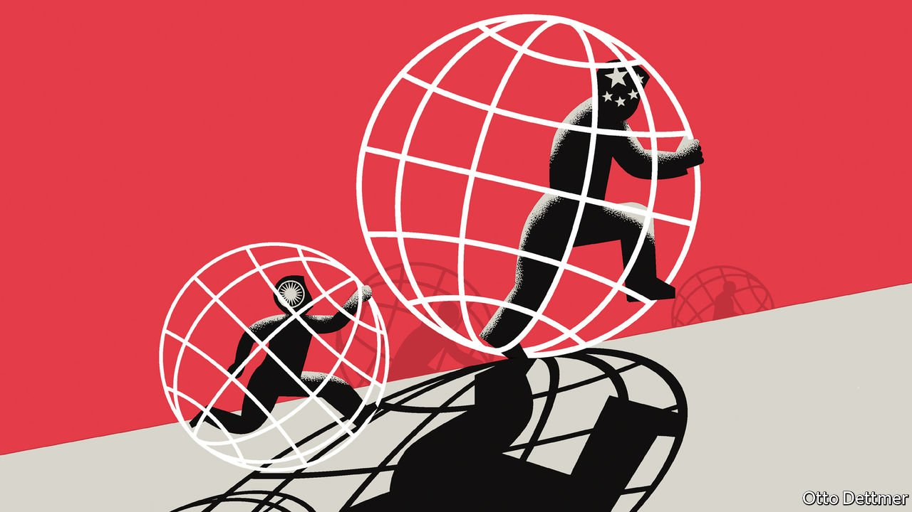

###### Free exchange

# The world needs a new economic motor. Could India fit the bill? 

##### The shifting structure of the global economy will make that hard 

 

> May 14th 2022 

THE WORLD could use more economic hope. The war in Ukraine has dealt a heavy blow to global growth prospects. Lockdowns and a property slowdown have sapped China, the erstwhile growth engine, of its vim. Given its size and potential, it seems reasonable to ask if India could be the world’s next economic motor. In April the IMF reckoned that Indian GDP might grow by more than 8% this year—easily the fastest pace among large countries. Such a rapid expansion, if sustained, would have a profound impact on the world. But, in large part because of the shifting structure of the global economy, things are not as simple as India taking up China’s mantle.

In the 2000s China accounted for nearly a third of global growth—more than America and the European Union combined—adding new productive capacity, each year, equivalent to the present-day output of Austria. By the 2010s China’s contribution had roughly doubled, such that each year of expansion was worth an additional Switzerland. From the turn of the millennium to the eve of the pandemic, China grew into the largest consumer of most of the world’s major commodities, and its share of global goods exports rose from 4% to 13%.


Could India replicate such feats? It is the world’s sixth-largest economy—as China was in 2000. And its output today stands broadly where China’s stood two decades ago. China went on to manage an average annual growth rate of about 9%. India grew by just under 7% per year over the same period. It might easily have done better, though, were it not for policy mistakes—such as Prime Minister Narendra Modi’s shock decision to withdraw some banknotes in 2016—and macroeconomic vulnerabilities, including an overextended financial sector. The government may have learnt from the first; both policymakers and the banks have worked to address the second. Before the war in Ukraine the IMF had reckoned that India might grow by 9% this year. Some optimists argue that, in the right circumstances, India could manage such rates on a sustained basis.

A closer look, however, suggests that India is not a substitute for China. One problem is that the world economy is much larger than it used to be, such that a given rise in India’s GDP raises global growth by less. Sustained annual growth of 9% would vastly improve the lives of Indians, and meaningfully tilt the balance of global economic and political power. But it would not mean that the world economy would revolve around India, as it did around China over the past two decades. India’s contribution to global growth would remain smaller than that of America and Europe combined, for example.

Perhaps more important, global economic conditions may be considerably more forbidding than those that enabled China’s rise. From 1995 to 2008, the value of world trade rose from 17% of global GDP to 25%. The share of goods exports participating in global value chains rose from about 44% of world exports to 52%. China was at the forefront of both trends. It was the most dominant trading country since imperial Britain, according to an analysis of “hyperglobalisation” published in 2013 by Arvind Subramanian of Brown University and Martin Kessler of the OECD, a rich-country think-tank.

India, by contrast, is a trade minnow. On the eve of the pandemic it accounted for less than 2% of global merchandise exports. It hopes to raise that share by investing in infrastructure, providing public subsidies to manufacturers and negotiating trade deals with uncharacteristic enthusiasm. But times have changed. World trade has fallen as a share of global GDP since the early 2010s. Economic nationalism could stymie a recovery. India may nonetheless hope to increase its exports by capturing market share from other economies—including China. But businesses and governments that were once willing to rely heavily on China in the name of efficiency have become more cautious. Their reluctance to become too dependent on any one source of supply could check India’s ambitions.

Dominating global supply chains may not be the only route to economic influence. India is a precocious exporter of tech and business services; though its GDP is only one-sixth that of China’s, its services exports only just lag behind the latter’s. Research published in 2020 by Richard Baldwin of the Graduate Institute in Geneva and Rikard Forslid of Stockholm University argues that technological change is expanding the range of exportable services, and providing more opportunities for workers in poor countries to compete with services workers in the rich world. But while tech and business services may continue to thrive in India, their expansion may be limited by an inadequate system of education, which performs well on measures of enrolment but not of learning outcomes, and by the protected nature of rich-world service sectors, which may be better insulated against foreign competition than were industrial workers against Chinese imports.

Subcontinental surge

Even if India manages a growth rate of nearer 6% than 9%, that would be nothing to sneeze at. It would make India the world’s third-largest economy by the mid-2030s, at which point it would contribute more to global GDP each year than Britain, Germany and Japan combined. Indian demand for resources would then drive commodity prices; its capital markets would tantalise foreign investors. A large English-speaking population and a democratic political system, if India can keep it, may allow Indian tech and cultural exports to wield more global influence than did China’s at similar income levels.

But the world by then will have recognised, if it has not already, that the rise of China was a unique event. Indian growth will be world-changing. But you should neither hope for, nor fear, a reprise of the Chinese experience. ■

Read more from Free Exchange, our column on economics:

 (May 7th) (Apr 30th)


