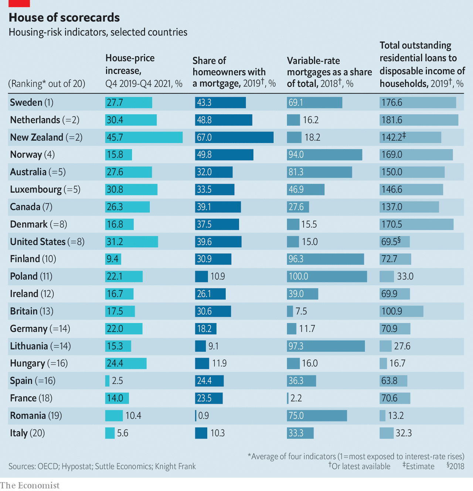

###### House of cards

# Which housing markets are most exposed to the coming interest-rate storm? 

##### The pain of rising mortgage repayments will be harder to bear in some places than in others 

 

> May 14th 2022 

STOCKS ARE sinking,  is in full swing and the spectre of global recession looms. But you wouldn’t know it by looking at the rich world’s housing markets, many of which continue to break records. Homes in America and Britain are selling faster than ever. House prices in Canada have soared by 26% since the start of the pandemic. The average property in New Zealand could set you back more than NZ$1m ($640,000), an increase of nearly 46% since 2019.

For more than a decade homeowners benefited from ultra-low interest rates. Now, however, changes are brewing. On May 5th the Bank of England, having forecast that inflation in Britain could exceed 10% later this year, raised its policy rate for the fourth time, to 1%. The day before America’s Federal Reserve had  by half a percentage point, and hinted that more tightening would follow. Investors expect the federal funds rate to rise above 3% by early 2023, more than triple its current level. Most other central banks in the rich world, ranging from Canada to Australia, have either started pressing the monetary brakes, or are preparing to do so.


Many economists believe that a 2008-style global property crash is unlikely. Households’ finances have strengthened since the financial crisis, and lending standards are tighter. Scarce housing supply together with robust demand, high levels of net household wealth and strong labour markets should also support property prices. But the rising cost of money could make homeowners’ existing debt burdens difficult to manage by increasing their repayments, while putting off some prospective buyers. If that hit to demand is big enough, prices could start to fall.

Homeowners’ vulnerability to sharp rises in mortgage payments varies by country. In Australia and New Zealand, where prices jumped by more than 20% last year, values have got so out of hand that they may be sensitive to even modest rises in interest rates. In America and Britain, where markets are a little less torrid, interest rates may have to approach 4% for house prices to fall, reckon analysts at Capital Economics, a consultancy.

Alongside price levels, three other factors will help determine whether the housing juggernaut simply slows, or comes crashing to a halt: the extent to which homeowners have mortgages, rather than own their properties outright; the prevalence of variable-rate mortgages, instead of fixed-rate loans; and the amount of debt taken on by households.

Consider first the share of mortgage-holders in an economy. The fewer homeowners who own their properties outright, the greater the impact of a rate rise is likely to be. Denmark, Norway and Sweden have relatively high shares of mortgage-holders (see table). A relaxation of lending standards in response to the covid-19 pandemic turbocharged borrowing. In Sweden tax breaks for homeowners have further fuelled the rush to secure mortgages, while a dysfunctional rental market, characterised by overpriced (and illegal) subletting, has pushed more tenants into home ownership. All this puts Nordic banks in a tricky position. In Norway and Sweden housing loans make up more than a third of banks’ total assets. In Denmark they account for nearly 50% of lenders’ books. Sharp falls in house prices could trigger losses.

 


Home and dry

By contrast with the Nordics, where home ownership has been fuelled by the growth of mortgage markets, many households in central and eastern European countries bought homes without taking on debt in the 1990s because property was so cheap. In Lithuania and Romania more than four-fifths of households are outright owners. Mortgage-free households are also more prevalent in southern Europe, notably Spain and Italy, where inheritance or family support is a common route to home ownership. Germans, for their part, are more likely to rent than own their homes. Rate rises will consequently have less direct impact on prices.

The structure of mortgage debt—the second factor—also matters. Rising interest rates will be felt almost instantly by borrowers on variable rates, which fluctuate with changes in policy rates; for those on fixed rates, the pain will be delayed. In America mortgage rates tend to be fixed for two or three decades. In Canada nearly half of home loans have rates that are set for five or more years. By contrast lending in Finland is almost entirely priced at floating rates. In Australia around four-fifths of mortgages are tied to variable rates.

Just looking at the proportion of borrowers on fixed versus variable rates can mislead, however. In some countries mortgage rates may often be fixed, but for a period that is too short to protect borrowers from the interest-rate storm. In New Zealand fixed-rate mortgages make up the bulk of existing loans, but nearly three-fifths are fixed for less than a year. In Britain nearly half the fixed-rate stock is for up to two years.

Resilience to rising rates will also depend on the quantum of debt taken on by households—our third factor. High indebtedness came into sharp focus during the global financial crisis. As property prices fell, households with towering mortgage repayments relative to their incomes found themselves squeezed. Today households are richer—but many are saddled with more debt than ever. While Canadians added C$3.6trn ($2.8trn) to their combined pile of savings during the pandemic, buoying their net wealth to a record C$15.9trn at the end of 2021, their ravenous appetite for homes has pushed household debt to 137% of income. The share of new mortgages with extreme loan-to-income ratios (ie, exceeding 4.5) has also risen, prompting Canada’s central bank to issue a warning about high levels of indebtedness in November last year.

Financial regulators in Europe are equally worried. In February the European Systemic Risk Board warned of unsustainably high mortgage debt in Denmark, Luxembourg, the Netherlands, Norway and Sweden. In Australia, homeowners’ average debt as a share of income has swollen to 150%. In all these countries households will face heftier monthly repayments just as soaring food and energy costs eat into their incomes.

All shapes and sizes

Bring this together, and some housing markets seem set for more pain than others. Property in America, which bore the brunt of the fallout from the subprime-lending crisis, appears better insulated than many large economies. Borrowers and lenders there have become more cautious since 2009, and fixed rates are much more popular. Housing markets in Britain and France will fare better in the short term but look exposed if rates rise further. Property in Germany and southern and eastern Europe appears less vulnerable. By contrast, prices may be most sensitive to rate rises in Australia and New Zealand, Canada and the Nordics.

One floor for house prices is that, in most countries, demand still vastly outstrips supply. Strong job markets, hordes of millennials nearing home-buying years and a shift to remote working have all increased the demand for more living space. New properties remain scarce, which will sustain competition for homes and help keep prices high. In Britain there were 36% fewer property listings in February compared with the start of 2020; in America there were 62% fewer listings in March than the year before.

Nor does the alternative to owning a home—renting—look particularly attractive. Across Britain average rents were 15% higher in April than in early 2020. In America they rose by a fifth in 2021, with bigger rises in hotspots, such as Miami, where they jumped by almost half. Rent controls cause a different sort of pain. Prospective tenants of such properties in Stockholm face an average waiting time of nine years.

As the era of ultra-cheap money comes to an end, then, demand for housing is not about to collapse. Yet one way or another, renters and homeowners will face an intensifying squeeze. ■

For more expert analysis of the biggest stories in economics, business and markets, , our weekly newsletter.

