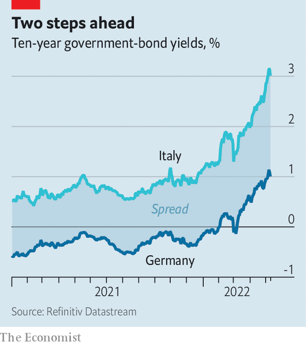

###### Buttonwood

# Why Italy’s borrowing costs are surging once again 

##### Despite all the euro zone’s crisis-proofing, Italy remains a worry 

 

> May 14th 2022 

A SURE WAY to cause shudders in Italian economic-policy circles is to talk up the prospect of higher inflation. For years subdued price pressures were the rationale for the European Central Bank’s super-lax monetary-policy stance. They provided necessary cover for an array of ECB bond-buying schemes that covertly but effectively bailed out Italy’s huge public debts.

 


Just now nerves in Rome are a little jangled. Annual inflation across the euro zone rose to 7.5% in April. ECB officials have been warming up markets for a possible interest-rate rise as soon as July. That would first require an end to the central bank’s main bond-buying programme. The yield on ten-year German bunds has surged in anticipation. So has the excess yield between riskier sorts of government bonds, notably Italy’s BTPs, and bunds. Italian bond spreads rose above two percentage points earlier this month (see chart).


Looked at one way, this rise is eye-catching, though not yet alarming. Italy’s spreads are not obviously out of line with those of corporate bonds of a similar credit rating, allowing for differences in maturity. Looked at another way, it is disappointing. After all the efforts over the past decade to make the euro zone crisis-proof, a BTP behaves not like a bund but like an investment-grade corporate bond—with spreads narrowing in calmer times but blowing out at the whiff of trouble.

Italy has long been the weakest big link in the euro-zone chain. It has emerged from the pandemic with government debt of 151% of GDP, the highest of any large economy bar Japan (where inflation is still quiescent). In the right conditions, such debts are manageable. Indeed, if Italy’s nominal GDP growth rate can stay ahead of the interest rate it pays, the debt burden would fall—as it did last year, when the economy bounced back from recession. Mario Draghi, the former ECB chief who is now Italy’s prime minister, has been following what might be called a “denominator” strategy with regard to the debt-to- GDP ratio. He has tapped the EU’s recovery fund, a €750bn ($790bn) pot financed by common bonds, to finance an investment splurge with the intention of lifting Italy’s GDP. These funds are conditional on reforms, which Mr Draghi has set in motion.

Inflation has upset this strategy in two ways. First, it puts a big dent in real output. The sharp rise in energy prices following the invasion of Ukraine makes Italians poorer and less able to spend on other things. Italy’s GDP shrank in the first quarter. Growth forecasts have been slashed. Second, the inflation shock has prompted a global rethink of monetary policy and widespread risk aversion in financial markets. The widening in Italian spreads is a consequence. With interest rates rising and central banks ceasing bond-buying, capital is being rationed more carefully. The safest credits get first call. Riskier borrowers get what’s left.

If sustained, higher yields will over time raise the cost to Italy of servicing its debts. Borrowing costs of 3% are not ideal. But Italy has locked in low interest rates on the stock of its existing debt, which has an average maturity of seven years. Over the longer haul Italy should be able to manage nominal GDP growth of at least that 3% rate—1% real GDP plus 2% inflation, say. Indeed, the current surge in prices, while deadly to real output, is adding to the inflation part of nominal GDP.

A big worry is that spread-widening gains momentum. Andrew Balls of PIMCO, an asset manager, detects a “cuspiness” to BTP yields—meaning that when they rise beyond a certain threshold, they tend to attract more panicky sellers than bargain-hunting buyers, leading to even higher yields. Anxieties about Italy’s politics are never far from the surface. Mr Draghi is trusted in Berlin and Brussels, but he is due to stand down before elections next spring. He may not last even that long, since cracks are emerging in his coalition over the war in Ukraine.

In those circumstances, the instinct is to look to the ECB to check the widening in spreads. But with inflation where it is, the central bank’s continued use of tools such as negative interest rates and asset purchases looks improper—hence the scramble to “normalise” monetary policy. Yet inflation seems less entrenched in the euro area than in, say, America. Wage growth is still fairly modest, for instance. The ECB, therefore, may not have to raise interest rates quite as much as financial markets are pricing in. Nervous technocrats in Rome will be keeping their fingers crossed.

Read more from Buttonwood, our columnist on financial markets: (May 7th)


