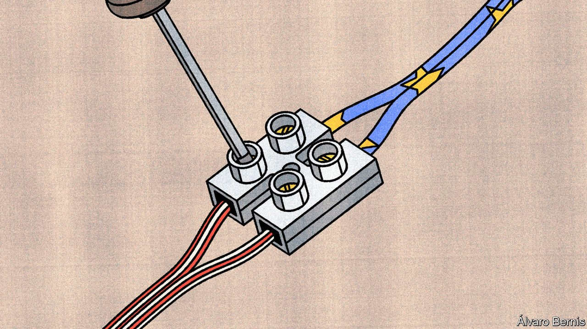

###### Connective action

# The war in Ukraine is spurring transatlantic co-operation in tech 

##### Talks are bound to get trickier once attention turns back to China 

 

> May 14th 2022 

A COMMAND CENTRE to scan the digital realm for global disinformation campaigns. Standardised plugs for electric cars that will work both in America and in the European Union (EU) and so lower the cost of building the infrastructure needed to decarbonise. A transatlantic team to scout for attempts by China and others to manipulate global technical standards in their favour. These sorts of initiatives sound like common sense, but they are difficult in a world where even allies have competing regulators, vying for technological dominion. Happily, a transatlantic diplomatic undertaking that most people have never heard of is trying to change all that.

The group in question, called the “Trade and Technology Council” (TTC), will convene in Saclay, a suburb of Paris, on May 15th and 16th. A constellation of grand officials from either side of the Atlantic—including America’s secretary of state, commerce secretary and top trade negotiator, and the EU’s commissioners for trade and competition—will be meeting for the second time. Whereas their first meeting in September in Pittsburgh was mainly meant for participants to get to know each other, the gathering in France will assess progress on their work so far and set goals for the next two years.


It is a momentous task. The TTC is the West’s response to efforts by China and others (notably Russia after its invasion of Ukraine) to build an autocratic digital world and bring the physical supply-chains that underpin it under their control. “The big question is whether democratic governments can develop a meaningful alternative,” explains Marietje Schaake of the Cyber Policy Centre at Stanford University. If America and the EU resolve their differences in tech, other countries are bound to follow their lead: the pair account for 55% of the global market for information technology, whose value is expected to reach a staggering $4.4trn this year, according to Gartner, a consultancy.

The TTC was set up last year as a “transatlantic inter-agency”, in the words of Paul Triolo of the Albright Stonebridge Group, a foreign-policy consultancy. It is supposed to be the main venue in which America and the EU co-ordinate policy for the digital realm. The two sides have created ten working groups, ranging from “technology standards” and “secure supply chains” to “investment screening” and “climate and clean tech”.

The structure of the TTC allows the relevant agencies and experts in Brussels and Washington to develop working relationships that go beyond ad hoc encounters that have long dominated transatlantic policymaking. It is a practical forum in which they can resolve their digital differences. Officials once barely knew who was in charge of a given topic on the other side of the Atlantic. Now they can just jump on a video call. “The TTC has become the conduit for much of the US-EU co-operation,” explains the chair of one of the council’s working groups.

The TTC has already helped move negotiations along in several areas, particularly with regard to a new version of “Privacy Shield”, an agreement to create a clear legal basis for flows of personal data across the Atlantic. The original was struck down by the European Court of Justice in 2020. It ruled that the agreement did not sufficiently limit American law-enforcement agencies’ access to the personal data of European citizens.

Although talks to reform “Privacy Shield” are not officially on the TTC’s agenda, they involve many of the same officials. Their familiarity with each other was one big reason why President Joe Biden and Ursula von der Leyen, the president of the European Commission, were able to announce in March that both sides had finally agreed on a deal “in principle”. This will provide the basis for more progress in the TTC. If America and the EU had not even been able to agree on data flows, says another official, other attempts at transatlantic co-operation in tech policy would have been futile.

Another project that has benefited from the TTC is the “Declaration for the Future of the Internet”, which was announced on April 28th and signed by more than 60 countries. Complementing the TTC, this document lays out the priorities for an “open, free, global, interoperable, reliable, and secure” internet—describing in effect an alternative to China’s and Russia’s increasingly autocratic technosphere. Yet it is not aimed mainly at those two powers, both of which are certain to ignore it. It serves instead as a warning to other countries tempted to copy some of the pair’s authoritarian ways.

Russia’s invasion of Ukraine has both spurred the council’s efforts and proved their usefulness. Officials had, among other things, to decide which technology exports to block, how to strengthen cyber-security defences and what to do about Russia’s online disinformation campaigns. “That has given us something to co-operate on,” says another TTC participant.

Unsurprisingly, in light of the war, the beefiest proposals in a leaked draft of the “joint statement” to be published at the end of the meeting in Saclay relate to security. Both sides wish to share more information and harmonise regulations, a step which could one day lead to a common list of sensitive technologies to be kept out of the hands of autocratic regimes. As for supply chains, the idea is to develop, among other things, an early-warning system to avoid the sort of bottlenecks that have led to the current shortage of microchips. The two sides will also vow to refrain from further “subsidy races”, a clear danger in the semiconductor industry.

But in most areas, the council’s woolly pledges hint at the difficulty of the task ahead. In AI, the EU and America aim to “develop a shared hub/repository of metrics and methodologies for measuring AI trustworthiness and AI risks”. In climate and clean tech, both “work towards a common methodology for joint EU-US recommendations on selected carbon-intensive products”. In tech investment, the pair are thinking about holding a “tabletop exercise” to learn how the other side reacts when a Russian or Chinese firm comes knocking to acquire a local company. In other words, officials still are trying to find a common language.

 


If concrete “deliverables” are few and far between, it is because America and the EU still live on different digital planets when it comes to regulating big online platforms like Facebook and Google. The EU is putting the finishing touches on a series of sweeping laws, including the Digital Markets Act, meant to increase competition, and the Digital Services Act, to control harmful content. No equivalent bills are likely to make it through America’s Congress. Optimists note that ordinary Americans, if not their elected representatives, seem open to the idea of such rules: they trust tech companies even less than Europeans do (see chart).

That is partly a function of America’s political gridlock, but partly also economic nationalism, in that far more of the firms to be regulated are American than European. The EU is guilty of similar protectionism: America’s negotiators want the TTC to speed up the deployment of two new ways of building mobile networks called Open RAN (short for Open Radio Access Network) and “virtualisation”. These should make it easier for new providers of telecommunications gear to emerge, which would provide more competition for Huawei, a Chinese information-technology giant which is accused of working closely with spooks in Beijing. But Open RAN and virtualisation also weaken two big European firms, Ericsson and Nokia, which are in the same business as Huawei. And they create opportunities for America’s big cloud providers, in particular Amazon Web Services and Microsoft, to get involved in telecoms.

 


More such squabbles are likely to emerge once the TTC focuses more narrowly on its original purpose: challenging China. “It’s one thing to negotiate export controls for Russia, where the economic impact is quite small, but things become much more difficult to do this for a giant like China,” says Martijn Rasser of the Centre for a New American Security, a think-tank. China is central to most tech supply chains. Many firms from both America and the EU have big investments there.

Another problem is that neither side can really be trusted to keep its promises. If Donald Trump is re-elected in 2024, or another Trump-like president enters the White House, the TTC may soon be forgotten. As for the EU, the European Court of Justice may yet strike down the new version of “Privacy Shield”, too. Similar lawsuits are possible in America as well. “It’s a legal Rubik’s Cube,” says Peter Swire of the Georgia Institute of Technology, who helped develop the new agreement, which has not yet been made public.

Counting your chips

The TTC’s admirers argue that the logical response is for the council to be more ambitious while it still can. They applaud its bolder aims, such as creating common rules for AI and increasing transatlantic co-operation on cyber-security. Another way to strengthen the group would be to invite other like-minded countries, such as Japan and South Korea, or even large companies and other organisations, to join its deliberations. (Big tech firms and other entities will attend the pow-wow in Saclay on an informal basis.)

Some would even like the TTC to evolve into a “tech alliance” of democracies, the digital NATO called for when Mr Biden was elected in late 2020. Recent developments suggest a more probable outcome will be a network of bilateral undertakings. In April the EU agreed such a deal with India and has embarked on a similar process with Japan. Tech is also being discussed in the Quad, the security dialogue between America, Australia, India and Japan. “Just as regulation tends to mirror the industries that it’s regulating, the international system is starting to mirror the industries that they’re trying to address,” says Tyson Barker of the German Council on Foreign Relations, another think-tank. “Expect an ecosystem of alliances.” ■

Read more of our recent coverage of the 

