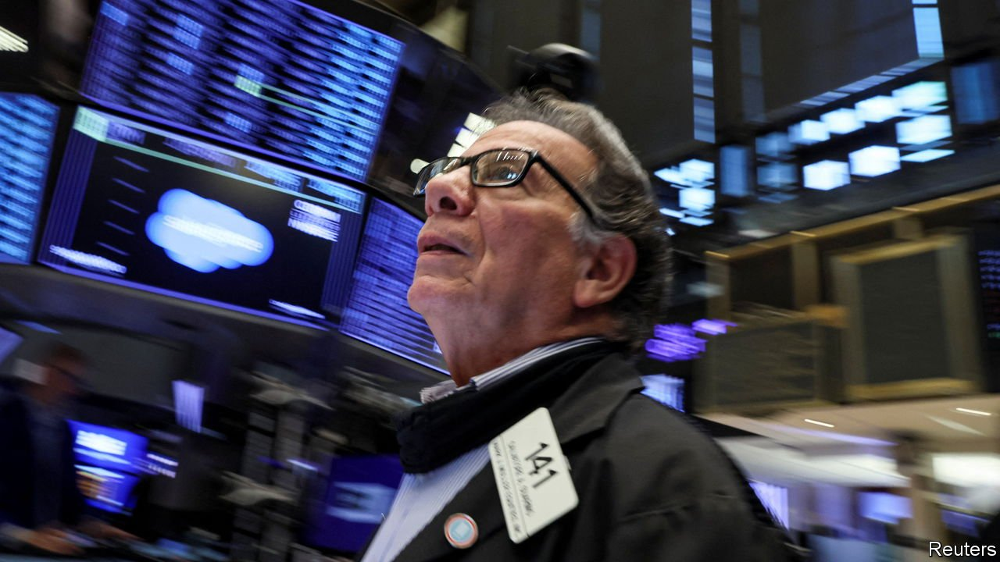
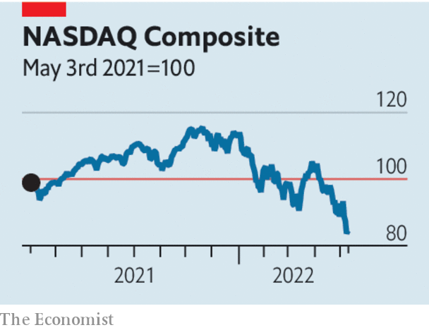

###### Financial markets

# A new bear market in American shares 

##### Could the sell-off raise the danger of a recession? 

 

> May 14th 2022 

AMERICA’s BEAR season, when hikers are advised to stay on their trails and carry pepper spray, runs for two months from September. It has come early for investors. The S&amp;P500 index of leading American stocks has fallen by 18% from its all-time high in January, ten percentage points of which was in the past month alone. The index is flirting with bear-market territory, a 20% decline. The NASDAQ, a tech-heavy benchmark, has plunged well past that level. Since November it has shed 29%.

For 18 months or so, since inflation began to climb, investors have fretted over how much the Federal Reserve would tighten policy, and how painful that would be for asset prices. The latest rout, which followed a meeting of the Fed on May 4th at which America’s central bank raised rates by 0.5 percentage points, offers an answer: very painful.

 


The market expects the Fed to raise interest rates by another 1.9 percentage points this year, even as it shrinks its balance-sheet fast. And the more entrenched inflation becomes, the more aggressive the Fed will have to be. Worryingly, American households  a year from now and almost 4% in three years, according to a survey from the Federal Reserve Bank of New York on May 9th.


Higher real interest rates erode the present value of future cashflows. The sell-off has been vicious for technology stocks whose valuations rest on expectations of much larger earnings far in the future (see Business section). For the same reason, prices of bonds with long maturities have fallen heavily. Many speculative assets without cashflows have done even worse. Bitcoin is trading at about $27,000, half its value in November.

One question is whether the market slump signals deeper trouble in the economy. America’s unemployment rate is just 3.6% and more than 11m jobs remain unfilled. But the more zealous the Fed has to be, the more likely it is to cause a recession. Meanwhile, war in Ukraine has stoked energy prices. And China’s zero-covid policy is damaging its economy and adding to supply-chain snarl-ups around the world.

The other question is whether financial-market turmoil may eventually amplify economic problems, rather than merely reflect them. Over the past decade debt and equity markets have played a bigger role in finance, in part owing to tighter regulation that has inhibited risky lending and trading by banks. Most household mortgages now originate outside the banking system, and are issued as securities and held by investors. American companies get 57% of their debt funding from investors in bond markets, up from 45% in 2007. Banks play a smaller role as the middlemen in financial markets, their place taken by computers and specialist trading firms.

These structural changes in the way finance works may mean that markets are more prone to bouts of erratic trading and nervous breakdowns. Regulators, as well as plenty of investors, have worried that the new-look Treasury market could seize up in times of stress, causing strains in the real economy. Violent moves in asset markets may have more of an effect not only on people’s retirement accounts and firms’ share prices, but also on their ability to borrow.

As ten-year Treasury yields have climbed from 1.6% in January to 3% now, mortgage rates in America have shot up from 3.0% to 5.3%. Risky firms are beginning to find it hard to issue debt. The first quarter of 2022 was the slowest for high-yield issuance since 2016. When it tried to sell $3bn-worth of bonds in late April, Carvana, a second-hand-car retailer, struggled to attract investors even at double-digit yields. Unfortunately, the hikers are far from being out of the woods just yet. ■

For more expert analysis of the biggest stories in economics, business and markets, , our weekly newsletter.

