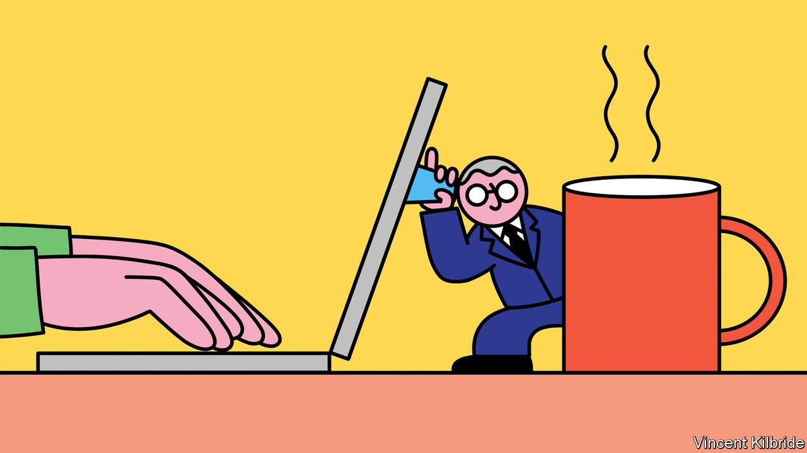

###### Employee surveillance

# How a new age of surveillance is changing work 

##### Look out: your boss may be watching you 

 

> May 14th 2022 

WORKPLACE SURVEILLANCE is nothing new. The dark Satanic mills of 18th-century Britain had supervisors to crack the whip. Shops have long used CCTV to monitor customers and staff, and some factory and warehouse workers have had to face the humiliation of timed toilet breaks. Still, if you enjoy the comfort of a white-collar job, you may be stunned to learn just how much you are being watched.

Calls and emails are monitored using ever more advanced software. Artificial intelligence (AI) is , tracking everything from Zoom-call rictus and twitchy keyboard strokes to the consistent note of irritation in your voice, in an attempt to assess your productivity and judge your state of mind.


Surveillance is rising because work-from-home policies mean that employers are keen to keep tabs on their remote workforce. Before the pandemic, around one in ten of the large businesses asked by Gartner, a research firm, had spying software. Within three years it expects the share to reach 70%.

Bosses also have ever-expanding amounts of data at their disposal, enlarging the digital footprint that can be monitored. Widely used software such as Google Workspace, Microsoft Teams or Slack can tell managers what time you clock in or how many calls you join on their platforms. Employee badges fitted with motion sensors and microphones can alert bosses if someone is loafing about. The blurring boundaries between work and home mean that video surveillance and other intrusive tools are barging into workers’ personal lives, social-media accounts and private devices at all times of the day.

The law is scrambling to adjust. In the state of New York employees subject to electronic monitoring must be told in advance, under a new law introduced on May 7th. Connecticut and Delaware require similar disclosures. California is considering new laws to strengthen privacy protections for workers, including a ban on digital monitoring without prior notice. The European Union’s General Data Protection Regulation establishes some basic rights for staff. Yet it is still early days and the technology is advancing fast. As a result, most firms are only just getting their heads around how much remote work is likely to remain permanent. A clear boundary between embracing new technologies on the one hand, and protecting workers on the other, has still to be drawn.

There are perfectly legitimate reasons for surveillance at work. Many jobs require monitoring for safety, security and compliance. Investment banks’ traders are tracked to prevent insider dealing, and the decisions of social-media moderators are traced and recorded to ensure consistency and accountability. In the same way that companies collect data on customers’ behaviour in order to improve their products, so professional employers are using monitoring tools to measure the productivity and engagement of their most important resource: their people. In the future such tools could help spot bad posture, root out bullying, and identify and share best practice among staff.

Yet it is easy to see the pitfalls. There is a long history of those with power abusing those without in the name of compliance and efficiency. In the most extreme cases, 20th-century despots ran vast informant networks, and some slave plantations in America and the West Indies kept tyrannical work records.

Today’s workers are not indentured, obviously. But many studies link excessive individual surveillance to higher levels of stress. And if algorithms trained on biased data are used to make more decisions, the odds of discrimination will rise. One analysis found that AI systems consistently interpret black faces as being angrier than white ones.

What to do? As law and practice evolve, some principles should govern workplace surveillance. Individuals must be fully informed, as the New York law provides. Some firms now disclose monitoring methods in the fine print of their employee handbooks, and specify what data managers have access to. But that is no substitute for consistent, easily understood information for staff—so they can decide how to behave at work, and whom they choose to work for.

Employers should have a legitimate reason for surveillance. Although the boundary will take time to establish through case law and precedent, this is vital to ensure that monitoring is proportionate. Firms should not have access to employees’ private devices, provided they are not used for work. And significant decisions made by algorithms should be subject to appeal and review by human beings. Establishing clear guidelines is not easy, but qualms over the potential abuse of surveillance will grow. It’s time to start drawing some lines. ■

For more expert analysis of the biggest stories in economics, business and markets, , our weekly newsletter.

