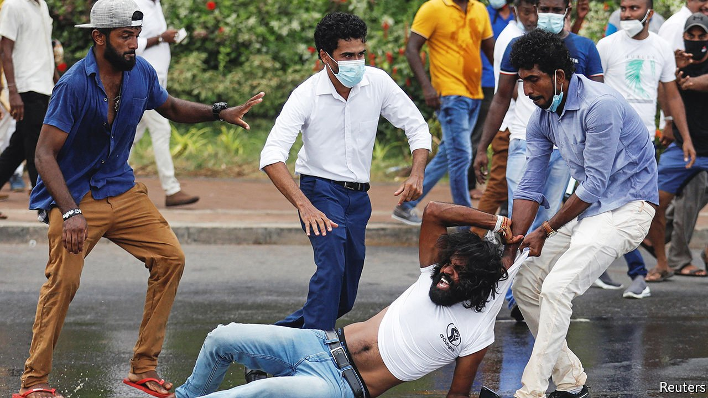

###### Gota must go

# The president should resign to save Sri Lanka from collapse 

##### But opposition politicians must also do their part 

 

> May 14th 2022 

ON PAPER, AT least, Sri Lanka is one of the wealthiest countries in South Asia, ranked by the UN on a par with much of eastern Europe in terms of development. Yet the country of 22m people is suffering severe food shortages, locked petrol pumps and power cuts lasting as long as 13 hours a day. The currency has lost nearly half its value against the dollar over the past two months. Foreign reserves stand at $50m, too little to cover even a day’s worth of imports and down from about $9bn in 2019. Last month Sri Lanka admitted it could . The country is broke.

Sri Lankans are furious. On May 9th protesters torched dozens of homes, most belonging to politicians, precipitating the , the once-beloved prime minister. Security forces evacuated him and his family to a naval base as a mob tried to storm his official residence. Vigilantes have set up checkpoints outside the country’s airports to prevent him and other officials from fleeing. A state of emergency is in force. The army has been ordered to shoot rioters and looters on sight.


How did it come to this? For an answer, look back to late 2019, when Sri Lanka was still picking itself up after a devastating set of terrorist attacks on Easter Sunday. Home-grown Islamists had targeted three churches and three luxury hotels, killing more than 250 people. Tourism, a big source of foreign exchange, took a hit, with arrivals falling from 244,000 the month before the attacks to 38,000 the month after.

It was against this backdrop that Sri Lankans chose as president a man known for an iron-fisted approach to security: Gotabaya Rajapaksa, who had brought to an end a 26-year civil war as head of the ministry of defence a decade earlier. Mr Rajapaksa, in turn, appointed as prime minister his older brother, Mahinda, who had been president from 2005 to 2015. The pair were seen as vigorous, can-do types, unlike the vacillators of the opposition. Their party won parliamentary elections by a landslide.

Untrammelled authority seems to have gone to the Rajapaksas’ heads. A two-thirds majority in parliament meant that they could have their way with the constitution—and they did, creating an executive presidency that granted Gota control over the appointment of ministers, judges and the heads of various nominally independent commissions. Many top jobs went to assorted brothers and nephews; others to retired or serving soldiers.

But even as the Rajapaksas appeared to be entrenching themselves in power, they were actually undermining their own authority through ill-conceived policies. They slashed taxes as the pandemic brought tourism to a screeching halt, which together clobbered the economy and severely reduced government revenue and precious inflows of foreign exchange. Downgrades from ratings agencies underlined the deteriorating economic picture and in effect closed the door to fresh borrowing abroad.

Instead of admitting their errors, the Rajapaksas pretended things were under control. They continued to defend the rupee and service Sri Lanka’s external debts of 44% of GDP, even as foreign reserves dwindled. A ban on imported fertiliser, to save dollars, was dressed up as a boost to organic farming—but had to be scrapped when crop yields plunged, threatening a further decline in exports. The war in Ukraine was the final straw, pushing up the prices of imported oil and food and prompting the government to resort to rationing for lack of foreign exchange.

The Rajapaksas and the country are now out of options. The government will have to slash spending and raise taxes, further eroding Sri Lankans’ standard of living even as inflation bites. The plunge in the rupee’s value will eventually boost tourism and other exports, bringing some desperately needed dollars. But Gota no longer has the credibility to negotiate with the IMF for fresh loans to tide over the country until that point, nor the authority to impose painful austerity. Opposition politicians, meanwhile, have no desire to take responsibility for a mess of the Rajapaksas’ making or to associate themselves with the unpopular remedies to come. And no economic repairs are possible while bands of arsonists roam the capital.

Put the country first

To calm the mobs and pave the way for a government of national unity, Gota must go. But the opposition should put the people before politics, too, and take some responsibility for extricating Sri Lanka from its predicament. The outlook may be bleak, but voters will reward the politicians who find a way out of the present impasse. It was by ending a seemingly endless war, after all, that the Rajapaksas first won the popular devotion that they have now betrayed. ■

