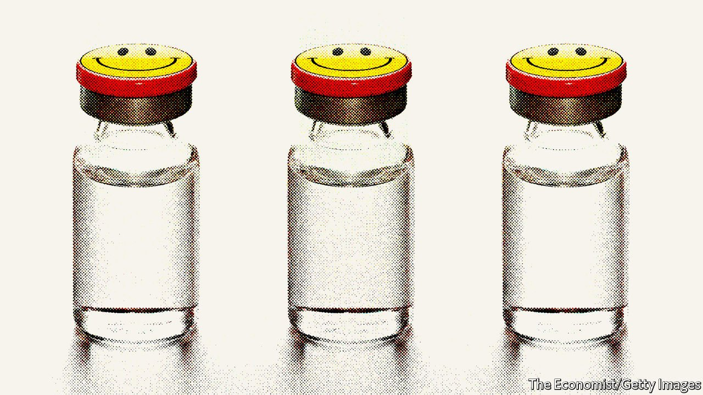
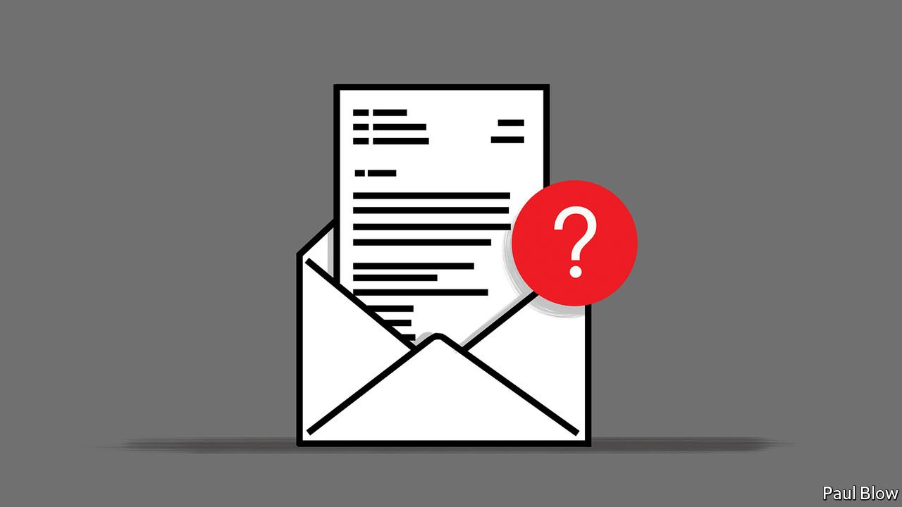

###### On central banks and inflation, China, Ronald Fisher, ketamine, granny flats, email sign-offs

# Letters to the editor 

##### A selection of correspondence 

 

> May 14th 2022 


Zero tolerance on inflation

You correctly noted that there is “nothing special” about the Federal Reserve’s 2% average target for inflation, except that it “has promised it in the past” (“”, April 23rd). Indeed, when Anthony Diercks, an economist on the central bank’s board, reviewed every optimal monetary-policy paper made available to the public since the mid-1990s, he was unable to identify a single one citing 2% as the ideal. Most papers—and the most highly cited ones—recommend an inflation rate of around 0%.


WILLIAM LUTHER

Associate professor of economics

Florida Atlantic University

Boca Raton, Florida

 


The stern warning in your special report on central banking () against overburdening central banks is appropriate. Taking on too many tasks, such as focusing on inequality and other social ills, risks undermining their independence by drawing them into politics. After his retirement from the Bank of England, Mervyn King wrote that, “the biggest threat to the future and independence of central banks comes from… promising too much.” The Fed and others have already gone a fair way in informally taking into account income distribution and other matters of an essentially political nature into consideration.

An early example of inserting politics into the Fed’s remit, and a root cause of many of its later problems, is the Humphrey-Hawkins Act of 1978, which introduced a dual mandate of price stability and maximum employment. The Fed has the unenviable task of trying to balance these two macroeconomic outcomes. Like others it seems that the Fed has over time favoured low unemployment (running the economy red hot) rather than having been sufficiently alert to early signs of inflation.

ONNO WIJNHOLDS

Washington, DC

Tell it how it is

A letter from the Chinese embassy’s spokesperson referred to the war in Ukraine as “an international dispute between two sovereign nations” (), as if it were some sort of mundane trade spat, rather than unprovoked and brutal military aggression by Russia. She wouldn’t have had to hunt far to find a precedent. Xi Jinping has described China’s response to invasion in the 1930s as a “war of resistance…where China resisted the invasion of a foreign enemy”. This is cited in “China’s Good War” by Rana Mitter, who notes that the Chinese government “has promoted the new collective memory” of the second world war “as a way to create a morally weighted narrative about China’s role in the global order”.

That moral narrative would be more consistent, and that role in the global order greatly more effective, if Mr Xi, his embassy spokesperson and their colleagues were to call out the situation in Ukraine for what it truly is.

ANDREW KORNER

Port William, Galloway

 


Cambridge’s cancel culture

As an alumnus of Gonville &amp; Caius college in Cambridge I have watched its contortions about Ronald Fisher with dismay (“”, April 23rd). If the fellowship truly wanted to take a principled stand about its predecessors, it could do no better than start with John Caius himself, a man who wanted to bar scholars who were "deformed, dumb, blind, lame, maimed, mutilated (or) a Welshman" from entry to the college. For more contemporary relevance it could turn to Jimmy Carr, a graduate of Caius, who thinks that the Nazi genocide of the Roma is amusing.

To pick on Fisher, who held views fairly unremarkable for his time, is simply giving in to those wishing to indulge in some virtue-signalling. Raking through the historical record for dead people who held views we now find unacceptable is a fool’s game. Both Churchill and Gandhi would fall foul of such a process. It consumes energy that would be best directed towards ongoing injustices.

PAUL WATSON

Cambridge

 


Drug lows

The use of ketamine to treat depression is being promoted in certain quarters (“”, April 23rd). In Canada, several medical specialists have touted its effectiveness. Some are almost delirious in their enthusiasm. I received ketamine as an anaesthetic for surgery, after being assured of its safety. They said I would experience a nice little "trip". I have never used recreational psychedelic drugs. What a trip it was. I awoke in a severe and prolonged tearful state, with profoundly suicidal thoughts. Two years later the images and sounds remain vivid and can trigger those same thoughts.

This cavalier use of ketamine is a modern iteration of the psychiatric experiments carried out in the 1950s at the Allan Memorial Institute in Montreal.

ASTRID AHLGREN

Ottawa

 


Housing attachments

” (April 23rd) pointed out that granny flats, or Accessory Dwelling Units as they are known, “have taken off in California…as house prices have soared”. We have a long tradition of these dwellings here. Allen Ginsberg’s poem, “A Strange New Cottage in Berkeley”, described the one on Milvia Street where he and Jack Kerouac lived in the mid-1950s. Unfortunately, it is long gone.

Cottages used to be available for short-term rentals to students and artists, but landlords are now unwilling to take the risk of expropriation by tenants who won’t pay, won’t leave, and who are supported by an autocratic rent board.

TOM BURNS

Berkeley, California

 


Kind regards

I would have enjoyed Bartleby’s advice on “How to sign off an email” more had I not been conscious of having committed pretty much every epistolary sin listed (). One sin omitted was the sad line that often precedes a sign-off. “No worries if not” negates everything that has gone before, and always make me cringe for the writer’s lack of self-worth. Anyway, thank you in advance for planning to print my letter. Although no worries if not.

LUCY BERESFORD

London

Automated corporate sign-offs can be a bore, especially when they include legal shields, equivalent to “by reading this message you implicitly agree not to use it as a reason to sue us”. More interesting is the signature that all employees at the International Institute for Management Development (IMD) are encouraged to use: “I am sending this email at a time that suits me. Please feel free to respond at a time that suits you.” It is a clear expression of respect for the notion of work-life balance that our hyper connected lives tend to disregard much too often.

BRUNO LANVIN

President, Smart City Observatory

IMD

Lausanne, Switzerland

Bartleby’s sign-off is oh-so 2010s. Today it is also necessary to state your preferred pronoun (she/her) and that the message was sent from the traditional, ancestral and unceded territory of the (fill in the blank) people.

BRENT SUTTON (HE/HIM)

West Vancouver, CanadaThe traditional, ancestral and unceded territory of the Squamish people

