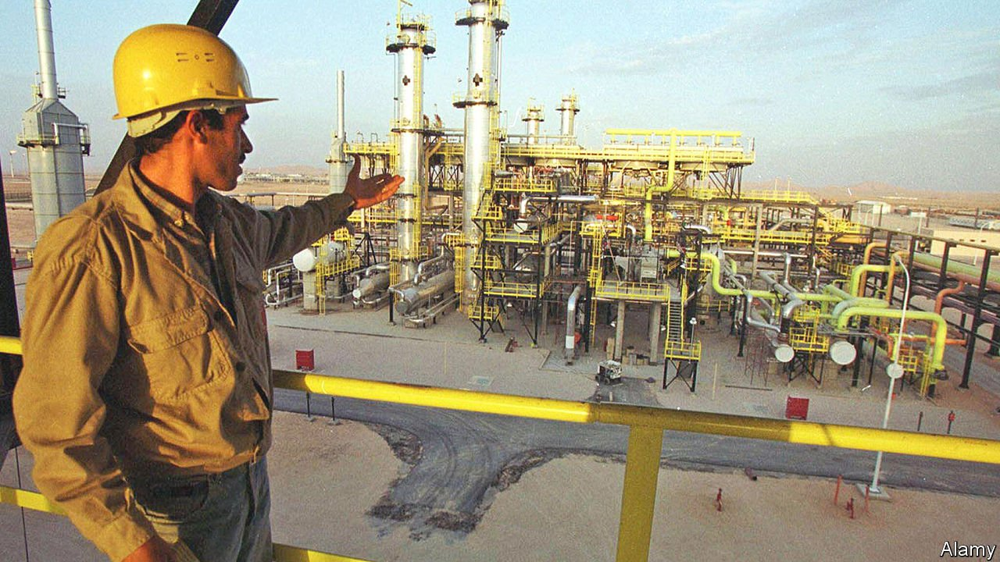
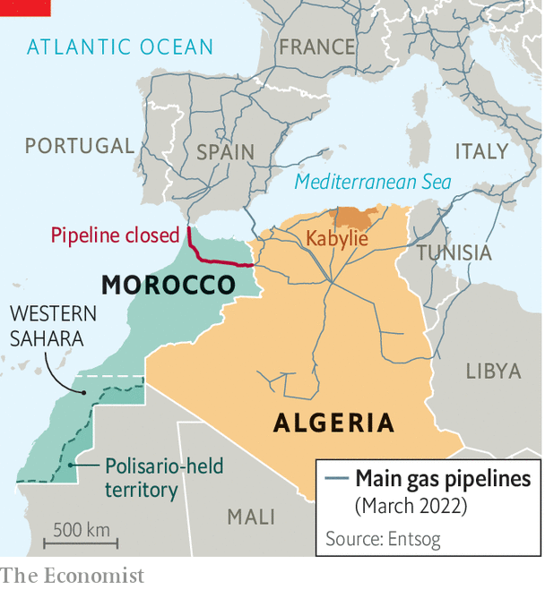

###### Gas fires in the Sahara

# Algeria’s ailing rulers stir tension with Morocco 

##### They may hope that a crisis with the neighbours will distract from problems at home 

 

> May 14th 2022 

THESE SHOULD be heady times for the world’s tenth-largest producer of natural gas. Russia’s invasion of Ukraine has sent European governments scrambling for new supplies. Algeria sends more than 80% of its gas exports to Europe. Most is piped to Spain and Italy (see map). As the continent’s third-biggest supplier, it should be investing in new capacity to produce and transport more of the stuff. Instead it is threatening to send less.

 


Last year Algeria shut a pipeline that runs to Spain via Morocco. The closure was an act of pique towards Morocco, which takes 7% of the flow as a royalty and gets almost all of its natural gas from Algeria. Spain still receives Algerian exports through a smaller undersea pipeline that bypasses Morocco. However, last month Algeria threatened to close that, too, after Morocco asked Spain to send it gas by reversing the flow of the now-idle Morocco-Spain pipeline. Algeria said it would stop all gas exports to Spain if it did so.


That may well be bluster: Algeria does not want to lose Spanish cash. In any case, Algeria’s inflammatory talk has much to do with its troubled domestic politics. But the threats are exacerbating Algeria’s long feud with Morocco. Well-connected Algerians say the stand-off with their neighbour could even tip into war.

Tensions between the two countries date back to 1963, when they fought a brief “sand war” over a strip of borderland a year after Algeria had won independence from France. Since then, ideological rivalry has deepened. Morocco is a conservative, pro-Western monarchy, whereas Algeria was a prominent member of the Non-Aligned Movement and friendly to the Soviet Union. The land border between the two has been closed since 1994, to the joy of smugglers and the annoyance of everyone else.

In the 1970s Algeria began backing the Polisario Front, a guerrilla group seeking independence for Western Sahara, which Morocco grabbed in 1975 after the departure of Spain, its colonial ruler. The decision to close the pipeline is linked to events in Western Sahara, where Morocco has been gaining ground both militarily and diplomatically.

It may not mean immediate pain for Morocco’s economy. About 60% of its energy comes from oil. Two gas-fired plants are switched on only to handle peak demand. Officials have discussed buying cargoes from Qatar, the world’s largest exporter of liquefied natural gas. Morocco has issued tenders for a regasification plant. It is also pushing ahead with renewables.

Lately Algeria’s grievances have grown. International news organisations reported last year that Morocco had used Pegasus, a powerful spyware tool made by Israel’s NSO Group, to snoop on the phones of some 6,000 Algerians, including politicians and generals. Morocco denies this.

Mindful of Algeria’s support for Polisario, Morocco’s ambassador at the UN has called for self-determination in Kabylie, a restive mainly Berber region of northern Algeria. Algeria saw this as a threat. It even blamed Morocco for devastating wildfires last summer. King Mohammed of Morocco tried to lower the temperature last year, calling for dialogue in his annual speech from the throne. But Algeria seems less keen on reconciliation.

Algeria is in a bad way. A movement called the hirak led protests that resulted in the overthrow three years ago of Abdelaziz Bouteflika after 20 years in power. The protesters had hoped that a new generation of leaders would emerge. Instead his fall only formalised the rule of Le Pouvoir, a clique of grey men who ran the show from the shadows throughout Bouteflika’s long rule. They have done little to reform a hidebound economy or clean up corruption. Unemployment is around 12%, and higher for the young. Inflation hit 8.5% last year.

A crisis with Morocco is a way to rally increasingly frustrated Algerians. Both sides seem geared up for conflict. Algeria and Morocco have the second- and third-largest armies in Africa. With a defence budget of $9.1bn, Algeria is the world’s sixth-biggest arms importer. Morocco spent $5.4bn on its armed forces last year, up by about a third from 2019. It ranks in the world’s top ten for military spending as a share of GDP; Algeria’s is 5.6% versus 4.2% for Morocco. Algerians, however, sound less keen on conflict than their leaders do. Younger ones may prefer their government to focus on jobs and the economy rather than rattle sabres at its neighbour.

Europeans, too, are wary of events across the Mediterranean. Last year Spain got more than 40% of its natural-gas imports from Algeria. A rupture would hit hard, just when energy prices are already sky-high. The Ukrainian war has prompted Spain to forswear Russian gas. It cannot afford to lose another supplier. On top of that, a conflict between nearby Arabs could mean a wave of migrants. In short, nobody would benefit. ■

