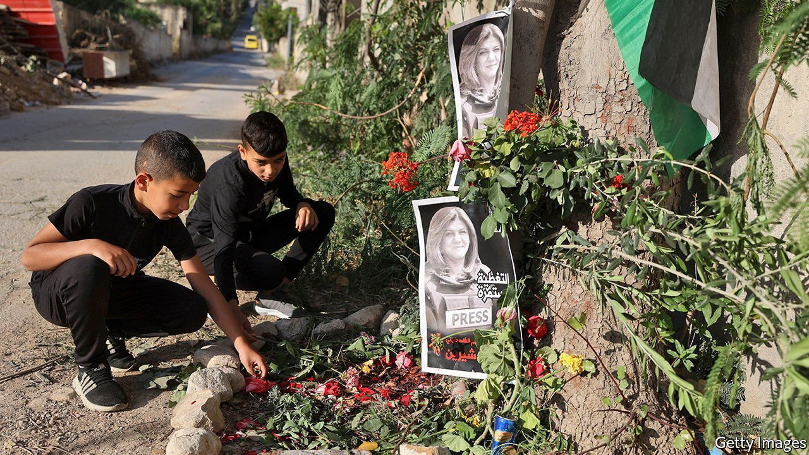

###### A death in Jenin

# Shireen Abu Aqleh was killed covering an Israeli raid 

##### A Palestinian journalist who reported on the Israeli-Palestinian conflict becomes its latest casualty 

 

> May 14th 2022 

LIKE SO MUCH of her life, Shireen Abu Aqleh’s final moments were captured in the stark style of news footage. Seven shots ring out. The cameraman creeps around to show a woman, clad in a flak jacket labelled “ PRESS”, lying prone in the dirt. A young man tries to help her, only to retreat after another shot. When he finally manages to lift her limp body, it is clear she is beyond help: one of the most recognisable faces in Arab media has been reduced to a bloody pulp.

Ms Abu Aqleh, a correspondent for Al Jazeera, a news channel based in Qatar, was killed on May 11th. She was in Jenin, in the West Bank, to cover a raid by Israeli soldiers. Several witnesses, her employer and the Palestinian health ministry say it was those soldiers who shot her.


Naftali Bennett, Israel’s prime minister, said it “appears likely” she was killed by Palestinian gunmen. By way of evidence his foreign ministry shared a 15-second clip showing a masked man shooting down an alley. Nothing indicates when it was filmed or what he was aiming at. Benny Gantz, Israel’s defence minister, later sounded less sure. B’ Tselem, an Israeli human-rights group, found where the clip was recorded—300 metres away and out of sight of the spot where Ms Abu Aqleh fell.

Ali al-Samoudi, a colleague at Al Jazeera who was also shot, says no armed Palestinians were nearby. Mr Bennett says the shooting that killed her was “indiscriminate and uncontrolled”. In raw footage, volleys of gunfire can be heard in the distance. The shots aimed at the journalists, louder and closer, sound controlled and seem to come from a single gun.

Ms Abu Aqleh, 51, started at Al Jazeera in 1997 and became one of its best-known reporters. Many young Arab journalists, especially women, cite her as an inspiration. A Christian Jerusalemite, she was omnipresent in the West Bank. That meant regular trips to places like Jenin. For the past six weeks Israeli soldiers have conducted almost nightly raids to nab suspects there, following a series of deadly attacks inside Israel, at least two of which were carried out by Palestinians from the area.

Since March, 19 Israelis and 30 Palestinians have been killed. Ms Abu Aqleh was the eighth Palestinian to die in the recent raids on Jenin’s refugee camp. Among the other victims was Muhammad Zakarneh, a 17-year-old shot by soldiers looking for his mother and brother.

Unsurprisingly, anti-Israel sentiment in the camp has soared. Fighters are celebrated as heroes. Alleyways are coated in the flags and graffiti of Islamic Jihad, the camp’s dominant militant group. Makeshift barricades guard its entrances.

This latest killing will rattle Israel’s unwieldy eight-party coalition. The government lost its majority last month when a member of Mr Bennett’s own party defected. Ra’am, a conservative Islamist party, is on the brink of bolting over clashes between Israeli police and worshippers at the al-Aqsa mosque in Jerusalem.

Mansour Abbas, the party’s pragmatic leader, would like to remain in the coalition to secure gains for his Arab-Israeli constituents. On May 11th he said his party would not back an opposition bid to dissolve Israel’s parliament. But events like Ms Abu Aqleh’s killing make staying in government ever trickier for him. ■

