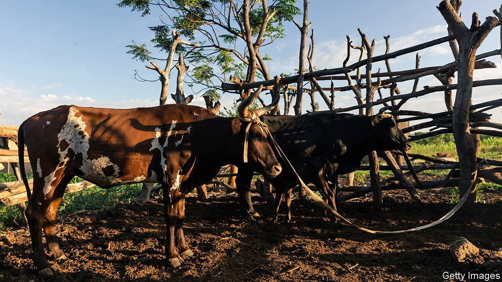

###### Heiferinflation

# Why a Zimbabwean firm offers pensions denominated in cows 

##### Ruminants are inflation-proof 

 

> May 14th 2022 

KELVIN CHAMUNORWA’S mother was a middle manager at a bank in Zimbabwe. She worked there for 25 years, steadily contributing to a pension. But horrendous inflation, which reached an annual rate of 231,000,000% in mid-2008, wiped out her savings. When she retired, her pension was so small it was barely worth collecting.

So Mr Chamunorwa, an actuary trained in Britain, started a company, Nhaka Life Assurance, to sell inflation-proof pensions to Zimbabweans. The pensions are not denominated in Zimbabwe dollars, since they quickly evaporate, nor in American dollars, since many Zimbabweans are .


Instead, they are denominated in cows, which the government can’t print. Savers, typically wage-earners such as teachers, chip in cash, which Nhaka immediately turns into cattle. The assets grow by breeding. When a policy matures, clients can demand payment in cows or the cash equivalent.

Zimbabweans have long seen cattle as a store of wealth. Mr Chamunorwa jokes that he has merely updated an old idea and added livestock insurance. His scheme is especially suited to a country where savers have lost all confidence in conventional finance. The only way to rebuild trust is to offer people “things they can touch and see”, he says. Nhaka holds viewing days when some of its 70,000 clients can visit the cows.

Mr Chamunorwa also likes to get away from his office in Harare, the capital, and visit them. At Nhaka’s farm in Selous, 75km away, he watches newly weaned calves hungrily munching hay, and offers his actuarial opinion. “Most of these, we’ll be putting a bull on them in 12 months’ time,” he says. That will be “a compounding of the investment return”.

