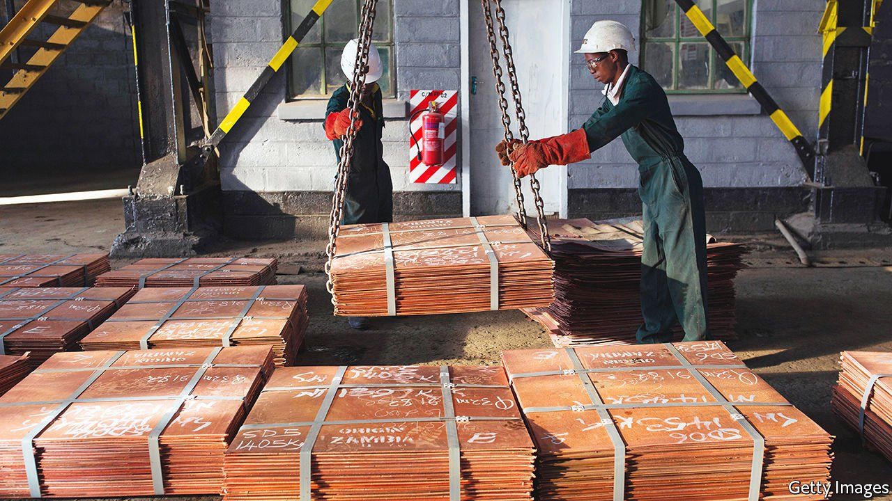

###### Copper-bottomed promises

# Zambia wants to be a model for resolving Africa’s debt crises 

##### President Hakainde Hichilema tells The Economist that China is “on board” 

 

> May 14th 2022 

AFTER FIVE unsuccessful attempts and a spell in prison on trumped-up charges of treason, Hakainde Hichilema was elected president of Zambia in August. The businessman’s victory was due to voters’ anger at the corruption and collapsing economy overseen by his predecessor, Edgar Lungu. The West was cock-a-hoop. So too were mining firms, which had all but stopped investing in Africa’s second-largest copper producer because of high taxes and threats of expropriation.

Nine months later, is Mr Hichilema enjoying the job he craved? “It’s not fun trying to rebuild a damaged economy,” he tells The Economist, “but someone has to do it.”


The job starts with restructuring Zambia’s unsustainable public debt, which is above 100% of GDP. Since the country defaulted in 2020 it has not serviced most of its external borrowing. As is the case with many of the 23 sub-Saharan countries the IMF deems to be in debt distress, it owes money to a more diverse group of creditors than African borrowers did in the 2000s, when loans were forgiven by rich countries and Western-dominated international institutions. Of its $17.3bn in external debt, only about half is owed to outfits like that. The rest is to Chinese entities ($5.5bn) and Western fund managers ($3.3bn), according to Bloomberg. Zambia is trying to persuade its creditors to take losses. The rest of Africa is watching closely.

Many African countries are sceptical of the “Common Framework”, a set of loose principles for resolving debt crises launched in 2020 by the G20, a club of big economies. It is meant to bring China and commercial creditors to the table, yet no country has gained debt relief this way. Mr Hichilema insists the common framework will work and that “China is on board”: it will co-chair, with France, a committee of Zambia’s creditors. At least 18 Chinese entities have lent money to Zambia; some should expect to lose part of their principal, not just see the loans extended, says Situmbeko Musokotwane, the finance minister. That would be unusual for China, which prefers to reschedule debts.

Mr Hichilema does not completely rule out a deal linking debt-restructuring to proceeds from copper mining. But he is aiming for one without “new liabilities” or a reduction in the mining revenues that could be used to invest in Zambia’s economy. He is optimistic about striking a deal with bondholders. He says Zambia has restored good faith with these creditors by making clear the true scale of its debts to China, which were about double what Mr Lungu’s government had admitted.

The IMF’s board will want to see progress on debt-restructuring before it approves a loan of $1.4bn. Mr Musokotwane is “very confident” this will happen next month. The fund has also endorsed a series of reforms, which will probably include cuts to fuel and electricity subsidies worth about $800m a year.

“We told the voters that we would deliver change,” says Mr Hichilema. “The type of change that would bring back economic growth.” Won’t some of these policies hurt Zambians? Voters don’t want to pay higher prices, he concedes, but “it’s a necessary process to rebuild our economy.”

There are encouraging signs. First Quantum Minerals, a Canadian miner, will expand a huge copper mine with an investment of $1.3bn—the largest in Zambia in a decade. Mr Hichilema wants to increase annual copper production from 800,000 to 3m tonnes over ten years. Zambia would then overtake Congo as Africa’s largest producer. To do so he will also need to resolve the future of other mines that were under utilised during Mr Lungu’s reign, largely because of disputes with the government.

Mr Hichilema’s free-market instincts are in welcome contrast, not just to those of his predecessor, but to those of many African leaders. Yet there is a risk Zambians will see IMF-endorsed reforms as inflicting pain of the sort that Mr Hichilema vowed to end rather than as necessary medicine. He says he is working “to restore the credibility of the country”. That means wooing friends abroad. But he must keep an eye on what happens at home, too. ■

