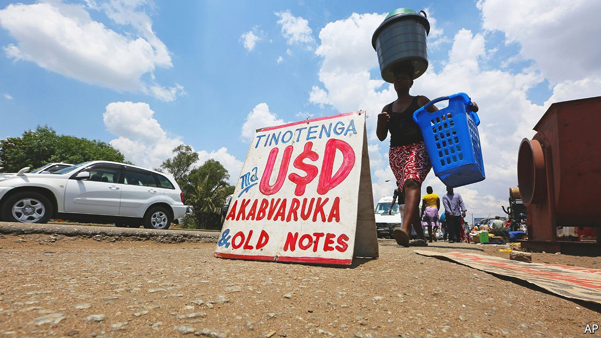
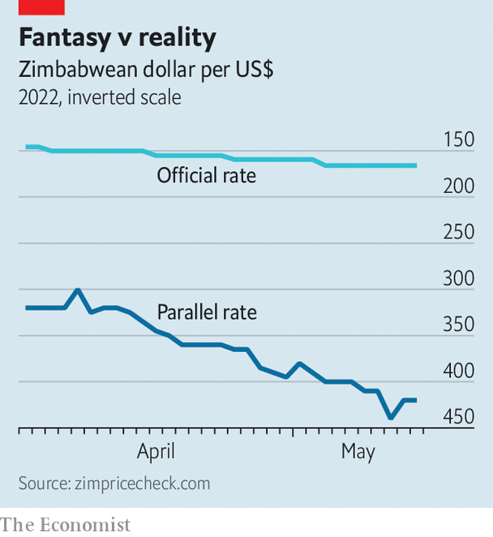

###### Savings and groan

# Zimbabwe’s president orders banks to stop lending 

##### It is an odd way to prevent hyperinflation 

 

> May 14th 2022 

“NEITHER A BORROWER nor a lender be” may occasionally be the right answer in a quiz about Shakespeare. It is no way to run a bank. Nonetheless, on May 7th President Emmerson Mnangagwa decreed that Zimbabwe’s banks should cease lending indefinitely. Whether he means it, and how this rule will be enforced, “I have no idea,” says a banker. She and her colleagues are desperately trying to find out.

The rationale appears to be that people have been borrowing money to bet against the Zimbabwe dollar. Others suspect that Mr Mnangagwa wants a scapegoat for the mess his country is in, and bashing bankers pleases voters. “It is absolute madness,” says Tendai Biti, an opposition politician and former finance minister. “Finance is the oxygen of industry. The business of banking is lending.” Banning it is unconstitutional, he adds.


“It’s a crazy environment,” says a local economist. Inflation is 152%, estimates Steve Hanke of Johns Hopkins University. In February 2019 an American dollar was officially worth 2.5 Zimbabwe dollars. Now the main official rate is around 160 and the black market rate is between 350 and 450. No one trusts the local currency. Many expect a return of hyperinflation, which ravaged the country between 2007 and 2009. Prices were rising so quickly in 2008 that statisticians could not keep up, but by one estimate inflation peaked at a mind-boggling 231,000,000%.

The president’s response has been erratic. He blames “economic hitmen” and “saboteurs” for the country’s distress. He has slapped fines on firms that refuse to accept the local currency, and sometimes says he will ban the use of the American dollar entirely. Now he is imposing currency controls, and a confusing list of other rules, to “stabilise” the economy. None of this has persuaded Zimbabweans to embrace the Zimbabwe dollar.

 


A farm worker called Jealous is on strike. He has one demand: to be paid in US dollars. Asked why, he gives a simple explanation: “When we go to the shops, they ask for dollars.” Nearby, a field of ripe blueberries sits unpicked in the sun. A refrigerated building that should be buzzing with people packing fruit into boxes for export is empty and silent. If the strike is not resolved, the fruit may rot. Similar stoppages have afflicted farms across the country.

If hyperinflation returns, it will be the government’s fault. Mr Mnangagwa, who seized power in a coup in 2017 and won a dodgy election the next year, has been spending far more than Zimbabwe can afford and ordering the central bank to print money to plug the gaps. Much of this goes on infrastructure—some of Zimbabwe’s roads have improved on his watch. But a hefty share is stolen.

Money-printing drives inflation, which saps the Zimbabwe dollar’s value. Meanwhile, Mr Mnangagwa insists on skewed exchange rates. Exporters must typically surrender 40% of their proceeds at the confiscatory official rate. A lucky few can buy these dollars for less than half what they are worth. In theory, they go to importers of essential things such as fuel, medicine and farm supplies. But a fat chunk goes to well-connected types. A local parliamentary report in 2019 found that $3bn disbursed for a government agriculture programme was not properly accounted for. Another report by The Sentry, a watchdog in Washington, DC, detailed how one of the prime movers of that programme, a crony of the president, had amassed a fortune from privileged access to hard currency and state contracts.

For ordinary Zimbabweans, life is a furious scramble for dollars. Percy Msona was a maths teacher, but found it hard to survive on the equivalent of $30 a month. Now he trades currency in the street. “It’s not good for Zimbabwe that teachers like me are quitting,” he sighs. Perhaps a fifth of the population has emigrated. Nurses, accountants, waiters and farmhands flock to Britain and South Africa.

Shopping in Zimbabwe is an obstacle course. Informal street vendors display prices in US dollars. Anyone who pays in local currency must do so at the black market rate. Formal shops, such as supermarkets, must price goods in Zimbabwe dollars and use the official rate if customers pay in greenbacks. Since no customer would accept such terms, they offer a huge “discount” for such purchases. Petrol stations are allowed to insist on US dollars. Attendants laugh at anyone who asks to pay in local currency.

Saving Zim dollars is pointless, since their value . Saving hard currency is not simple, either. Many Zimbabweans receive remittances from relatives abroad, but few feel safe putting their greenbacks in banks. It is often hard to get them out again, and the government has in the past forcibly converted dollar accounts into local money at a grabby rate. Hence the proliferation of safety-deposit-box firms, which let people store their savings away from the state’s greedy eyes. Many people stash cash under the bed. “The living room is Barclays, the bedroom is Standard Chartered,” jokes a Zimbabwean about her mother’s squirrelling of savings around the house.

Others who want to save must be creative. Bricks are stacked in many a backyard. Perched on the roof of a half-built house near Harare, the capital, Munyaradzi Dombojena explains why. Every time his family has spare cash, they buy building materials. In time, they will have a house.

Zimbabwe has enormous potential. Its soil is fertile and studded with gold, at a time when both food and minerals fetch high prices. Its people were until recently among the best educated in Africa. Yet their rulers keep them down. A general election is due next year. The government will surely print more money to buy food for ruling-party supporters and truncheons for opposition-party skulls. Mr Biti says the opposition would win a fair contest, but it won’t be fair. “We’re run by a phalanx of thugs and gangsters,” he says. ■

