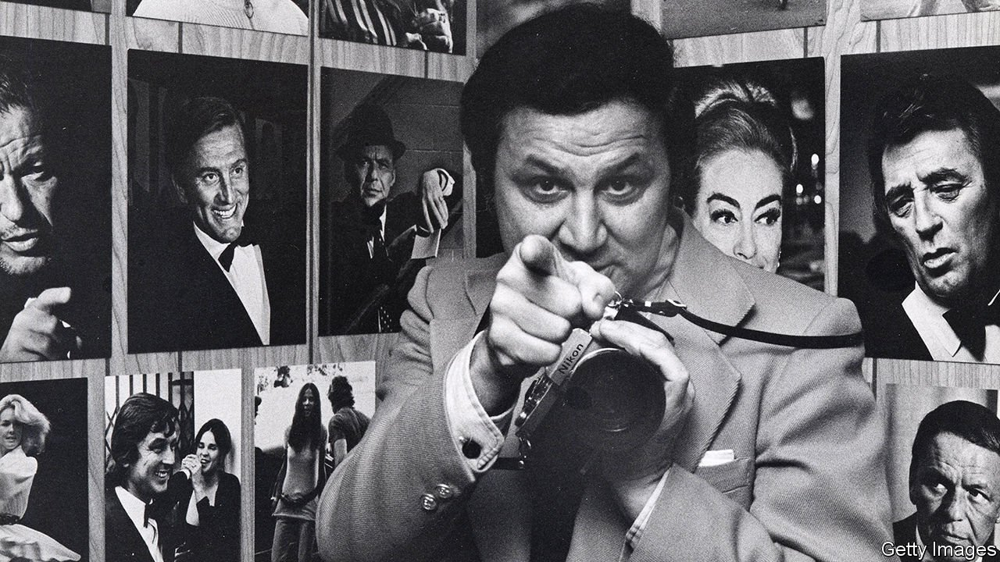

###### Obituary: Ron Galella

# Ron Galella, the original paparazzo, died on April 30th, aged 91 

##### The snapper to the stars was best known for his run-ins with Jackie Kennedy 

 

> May 14th 2022 

SOME PHOTOGRAPHERS use studios, and assistants to help with the lighting. Ron Galella had a method, a method he believed in so deeply it amounted to a creed: learn to crash events, find out where the kitchen is (useful for sneaking in), never check your coat, shoot fast and always hold the camera in front of your chest. If you hold it up and look through the lens, you don’t see the eyes. What you need is eye contact. Eye-to-eye, person to person, he liked to say, that’s how you get the real McCoy.

He wasn’t always so confident. He grew up in the North Bronx, with an accent as thick as provolone. From his father, an immigrant from Italy who made coffins and piano cases and never really learned to speak English, he learned to be tight with money. His American-born mother longed for the glamour she saw in the movies, and named her son after a film star. Both chippy in their own way, his parents fought all the time. His main comfort was a pet rabbit, until his father cooked it in a stew.


It was the air force that give him his first break, during the Korean war, when he signed up for photography lessons while learning about camera repair. Soon he was shooting visiting celebrities for the base newspaper. After he was discharged in 1955 the GI Bill helped him through art school in California. He began photographing actors at premieres and parties in his spare time to make extra money.

He was lucky with timing. In 1960 Federico Fellini’s “La Dolce Vita” introduced the world to a photographer named Paparazzo. The filming of “Cleopatra” in Rome shortly afterwards fuelled demand for celebrity snaps as its two stars, Elizabeth Taylor and Richard Burton, embarked on an adulterous affair that scandalised the Vatican and made headlines across the Atlantic. The young camera repairer, fresh out of the air force, quickly learned that his part-time gig could become a lifelong career.

He became adept at catching stars with their guard down: Greta Garbo coming out of her apartment, face hidden in a handkerchief; John Lennon and Mick Jagger sharing a smoke; Mick Jagger again, Bob Dylan and Bruce Springsteen sharing a mic; Gina Lollobrigida coming profile-to-profile with Michelangelo’s David. He bribed a watchman to lock him in a ratty Thameside warehouse one weekend so he could spy on Taylor and Burton squabbling over breakfast aboard their yacht, Kalizma, after they put up gauze curtains around the deck to ensure their privacy. What made him famous wasn’t his photographs, but the subjects he photographed. Andy Warhol, who saw him in the same way he saw himself, as a lonely outsider craving to be let in, called it “being in the right place at the wrong time”.

Some didn’t mind being caught at the wrong time or having their privacy invaded. It gave them exposure and meant they were on the up. But many did. Elaine, a famed New York restaurateur, tried to hit him with a dustbin lid. Sean Penn spat at him. Marlon Brando punched him in the jaw, knocking five of his teeth out.

There was no one he pursued like he pursued Jackie Kennedy. She was mysterious, elusive—and gloriously photogenic. He hid behind the coat-check when she went to a restaurant and followed her to her seat when she was at the theatre, he boasted in “Smash His Camera”, a documentary. Almost every day he lurked outside her apartment building at 1040 Fifth Avenue, and once even followed her to a Greek island where, dressed up as a sailor, he took pictures of her on holiday. He dated her maid to pump her for information, until she got the sack. Asked about the Jackie fixation, he said he was unattached at the time and saw her as his golden girl, his girl friend (in a way). When he did eventually marry, it was to a woman whose voice reminded him of Jackie’s.

In all the years he shot Kennedy, he always said his best streak came in early October 1971. On October 4th he snapped her watching her daughter playing tennis in Central Park. The next day she went shopping at Bonwit Teller. On October 6th he caught her at the corner of 85th Street and Fifth Avenue and later at the New York Public Library. On October 7th he’d just finished some portfolio shots for a model when he saw her coming out of the side entrance of her building. It was late in the afternoon, with a blue sky and a light breeze. Perfect soft Manhattan light, he called it. As she turned onto Madison Avenue, he hopped in a cab. At the honk of a horn she suddenly looked up, and he got what he would always call his Mona Lisa shot, “Windswept Jackie”, with her hair blowing across her face and just the beginnings of a smile.

The smiling didn’t last, of course. As soon as she recognised him, she hid behind her sunglasses. Two months later she sued him. Life magazine ran a cover story with the headline, “Jackie and the Jackie-Watcher”. He was ruining her life, she told the court. She had no peace, no peace of mind, she said. She was always under surveillance, imprisoned in her own house. The judge agreed, and ordered that he respect a no-go zone around the former First Lady and her children. When he broke the embargo repeatedly, the court threatened him with jail.

His pictures, and the way he got them, spawned an industry that came to see celebrities as prey to be hounded. His photographs are now in the Museum of Modern Art. “Windswept Jackie” is his most popular, and most expensive, print. The trial made him famous—and rich enough to build a mansion in New Jersey with a photo gallery covering one entire floor, a basement archive for the 3m pictures taken over half a century and a cemetery in the garden for the pet rabbits he still loved from childhood.

If before the trial he was regarded as a gadfly, afterwards many saw him as a pest. When it ended he received an anonymous letter: “You are a rat...I pray that you get paid back for the misery you are causing a woman who has gone through hell, a hell caused by another maniac like you. You are stupid, monstrous and slimy. You should be deported to an island to rot.” When Kennedy died, he headed one last time to 1040 Fifth Avenue. He took no pictures that day; just paid his respects. ■

