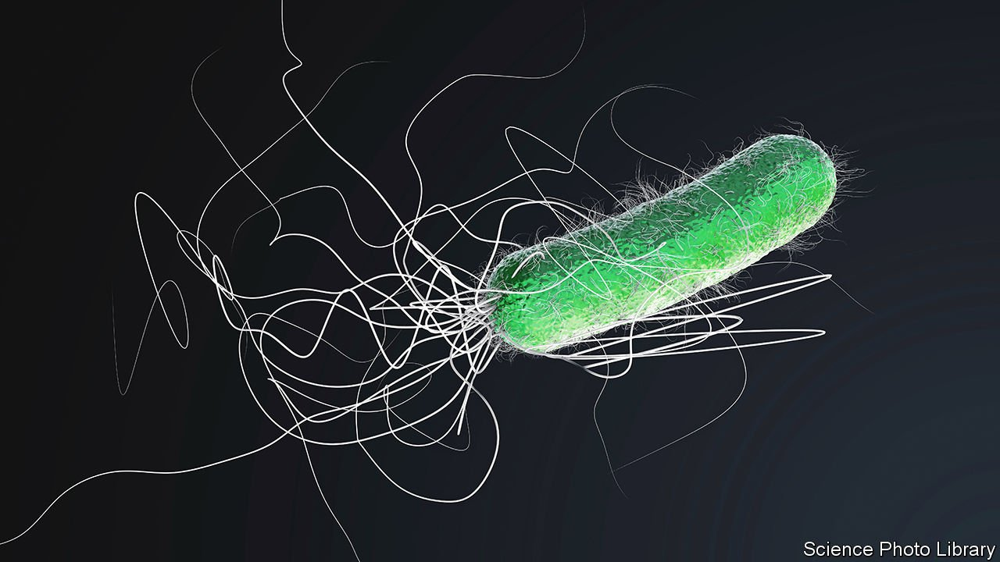

###### Bacterial cunning

# A bacterium that tricks the immune system into nurturing it 

##### The discovery may usher in new approaches to treating infections 

 

> May 14th 2022 

THE IMMUNE system has many weapons with which to counter hostile incomers. But what works against one may not be effective against another. An interloper can take advantage of this by misdirecting the system into thinking it is fighting an enemy that it is not. This buys time for that interloper to become entrenched. That is sneaky. Sneakier still, though, is the approach just discovered by Ruslan Medzhitov of Yale University. As he and his colleagues report in Immunity, they have found a bacterium that induces its host’s immune system to release compounds on which it can then feed.

Mammalian immune systems have two modes of attack. Type-1 is used against bacteria and viruses; type-2 against multicellular parasites such as worms. Some invading bacteria, however, provoke a type-2 response when type-1 would be appropriate. Dr Medzhitov decided to take a closer look.


He and his colleagues studied the behaviour of Pseudomonas aeruginosa, a bacterium which causes stubborn infections in people with cystic fibrosis. They suspected it was leading the body to mount an ineffective type-2 response against it and wanted to know how it was doing this.

To explore the matter, they grew laboratory cultures of the sorts of epithelial cells that line human airways and monitored their gene-expression profiles when exposed to LasB, a toxic enzyme produced by the bacterium. They found that LasB activated signalling pathways which drove the epithelial cells to make a protein called amphiregulin. This forms the basis of a thick mucus that excels at ensnaring parasitic worms. It also recruits immune cells called eosinophils, which are adept at attacking multicellular parasites.

A type-2 error

That finding alone is interesting, because it helps explain why cystic-fibrosis patients with bacterial infections often develop copious mucus in their lungs, even though this does nothing to counter the bacteria. More intriguing, though, was what happened when the researchers tried growing P. aeruginosa on samples of this mucus. So long as LasB was present, the bacteria did not merely thrive, but actually consumed the mucus. Not only is P. aeruginosa tricking the immune system into an inappropriate response, it is also feeding on the result. And to make things worse still, Dr Medzhitov also discovered that all this immune manipulation makes the surrounding tissues prone to allergy.

Allergic reactions are, essentially, exaggerated and inappropriate type-2 immune responses. The researchers therefore wondered whether the reactions being created by LasB could cause lasting allergies to develop. To find out, they sprayed mice infected with P. aeruginosa with egg-white protein (often used as an experimental allergen) on the first and seventh days of a four-week experiment. As a control, they did the same with some mice genetically engineered to lack the ability to produce amphiregulin when exposed to LasB.

They theorised that, in the absence of worms, the inflamed epithelial tissues in normal mice might instead identify the egg-white protein as an intruder. This is exactly what happened. When injected with a small amount of egg-white protein two and three weeks after the start of the experiment, the normal mice showed a strong allergic response to it. In contrast, the amphiregulin-free mice showed little.

These discoveries, fascinating in and of themselves, also pave the way for new approaches to treating infections in those with cystic fibrosis. Moreover, if one bug has thus evolved a way to milk the immune system, the chances are good that others have done so too. Thus alerted, researchers will be on the lookout for similar cases. ■

To enjoy more of our mind-expanding science coverage, , our weekly newsletter.

