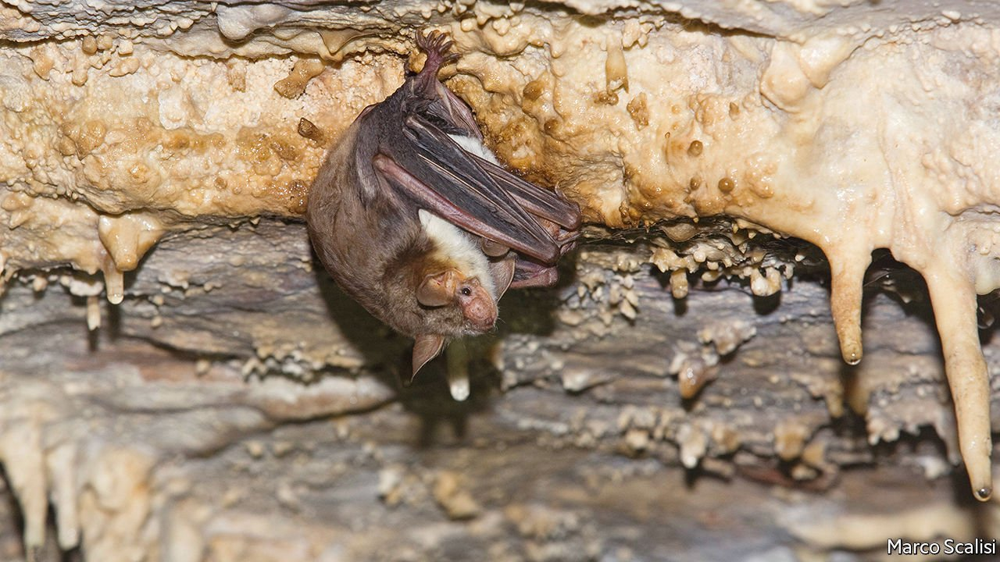

###### Buzz off!

# Bats mimic hornets when owls are nearby 

##### It is their way of spooking predators 

 

> May 14th 2022 

IN THE ANIMAL kingdom, mimics are a dime a dozen. Stick insects pretend to be twigs. Hawk-moth caterpillars resemble venomous snakes. Edible heliconid butterflies disguise themselves with the wing patterns of noxious ones, and noxious ones copy each other to make it easier for predators to learn what not to eat.

All these examples, though, are visual. Auditory mimicry is rarer. But, as he describes in Current Biology, Danilo Russo of the University of Naples Federico II thinks he has found a novel case of it. Some bats, he believes, mimic angry bees, wasps and hornets in order to scare away owls that might otherwise eat them.


Dr Russo first noticed the propensity of greater mouse-eared bats to buzz a few years ago, when he was collecting them in mist nets to study their ecology. The noise struck him as similar to the sound of hornets that inhabited the area of southern Italy he was working in. That led him to wonder whether bat buzzing was a form of mimicry which helped its practitioners to scare off would-be predators.

To test this idea, he and Leonardo Ancillotto, a colleague at Federico II, first recorded the buzzing that captured bats made when handled. Then, having donned suitable protective clothing, they embarked on the more dangerous task of recording the buzzing made, en masse, by four different species of hymenoptera: European paper wasps; buff-tailed bumblebees; European hornets; and domestic honeybees. Computer analysis revealed that chiropteran and hymenopteran buzzes were, indeed, similar.

For the next part of their experiment Dr Russo and Dr Ancillotto recruited the services of 16 captive owls—eight barn and eight tawny. Both of these species are known to hunt bats.

The researchers put the owls, one at a time, in an enclosure equipped with branches for them to perch on, and also two boxes with holes in them. The boxes resembled the sorts of cavities in trees that owls would explore in the wild for food. They placed a loudspeaker alongside one of the boxes and, after the birds had settled in, broadcast through it five seconds of uninterrupted bat buzzing and a similar amount of insect buzzing three times in a row for each noise. As a control, they broadcast in like manner several non-buzzing sounds made by bats.

During the broadcasts (which occurred in random order) and for five minutes thereafter, they videoed the owls. The videos were then analysed, by an independent observer, without benefit of their soundtracks. The results were unequivocal. When they heard both the bat buzzings and the hornet buzzings the owls moved as far from the speakers as they could manage. In contrast, when the non-buzzing bat sounds were played, they crept closer.

Dr Russo and Dr Ancillotto believe this is the first reported case of a mammal using acoustic mimicry to scare away a predator. They strongly suspect, however, that it is not unique. Anecdotes suggest several birds and also small mammals, such as dormice—particularly species that dwell in trees and, like dormice, in rock cavities—make buzzing noises when their hidey-holes are disturbed. This has not yet been documented formally as acoustic mimicry. But, given the propensity for venomous buzzing insects to dwell in those sorts of places too, and also the fear that these insects generate in other species, human beings included, Dr Russo thinks this may well be what is going on. He therefore predicts that when these other buzzes are recorded and analysed the results will show that acoustic mimicry by vertebrates of stinging insects is far more widespread than currently realised. ■

To enjoy more of our mind-expanding science coverage, , our weekly newsletter.

