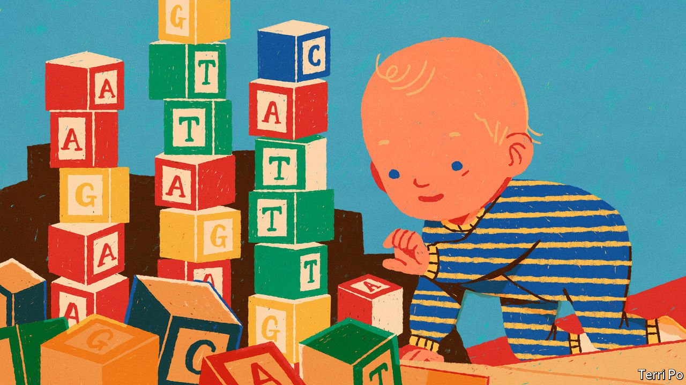

###### Genetic disease

# Full-genome screening for newborn babies is now on the cards 

##### A boon for medicine. But it raises questions of privacy 

 

> May 13th 2022 

OVER THE years, doctors have described more than 7,000 rare diseases, generally defined as those affecting fewer than one in 2,000 people. So, though individually unusual, such illnesses are collectively a serious problem—a long-tail of need which is hard to treat because patients are few in number and their symptoms often picked up too late. Three-quarters of rare diseases are genetic, and Global Genes, an American advocacy group, reckons 400m people around the world are affected by them. For medicine to do better, people with them need to be noticed earlier, preferably in the first days of their lives.

To that end, doctors in many places want to sequence and screen babies’ entire genomes at birth. In America there are projects to do just that at Boston Children’s Hospital, Columbia University and Rady Children’s Hospital in San Diego. A pioneering group at Harvard, known as BabySeq, has recently received money to expand its small-scale work to include 1,000 babies. In Europe, a five-year project called Screen4Care is starting. And efforts are also under way in Australia, China and Qatar. But the project to watch is in Britain. There, a government-owned company called Genomics England, originally set up to run a study called the 100,000 Genomes Project, which investigated genetic diseases and cancer in adults, will soon start a pilot project intended to sequence the genomes of 200,000 babies. That could presage a national programme.


Screen saver

Screening babies for genetic diseases is not a novel idea. Across North America, Europe and the Middle East, in particular, newborns are often checked at birth for a handful of common heritable illnesses, such as sickle-cell anaemia, thalassaemia and cystic fibrosis. But a whole-genome sequence offers the prospect of spotting thousands of disorders rather than the few which are currently searched for.

Early diagnosis means earlier treatment. This, in turn, means that children’s lives will be improved and even saved. But the power of the technology also means it is possible, in theory, to screen for conditions that would occur later in life, or even to help parents avoid having other children with the same genetic mutation.

Just how many risk-associated variants it is appropriate to screen for is an open question. BabySeq, which was the first project of its kind, tested for about 1,000. It found that 11% of the 159 infants it looked at harboured at least one variant associated with a child-onset disorder.

While techno-utopians might think it a good idea to test for everything, parents of newborns are more cautious. On May 4th, at a meeting held in London by Genomics England, Rick Scott, the organisation’s chief medical officer, said discussions with parents and doctors had led his team to conclude that people want any genomic-screening programme for newborns to look for a far narrower set of conditions than BabySeq sought. The most appealing tests were for variants associated with a high probability of childhood illness, and which would benefit from early treatment.

The set of variants Genomics England will seek is therefore being decided “cautiously”, says Dr Scott. At the moment, the proposed list has several hundred items on it. If implemented in toto, this would result in about one baby in 200 receiving a diagnosis of a rare genetic disorder. That list would be likely to grow as understanding improves and new treatments arrive.

This public consultation has shown that some parents want to know everything possible about their child while others very definitely do not. One particular finding, according to David Bick, a clinical geneticist who advises Genomics England, is that parents want certainty. They feel it is no use being told that a child is “fairly likely” to have a condition. Rather, they want a pretty clear “yes” or “no”.

Many also do not want to know of adult-onset illnesses that their children may one day suffer. This means rejecting tests which might indicate a newborn’s risk, later in life, of contracting cancer, diabetes or Alzheimer’s disease. That information would bring with it the burden of deciding what to tell their child, and when. Rather, these parents feel, it should be up to the children themselves, if they so wish, to seek that information when they are older—which would be easy if their genomes were already on file.

There are, however, still some conundrums. For example, Pompe’s disease is a disorder in which a carbohydrate called glycogen builds up in the body's cells. The infant-onset form of this illness must be treated straight away. The adult-onset form can be left until those with it are in their 30s. The current genetic test cannot distinguish between these forms. The cost of prompt treatment for youngsters is therefore that some parents must carry the knowledge that their offspring will suffer eventually, though not immediately.

Tay-Sachs disease, an illness fatal in childhood, causes another dilemma. Some parents absolutely do not want to know about it, because that would spoil their experience of the early years they have with their child. Others feel knowledge is power, and so do wish to know.

One of the trickiest questions of all concerns Duchenne muscular dystrophy, a degenerative illness that starts in childhood. Screening for this would find it in six of every 100,000 children tested. But only a small number of these have forms of the disease that can currently be treated, and the drugs needed are not widely available. However, learning that one’s child has this disease could also allow children to join trials of new drugs.

Over the coming year Genomics England, along with doctors, patients and the wider public, will wrangle with such questions, armed with a set of principles (which are themselves up for discussion) about what tests should be done. These principles include the idea that screening should lead to improved outcomes in those it is applied to; that this should not involve many invasive follow-up tests; and that there is strong evidence the genetic variant being tested for does indeed cause the condition in question.

And there is one other thing. This is the tricky question of how to ensure that the data are kept safe for a lifetime. Properly informed consent for all the various uses such data might be put to is central to the British plan. Other places may not be so scrupulous. Moreover, things change. The temptation to crack open genetic databases for police investigations might prove irresistible. Insurance firms would surely be delighted to snoop as well, if they were allowed to.

Most important, such data are a veritable Aladdin’s cave for medical researchers—a cave to which only some parents will be prepared to add their children’s sequences. (Informed consent means data should not be used in this way unless parents have explicitly agreed to it.)

Combining the fruits of future scientific advances with people’s full DNA sequences, collected at birth, could bring huge medical benefits. But it might also be a double-edged sword. Current knowledge of how genomes work is primitive. There is also a lot of so-called dark genetic matter in them, which does things currently unknown. Genomes may conceal secrets of, say, potential mental illness, or of behavioural predispositions that a genome’s owner would rather stayed private. Current rules say that they should. But for those who have opened the door to doctors and scientists to look at their data, the question of whether those data will remain secure for a lifetime may be a gamble. ■

To enjoy more of our mind-expanding science coverage, , our weekly newsletter.

