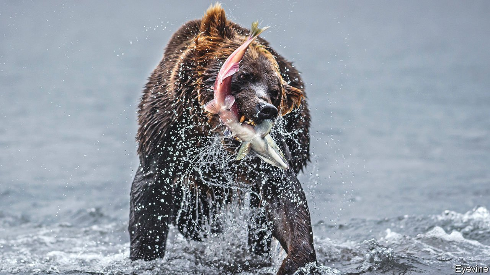

###### Science and international politics

# Russian and Western scientists no longer collaborate in the Arctic 

##### That is bad, not least for climate research 

 

> May 14th 2022 

KNEE-DEEP in the rushing waters of a creek in the valley of the Pasvik river, Paul Aspholm of the Norwegian Institute of Bioeconomy Research is trying to prevent a lifetime’s work from being washed away by politics. Wading into the frozen stream, he peers through a water visor and tots up how many mussels he can spot in an area recently exposed by thawing ice. He would normally compare these numbers with similar data gathered by Russian counterparts splashing likewise in rivers a few kilometres farther east. But all contact with them has stopped.

Dr Aspholm has spent 30 years studying the wildlife that inhabits the Arctic lands where Norway and Russia march. He has needed Russian scientists’ assistance for almost everything he has done. Together, they have kept track of species ranging from the area’s native brown bears to the invasive pink salmon that are driving out local trout and salmon, and which die in such numbers when they spawn that bacteria feeding on their corpses turn the rivers toxic and so kill other animals which live in or drink those waters. They had planned this autumn to start tracking the migration of elk along a narrow “superhighway” through the tundra, but the war has put paid to that.


Since the invasion of Ukraine in February, ties between Russian and Western scientists have frozen. Hundreds of long-standing partnerships like Dr Aspholm’s have been put on indefinite hold and projects involving Russian researchers have either suspended their participation or been put on ice entirely.

This has thrown Arctic science into chaos. More than half the Arctic’s coastline is Russian. Information from stations in Siberia and buoys in the Arctic Ocean provide irreplaceable data on climate change. Fieldwork in the Russian Arctic gives snapshots of how animals, plants and soils are responding to this change. The Arctic Council, an intergovernmental forum which promotes research in the area, has been on pause since early March.

In northern Norway, Dr Aspholm is making a leap of faith. Later this month he will take his team back to the Pasvik, which forms part of Norway’s border with Russia, for a bird-counting expedition that has happened every year since 1995. “We will try and do it just like last time,” he says, “and hope that the Russians show up at the same time and do it the same way on their side.” If the Russians do not appear, he worries, there is a good chance any data his team gather will be incomplete nonsense.

On its own, a gap in knowledge of the peregrinations of waders might not matter much. But such lacunae add up. And for data that feed into research on climate change, which the timings of bird migrations do, such losses are important.

Sanctions, says Dag Rune, rector of the Arctic University, in Tromso, “will have devastating consequences for Arctic research, and the consequences for climate change are obvious. Projects in the Arctic”, he observes, “are major operations that involve money, equipment, travel, and this is exactly the kind of research that is being most affected by sanctions.”

Sander Veraverbeke, a climate scientist at the Vrije Universiteit in Amsterdam, is another whose work is threatened. He studies fires in the Arctic, and had been planning to resume fieldwork in northern Siberia after two years lost because of covid-19. Since he was last in Russia, Siberia has been ablaze. The past three years have seen record numbers of fires in the east of that vast expanse of land: not a good time, then, for there to be gaps in the data.

Some work can be done using satellites, or by studying comparable sites in Canada and Alaska. But this gets you only so far. Permafrost research, crucial for understanding where climate projections will end up, is likely to suffer in particular. Two-thirds of Russia is covered by permafrost, and this frozen ground locks up huge amounts of organic material. As it melts and that organic material decays, greenhouse gases in the form of methane and carbon dioxide are released into the atmosphere. Without good data on these emissions, understanding about their contribution to climate change will decline.

Something even more destructive than a further year of lost fieldwork, however, is the damage to networks that have been knitted painstakingly together since the cold war. Levels of formal communication between Western and Russian scientists have declined to a point far worse, even, than during the late 1970s and 1980s. Russian researchers have, for example, been “disinvited” from academic conferences, such as the Arctic science summit week held at the end of March, where scientists gather to present research, compile and assess data, and discuss research priorities.

Climates of opinion

Isolating Russia this way creates a dilemma. Losing Russian contributions to climate science in order to punish the place for invading Ukraine might be seen as cutting off noses to spite faces. “We are missing out on almost two-thirds of the Arctic now,” explains Dr Veraverbeke. “We have a lot of good colleagues that we need to be in touch with and collaborate with to have an understanding of what is going on in Siberia. It is really impacting our understanding of one of the most dramatically changing areas on Earth.”

Russian science will suffer too. Russian researchers rely on the West not just for collaboration, but also for the money that comes with it. Of Russia’s top ten scientific collaborators, according to publication statistics from Nature Index, a database that tracks scientific output, only China has failed to impose post-invasion academic sanctions on Russia. There is thus a looming funding crisis for dozens of Russian research and data stations that were maintained by Western support.

Even if things start to normalise soon, it might be difficult to snap back to how it was. “It will not be easy,” says Dag Olsen, at the Arctic University. “There is absolutely no trust.” In March 200 of his Russian counterparts, including the rector of the Northern Arctic Federal University in Arkhangelsk, signed a letter supporting the invasion of Ukraine. In Pasvik valley, meanwhile, the only contact Dr Aspholm has had with the Russian scientists on the other side since the academic curtain fell was an email from a colleague in Karelia. “It was an opinion about mussel distribution,” he laughs. “I am not able to reply.” ■

To enjoy more of our mind-expanding science coverage, , our weekly newsletter.

