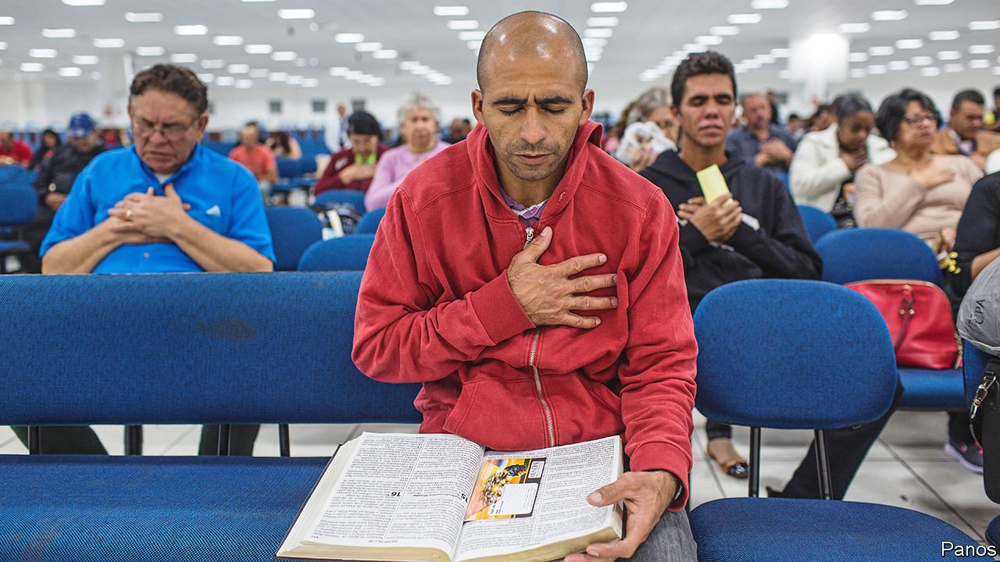

###### The cross on the ballot

# Evangelicals are key to Brazil’s upcoming election 

##### But they are not necessarily going to vote for Jair Bolsonaro 

 

> May 14th 2022 

POLITICAL HOPEFULS always cast doubt on the abilities of their competitors. But when Luiz Inácio Lula da Silva finally confirmed on May 7th that he would be running in Brazil’s presidential election in October, his campaign speech included attacks which were more moralistic than most. Lula, as he likes to be known, was scathing about Jair Bolsonaro, the incumbent, arguing that a president who does not cry for those rummaging for food in rubbish or for the 660,000 Brazilians dead from covid-19 is not worthy of the title. “He may call himself a Christian, but he has no love for his neighbour,” he said.

Lula, who was president from 2003 to 2010, has much to gain by doing down his rival’s godliness. Evangelical or born again Christians make up around a third of Brazil’s electorate. In 2018 seven out of ten of them chose Mr Bolsonaro over Fernando Haddad, the candidate from Lula’s Workers’ Party, according to one poll. (Lula was not on the ballot.) In April another pollster found 52% of evangelicals would vote for Mr Bolsonaro in the first round, compared with 30% for Lula. “[Evangelicals] are going to decide the elections,” says Victor Araújo, who writes about the politics of Brazilian Christians.


That the presidency of Brazil, which has more Roman Catholics than any other country, would be determined by evangelicals would have been hard to believe half a century ago. Then they made up just 5% of the population; Catholics, by contrast, accounted for 92%. Evangelicals look set to become the biggest religious group in Brazil within a decade. In São Paulo, the biggest city, the number of evangelical churches increased by a third between 2011 and 2020, to over 2,000.

This shift is already transforming society. Brazilians listen to gospel music more than samba. Members of the Seleção, Brazil’s revered football team, frequently praise God on the field. Bigger churches, which often operate as multinational companies, report profits touched by the divine. Church revenues almost doubled between 2005 and 2013, to over $11bn.

Evangelicals are also changing Brazilian politics. Since the 1990s they have sought to elect local representatives who can protect their churches’ interests. Today, these interest groups are national. In Congress, 195 of the lower house’s 513 deputies belong to the evangelical caucus.

Mr Bolsonaro is Catholic but his wife, Michelle, is evangelical. The family enjoys the support of the country’s most powerful pastors, such as André Valadão, who once shared a pulpit with one of Mr Bolsonaro’s sons. On Instagram, a social-media app, Mr Valadão puts up posts explaining to his 5m followers why it was acceptable for Cain to marry his sister and why Christians should not vote for the left. Edir Macedo, a billionaire bishop who owns Brazil’s second-largest TV station, backed Lula in 2002 but Mr Bolsonaro in 2018. Lula does have the support of Paulo Marcelo, a left-leaner in the Assembly of God, Brazil’s biggest church. But that is one person against “an army” of pastors, says Juliano Spyer, an academic.

The megachurches do not represent all believers. Brazil has thousands of smaller churches, and many different versions of evangelicalism. More middle-class types are less likely to vote for Mr Bolsonaro. Pentecostals, who make up around two-thirds of evangelicals, are more so. But while their highest-profile leaders often resemble the white, affluent men who form Mr Bolsonaro’s core support, most rank-and-file members are poor and black. It is their votes that the candidates will be battling for in October.

Some will plump for Mr Bolsonaro because they believe he is upright and pious. In Belo Horizonte, a city in the bellwether state of Minas Gerais, Carlos, a Pentecostal pastor, sports straightened Afro hair and a grey pinstripe suit. Standing in front of a golden pulpit with “JESUS” written in large black letters down the front, he explains that church is “a hospital for the soul”, which he claims saved him from a life of crime. Mr Bolsonaro, as “a man of God”, is the person to defend it.

Others simply like the ideas that Mr Bolsonaro champions. “Evangelicals are not voting for him as a person, they are voting for principles,” says Isnard Araújo, a councilman and pastor, of the thrice-married president. These include protecting “family values” such as marriage, “manly” behaviour and opposition to abortion. Evangelicals are not the only voters who find these ideas appealing, says Fábio Baldaia of the Federal Institute of Bahia, but they respond to them more than most.

Evangelicals may also be more exposed to fake news on social media, which in turn could influence how they vote. The WhatsApp messaging service is used by 145m people in Brazil, the second-largest number of users in the world. A recent poll found that 92% of evangelicals belong to religious WhatsApp groups, compared with 71% of Catholics. In the same survey, half of evangelicals said they had received fake news from such chats. Others are told more explicitly by their pastors how to cast their vote. “This is the person who marries you, buries your father, baptises your kids, and visits you when you are sick,” says Fillipe Gibran, a pastor in Belo Horizonte.

But not all churchgoers embrace the politics of their pastors, warns Vinicius do Valle of the University of São Paulo. Many are tired of the politicisation of their faith. Evangelicals “have a thousand other identities”, he says. In Salvador in north-eastern Brazil, Mr Bolsonaro got less than a third of votes cast in 2018, despite the city’s fast-growing Pentecostal population. This may be because Salvador is 80% brown and black. Mr Bolsonaro has made derogatory remarks about black people; he once said that members of a quilombo (a community descended from runaway slaves) “don’t do anything” and were fat. Many in Salvador consider the president racist, says Cláudio Almeida, a researcher from the city.

Poverty also plays its part. Almost a third of Pentecostals have a monthly income of half the minimum wage or less (ie, less than $118 at current exchange rates). While some will be swayed by otherworldly promises of rewards in heaven, others will vote based on their rising bills.

Possibly the most decisive votes will come from women, who make up 58% of evangelicals. A recent survey showed that while men clearly prefer Mr Bolsonaro, among evangelical women, Lula leads by nine percentage points. This is in keeping with broader surveys which show Mr Bolsonaro trailing Lula with women of all religions. “In some ways, gender is more important than faith,” says Cláudio Couto, a political scientist. (In 2018 poor women helped elect Mr Bolsonaro.)

Many evangelicals will never vote for Lula. He was convicted of corruption after leaving office, although the conviction was later overturned. His recent comments that abortion should be treated as a public-health issue worry many religious types. But his critiques of Mr Bolsonaro’s presidency may resonate with enough of them to swing the vote in his favour.

“What do you want me to do?” Mr Bolsonaro asked critics of his slow response to the virus and anti-vaxxer statements at one point during the pandemic. “I’m Messiah [his middle name] but I can’t do miracles.” For Alex, an evangelical bus driver who spent two weeks hospitalised with covid, such an attitude was inexcusable. “God saved me, but if the government had secured vaccines, thousands of people would not have died,” he says. He voted for Mr Bolsonaro in 2018. This time, he says, he will not do so again. ■

