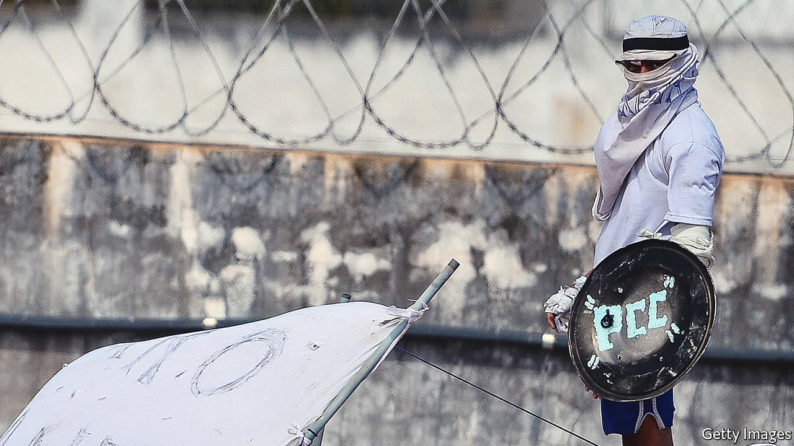

###### Crack on

# South America’s biggest gang has immense sway in Brazil 

##### First Capital Command seems to run a shadow state in parts of the country 

 

> May 14th 2022 

BOMBS AND bullets could not remove cracolândia, the largest open-air drug market in South America, from the heart of São Paulo. When violence failed, the police took away the black tents in which women weighed packages of powder. They raided the surrounding hotels, where customers ordered food on delivery apps while waiting for their illicit orders. Still, the business flowed. The dealers merely put up umbrellas and sold drugs from backpacks.

But in March cracolândia emptied. Hundreds of dealers and addicts dispersed without any sign of violence. The police initially claimed credit, but whispers said that the move had instead been orchestrated by First Capital Command (PCC), South America’s largest gang, on the orders of its imprisoned leadership. The drug-sellers, in cahoots with the PCC, are pitching up elsewhere in smaller groups.


That a gang could do what the Brazilian police could not is perhaps not terribly surprising. In some ways the PCC has set itself up as an alternative form of government, according to Gabriel Feltran, a sociologist who has studied the group for decades. Many poorer Brazilians “feel they can trust the PCC more than the state”, he says.

Last year the US Treasury named the PCC as one of the most powerful criminal organisations in the world. The group is now involved in everything from petty crime to international drug-smuggling. It first formed in São Paulo’s overcrowded prisons in the 1990s, and still counts many thousands of inmates as its members. In 2017 the PCC was behind the beheading and killing of dozens of inmates in various prisons. The group is thought to control the trade in stolen phones that plagues São Paulo, Brazil’s biggest city, where a mobile phone is reported stolen every 3.5 minutes—and, with it, access to the owner’s banking app. On April 25th a young man was shot for his phone by a fake delivery driver. After the phones have been hacked to gain access to the banking app , they are sold.

But the group has pretensions to be greater. It loftily claims to be motivated by a desire to help the “oppressed of the system”, rather than just to make a juicy profit. The gang’s rules are designed to benefit a “fraternity of crime”: it provides loans, weapons and a network of contacts to help illicit enterprises flourish. It acts like a “government of the crime world”, says Bruno Paes Manso, who co-wrote a book on it.

Indeed some think the group is behind the dramatic fall in crime in the state of São Paulo. Since 1999 its homicide rate has plunged by 80%. It has gone from being one of the most dangerous places in Brazil to one of the safest. Although police take credit for the decline, academics point out that the biggest falls occurred in the most violent suburbs, at around the time that the PCC began to make its presence felt in such places. To end the gang wars of the 1990s, the group created its own parallel court system in which to settle disputes, says Mr Feltran. It mediated among gang members’ families, churches and other members of civil society.

Today order is maintained by members known as disciplinas who hand out punishments, such as beatings, to those who break their rules. Many residents find them less threatening than the police, who killed 6,000 Brazilians in 2020. (Police in the United States, by contrast, killed 1,000 people that year.) One of the group’s maxims is, “Crime strengthens crime.” It pays to be strong where the state is weak. ■

