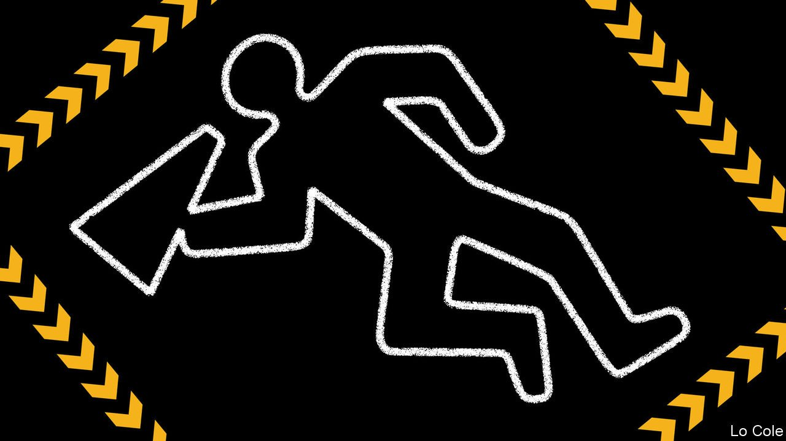

###### Bello

# The front-runner for Colombia’s election faces death threats 

##### The country has a long history of political murder 

 

> May 13th 2022 

FOR MONTHS opinion polls have made Gustavo Petro, a leftist populist, the front-runner in Colombia’s presidential election, which is due to take place on May 29th. But Mr Petro’s challenge is not just to defeat his rivals, chief among them Federico Gutiérrez, a centre-right former mayor of Medellín. It is also to stay alive. Earlier this month Mr Petro cancelled a two-day campaign trip, for reasons of security. His team said it had information that La Cordillera, a paramilitary group, was planning to kill him.

This threat conjures up ghosts from Colombia’s past. In 1989 Bello spent a day in the southern city of Palmira watching César Gaviria campaign. He was followed by three ambulances, one equipped with an intensive-care bed. He spoke from behind a bullet-proof rostrum, surrounded by a huddle of six policemen clutching Uzi submachineguns. Mr Gaviria had replaced Luis Carlos Galán, a Liberal reformer who was gunned down at a rally three months before. By the time Mr Gaviria was elected president in 1990, two more candidates, both left-wingers, had been shot dead.


Those were the days when Pablo Escobar, the boss of the Medellín drug mob, had declared war on Colombia’s political establishment. The country is much improved since then, thanks first to a security build-up, though one not free of abuses, by Álvaro Uribe, president from 2002 to 2010, and then a peace agreement with the FARC guerrillas in 2016 by his successor, Juan Manuel Santos. The murder rate fell by almost two-thirds between 2002 and 2017.

But security has deteriorated since then. Iván Duque, the current president, has failed to make the most of the peace agreement. In November he claimed to have dismantled the Gulf Clan, the largest paramilitary drug-trafficking organisation, when troops arrested its boss, Dairo Antonio Úsaga. But this month, hours after Mr Úsaga was extradited to the United States, the Clan shut down a large swathe of north-western Colombia with a four-day “armed strike”.

Mr Duque has politicised the security forces, naming as commanders people close to Mr Uribe. According to prosecutors, several retired officers have links to the Gulf Clan. When Mr Petro alluded to that in a tweet after six soldiers were killed by drug-traffickers in April, General Eduardo Zapateiro, the army commander, attacked him for using their deaths for “campaign narratives” and offered other criticisms of the candidate. Many opposition figures saw this unusual political intervention as unconstitutional, and called for General Zapateiro to be sacked. But Mr Duque defended him.

If Mr Petro wins, he would be Colombia’s first avowedly left-wing president. He was once a member of M-19, a nationalist guerrilla group. But that is not the reason he alarms many Colombians. Rather it is because until recently he was an enthusiastic supporter of the late Hugo Chávez, Venezuela’s elected autocrat. He now presents himself as a moderate and has pledged not to expropriate any businesses. But some of his proposals still seem quite extreme. He promises, for example, to guarantee public employment to all the jobless (unemployment stands at 12%) and to persuade the central bank to print money to finance the government. He wants to re-establish diplomatic relations with Venezuela. Other proposals are opposed by reactionary landowners and cattle-farmers, such as a plan to tax idle land.

Colombia is a country of checks and balances. The powerful constitutional court thwarted Mr Uribe’s attempt to turn himself into president for life. The central bank is independent. Mr Petro would lack a majority in the Congress, although he might secure one eventually.

Mr Petro wears a bulletproof vest and does not announce his venues until the last minute. If he were to be killed it would be a moral indictment of Colombian democracy that would risk a downward spiral into violence. In 1948 Jorge Eliécer Gaitán, a demagogic populist who like Mr Petro was a crowd-puller, was shot dead in Bogotá, the capital. He had said, paraphrasing the Gospel of St Luke, “If they kill me, there will not be left one stone upon another”. And so it came to pass: the centre of Bogotá was almost destroyed in days of rioting. Colombia was plunged into ten years of violence in which perhaps 180,000 people died.

That should be a warning to any would-be assassins and their sponsors. If he is elected Mr Petro may prove to be a bad president. But it is up to Colombia’s institutions to restrain him and only they can do so peacefully.

Read more from Bello, our columnist on Latin America:

 (Apr 2nd) (Mar 26th)  (Mar 19th)

