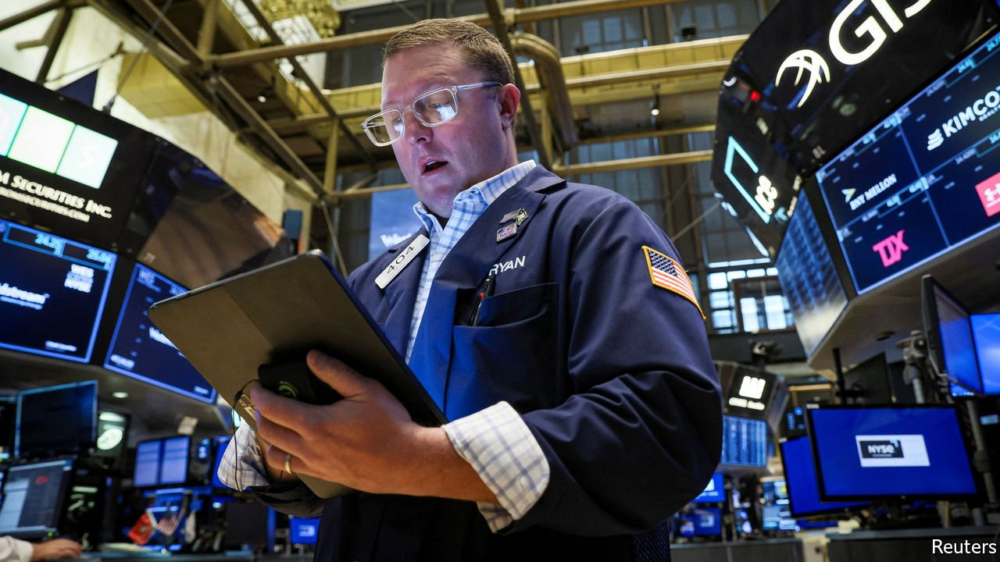
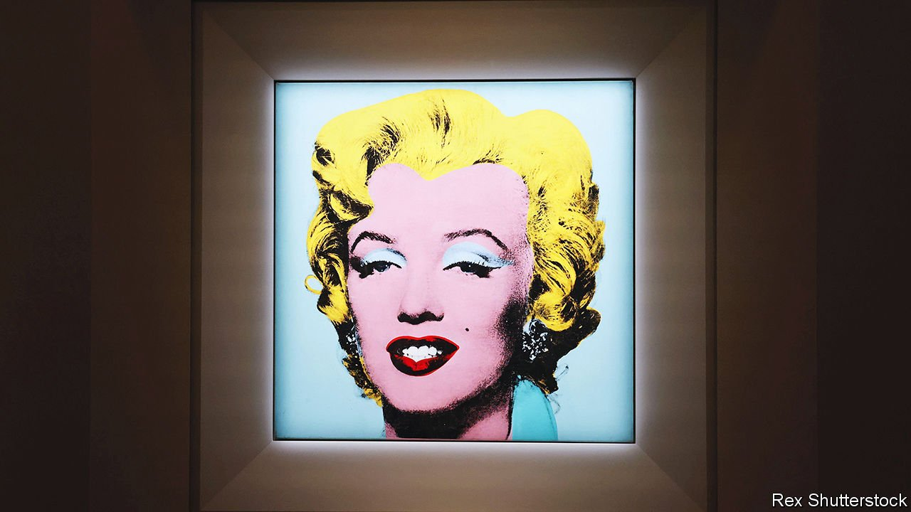

###### The world this week

# Business 

#####  

 

> May 14th 2022 

Stockmarkets endured , as investors fretted about the Federal Reserve’s aggressive moves to tighten policy, high inflation and slowing growth. After its longest weekly losing streak since 2011 the S&amp;P 500 closed below the 4,000 mark for the first time in 14 months. The Nasdaq Composite plummeted to its lowest finish since November 2020. Apple’s share price dropped by 12% over five days. The sell-off extended to stocks in Europe and Asia.

What goes up…


Cryptocurrencies took a pummelling amid the commotion, as investors pulled back from speculative assets. Bitcoin shed 30% of its value over a week. Coinbase, the biggest crypto-exchange in America, lost more than 2m users in the second quarter, a fifth of its customer base.

More data  than expected also spooked investors. With supply chains disrupted and factories closed because of covid lockdowns, the country’s exports grew by 3.9% in April, year on year, the slowest pace since June 2020.

America’s annual rate of  inflation as measured by the consumer-price index fell to 8.3% in April, from 8.5% in March, the first drop in eight months. But most economists had been expecting April’s figure to fall to 8.1%.

Christine Lagarde, the president of the European Central Bank, gave the clearest signal yet that it  will raise interest rates in July or September when she suggested that she expects such a move in the third quarter. The bank has maintained a negative rate on its deposit facility since 2014.

Hong Kong’s central bank stepped in to protect the Hong Kong dollar’s peg to the greenback for the first time since 2019. Investors have been shedding assets denominated in Hong Kong dollars as the local economy suffers from covid lockdowns and crackdowns on Chinese tech firms.

BlackRock, which two years ago warned about the risks of climate change to investments and pushed for green-friendly shareholder proposals at company meetings, said it would support proportionately fewer of them this year because they are not consistent with its clients’ interests. The world’s biggest asset manager gave several reasons, including a regulatory change in America that has increased the number of proposals of “varying quality” and the impact of the war in Ukraine on energy markets. And it won’t support shareholder votes that are intended to micromanage companies.

FIFA, football’s global governing body, and Electronic Arts, a video-game publisher, announced an end to a three-decade deal by which FIFA lent its name to an annual series of games. The deal had brought in $150m a year for FIFA, making it the organisation’s biggest commercial venture besides the World Cup.

SoftBank said its tech-focused investment funds posted a loss of ¥3.7trn ($33bn) for the year ending March 31st, pushing the Japanese conglomerate to an overall annual loss of ¥1.7trn. The value of SoftBank’s stakes in companies such as Coupang, Didi Chuxing, DoorDash and Grab have plummeted over the year, as their share prices have tumbled.

The magic kingdom

Disney allayed fears that it would follow Netflix by losing subscribers from its streaming service, when it reported that an additional 7.9m customers had signed up to Disney+ in the first quarter, taking its subscription base to 137.7m. That is still some way behind Netflix’s 222m, but Disney+ is sticking to its goal of reaching up to 260m users by 2024.

With sales from its covid vaccine set to dip in coming years, Pfizer shored up its future revenue stream by agreeing to acquire Biohaven Pharmaceuticals, which develops drugs for neurological disorders, for $11.6bn. Separately, BioNTech, the German drug company that collaborated with Pfizer to produce their vaccine, said revenue and profit more than tripled in the first quarter, year on year, though it expects sales will slow. There is now a huge glut of covid vaccines in the market.

Building on its pledge of “delivering a smoke-free future”, Philip Morris International, which makes Marlboro cigarettes, struck a deal to buy Swedish Match for $16bn. Swedish Match’s smoke-alternative products include a type of snuff called “snus”, tobacco pouches that are placed behind the upper lip.

 


Andy Warhol’s silk-screen portrait of Marilyn Monroe, “Shot Sage Blue Marilyn”, was sold for $195m at Christie’s in New York. That was a record price at auction for a work by an American artist and also for a piece of 20th-century art; the previous record was the $179.4m paid for Pablo Picasso’s “Les Femmes d’Alger (Version O)“ in 2015. The super-rich are itching to splash out after covid suppressed demand. “The expensive stuff got more expensive,” said Christie’s head of 20th-century art.

