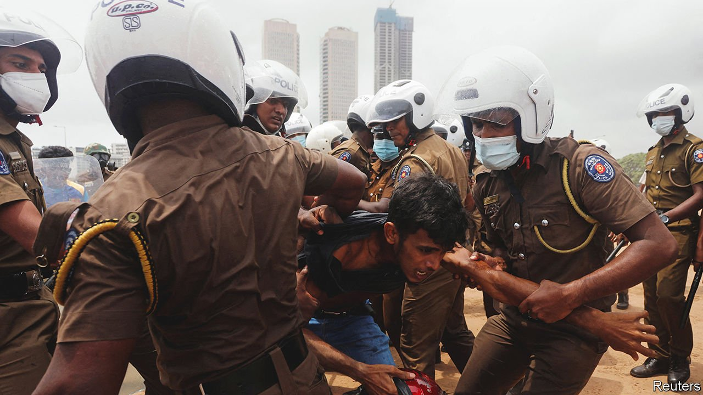
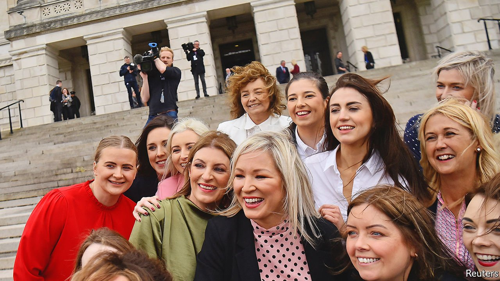

###### The world this week

# Politics 

#####  

 

> May 14th 2022 

Mahinda Rajapaksa resigned as prime minister of  amid a wave of violence, as the country endures its worst ever economic crisis. Gotabaya Rajapaksa, the president and Mahinda’s younger brother, also came under pressure to step down. Protesters burned down politicians’ houses and a museum dedicated to the Rajapaksas, whom they blame for crippling shortages of food and fuel and for runaway inflation. Gotabaya called for the opposition to join a government of national unity and ordered the army to shoot rioters on sight.


Ferdinand Marcos junior, better known as “Bongbong”, won the Philippines’ presidential election. The son of a former dictator, who was overthrown by the “People Power” revolution in 1986, Mr Marcos asked not to be judged by his ancestors but by his actions. One of his first actions was to visit his father’s grave in Manila. Sara Duterte, the daughter of the outgoing president, Rodrigo Duterte, won the vice-presidency.

The Taliban issued a decree that in effect requires women in Afghanistan to wear a veil in public whenever they leave their homes.

The authorities in Shanghai . A weeks-long lockdown has pushed daily new cases well below their recent peak, but China’s biggest city is still struggling to extinguish an outbreak. Food deliveries have been banned in some areas and hospital visits must be approved. Neighbours of anyone infected are often being forced into quarantine.

North Korea  after admitting to its first covid infections since the pandemic began more than two years ago.

John Lee was chosen to lead Hong Kong by a 1,500-member committee packed with Communist Party loyalists. He was the only candidate. Mr Lee oversaw the crackdown on pro-democracy protesters in 2019. He has embraced a draconian national-security law that the central government imposed on the territory in 2020. Meanwhile, Cardinal Joseph Zen, an outspoken advocate of democracy, who is 90, was arrested in Hong Kong for allegedly colluding with foreign forces.

A new Helsinki accord

Finland’s president and prime minister recommended that the country formally join NATO, a potential reversal of 80 years of neutrality. Before Russia’s invasion of Ukraine only about 20% of Finns supported membership; that figure is now around 70%. Sweden is also expected to say it will join. One of the supposed goals of Russia’s invasion was to stop NATO’s expansion; if the two countries’ parliaments approve the change, it will have achieved the opposite.

Vladimir Putin, Russia’s president, announced no new initiatives in the war in  Ukraine in a  to commemorate victory in the second world war. He declared neither victory, as some had expected, nor an escalation of the war. The conflict is becoming more static, with intelligence analysts in America and elsewhere now predicting a stalemate. Ukrainian troops have succeeded in driving Russia back from Kharkiv. The last defenders of the city of Mariupol continue to resist a Russian siege. But Russia has made small territorial gains in the Donbas region and still seems to be aiming to cut off Ukrainian forces there.

America’s House of Representatives approved an extra $40bn in military and humanitarian aid for Ukraine. There was some resistance from Republicans, which could slow the bill’s passage in the Senate. America imposed more sanctions on Russia, and the G7 made a commitment to ban Russian oil imports “in a timely and orderly fashion”.

Jill Biden, Joe Biden’s wife, visited a border town in Ukraine, where she met Olena Zelenska, the wife of Ukraine’s president. It was Mrs Zelenska’s first public appearance since the Russian invasion began in February.

 


In Northern Ireland the nationalist Sinn Féin party took the most seats in assembly elections. It is the first time since Ireland’s partition in 1921 that unionists have not been the biggest party in the province. Disagreement over the Northern Ireland protocol, a post-Brexit deal which creates a customs barrier with the rest of the United Kingdom, is  to restoring the government in Belfast.

Shireen Abu Aqleh, a prominent Palestinian journalist for Al Jazeera,  while reporting on a clash between Israeli forces and Palestinians in the restive West Bank town of Jenin. Colleagues at the scene blamed the Israeli army, which said she may have been shot by Palestinian gunmen. Israel’s foreign minister offered a joint Israeli-Palestinian inquiry. A few days earlier, three Israelis were killed by two Palestinians wielding axes, the latest in a wave of terrorist attacks in Israel.

The IMF resumed lending to Mozambique, having suspended it six years ago after it emerged that the country had $2bn in undisclosed debts. Credit Suisse, which arranged the loans, was fined last October for failing to carry out due diligence; its bankers pocketed some of the cash.

Islamic State West Africa Province, a Nigerian terrorist group, released a video purporting to show the murder of 20 Christians in the north-eastern state of Borno.

Colombia sent 2,000 members of the security forces to deal with a spate of violence by the Gulf Clan, a criminal gang, in reprisal for the extradition to America of its leader, Dairo Antonio Úsuga, known as Otoniel. President Iván Duque claims that Otoniel is the world’s most dangerous drug-trafficker.

The outsiders

Andrés Manuel López Obrador, the president of Mexico, visited Cuba and praised his communist counterpart there. Mr López Obrador threatened to skip a gathering in Los Angeles in June of governments from across the Americas unless the United States also invites Cuba, Nicaragua and Venezuela.

A 28-year-old woman in El Salvador was sentenced to 30 years in prison for the death of her unborn child following an obstetric emergency. Abortion is illegal in the country.

Republicans in America’s Senate blocked a bill that would override state laws and give women a right to abortion. The legislation was never expected to pass but marks the first attempt by Democrats to enact such a right following the leak of a draft decision of the Supreme Court that would, if adopted, . Some Republicans would like to go further still and try to impose an outright national ban.

