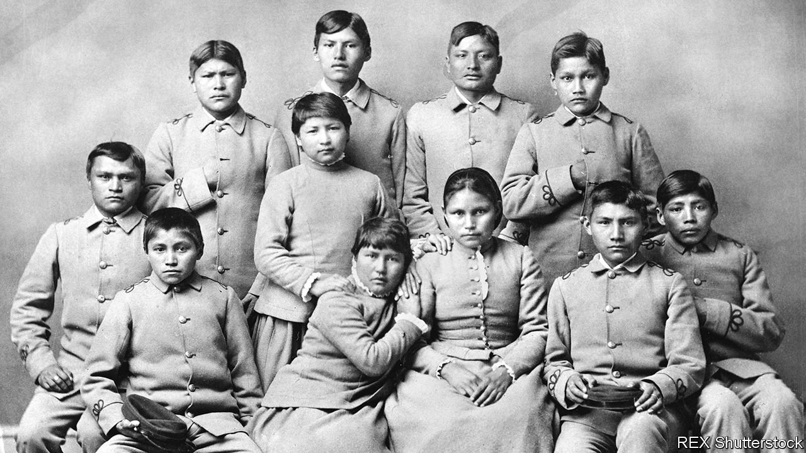

###### Forced assimilation

# A report on Native American boarding schools shows their horrors 

##### Some of the children never returned home 

 

> May 14th 2022 

SOPHIA TETOFF was 12 years old in 1901 when she was sent 4,000 miles from her island home in the Bering Sea to Carlisle, an Indian boarding school in Pennsylvania. Sophia was a member of Alaska’s Unangax people. Five years later, she died from tuberculosis. She was buried in the school’s cemetery and largely forgotten. Her name on her headstone was misspelt. Her tribe’s name was incorrect. Sophia was one of thousands of children separated from their communities, often forcibly, and sent to Indian boarding schools.

Last summer Deb Haaland, the secretary of the interior, whose department manages the Bureau of Indian Affairs, announced the Federal Indian Boarding School Initiative, a comprehensive review of the troubled legacy of such policies. On May 11th Ms Haaland, the first Native American cabinet secretary, released the first volume of the review. The investigation found that from 1819 to 1969, the federal Indian boarding-school system had 408 schools across 37 states or territories. Burial sites were identified at 53 schools (as the investigation continues that number is expected to rise). The Indian children who died at schools far from their families could number in the tens of thousands.


“The consequences of federal Indian boarding-school policies…inflicted upon generations of children as young as four years old are heartbreaking and undeniable,” said Ms Haaland. Forced-assimilation practices included cutting off the children’s long hair, and stripping them of their traditional clothing, language and culture. The government mixed children from different tribes to disrupt connections and force the use of English. There was rampant physical, sexual and emotional abuse as well as malnourishment, disease and overcrowding. Many children were sent out to farms and businesses for months of manual labour. The schools often pocketed their wages.

Ms Haaland was moved to shed light on these traumas by the discovery of hundreds of unmarked graves connected to Indian residential schools in Canada. The review found much evidence of intergenerational trauma caused by family separation and cultural eradication. Ms Haaland’s own grandparents were stolen from their families and sent away to school. Her great-grandfather was taken to Carlisle.

Carlisle was used as a model for other schools. Its founder, Richard Henry Pratt, infamously said in 1892, “Kill the Indian in him, and save the man.” His outlook was not novel. As far back as George Washington it was part of federal policy. Indian territorial dispossession and assimilation through education was considered a cheap and safe way of subduing Native Americans. By 1926, 83% of Indian school-age children were attending boarding schools.

The initiative will continue its search for burial sites. It also intends to identify surviving boarding-school pupils to document their experiences. And it will explore the potential repatriation or disinterment of children’s remains. Sophia’s remains, along with those of nine Rosebud Sioux children, returned to Alaska and South Dakota last summer, where they were welcomed home by their communities. At the review’s unveiling Deborah Parker, head of the National Native American Boarding School Healing Coalition, said: “Our children deserve to be brought home.” ■

For exclusive insight and reading recommendations from our correspondents in America, , our weekly newsletter.

