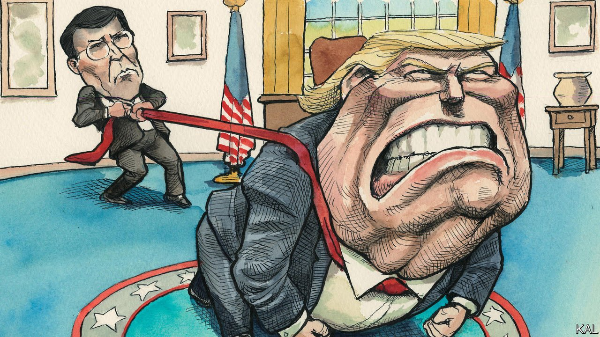

###### Lexington

# Donald Trump’s accommodation with violence 

##### Mark Esper’s memoir of the dying months of the Trump administration is a frightening read 

 

> May 14th 2022 

AHEAD OF THE mid-terms in 2018, the New York Times published a sensational piece from a “senior official” in Donald Trump’s administration who claimed to be “working diligently from within to frustrate parts of [the president’s] agenda and his worst inclinations”. After it emerged that the author was Miles Taylor, a little-known staffer in the Department of Homeland Security, the Times was accused of mis-selling. Yet it turns out Mr Taylor’s words were before long equally true of the secretary of defence.

In his much more lurid confessional, “A Sacred Oath”, Mark Esper describes his tenure at the Department of Defence as an 18-month white-knuckle effort to prevent Mr Trump starting “unnecessary wars”, launching “strategic retreats” and causing “politicisation of the DOD” and “misuse of the military”. And to do so while avoiding getting sacked, because that would probably lead to Mr Trump replacing him with one of the sycophants and crazies the president was increasingly surrounding himself with.


On the plus side, Mr Esper, a former defence-industry lobbyist, claims to have helped persuade Mr Trump not to shoot Black Lives Matter protesters (“Can’t you just shoot them. Just shoot them in the legs or something?” the president asked the chairman of the joint chiefs of staff); or to withdraw American troops from Afghanistan and Germany; or launch “missiles into Mexico to destroy the drug labs”. Yet Mr Esper, by his admission, could at best mitigate the damage Mr Trump did. He was fired in November 2020, after which the president carried out the feared purge of senior Pentagon staff and their replacement with some of the most malign or inept individuals in his coterie.

Hair-raising accounts of the Trump presidency are now so familiar it is easy to become complacent about them. Mr Trump’s authoritarian instincts and lack of principle are a matter of record. Even so, Mr Esper’s memoir stands out for a few reasons.

One is the credibility of his revelations. A stolidly partisan establishment conservative, plucked from relative obscurity by Mr Trump, he owed him everything, resented his left-wing critics, got along with many of his henchmen and took a fairly relaxed view of the president’s foul-mouthed eccentricities. He appears to have taken such little note of Mr Trump’s behaviour in the first three years of his presidency that Mr Esper was surprised the first time he heard Mr Trump announce a sudden withdrawal from South Korea and call Vice-President Mike Pence and other members of his top team “fucking losers”. (The Pence incident “really caught my attention”, Mr Esper writes in wonder.) Having risen higher than he could have expected to, he is also eager to see the upside in whatever he did. He claims to have run an unusually harmonious Pentagon leadership team, to have overseen a golden age of co-operation between the Defence and State Departments, to have moulded Mr Trump’s wild orders into all manner of policy successes. “Judgments should be made…on the lemonade that was made, rather than the lemons that were handed to us.”

That, importantly, chimes with a common defence of Mr Trump which Republican politicians are already starting to dust off, as the prospects of his running again in 2024 increase. He was unconventional, but had great and successful policies, it is said. Yet, as Mr Esper makes clear, unwittingly at times, that was not true. The Trump administration did a lot of solid work, as all governments do (and, who knows, perhaps the changes Mr Esper made to defence recruitment and spending programmes were as groundbreaking as he claims). But such progress was generally made despite Mr Trump, often surreptitiously. And much of what the president touched directly was a disaster.

He was the biggest leaker in the leakiest of administrations. He was unable to make decisions, unable to maintain a consistent policy, was forever wasting his cabinet members’ time with meetings that would turn, no matter the subject under discussion, into extended presidential rants on “his greatest hits of the decade: NATO spending, Merkel…closing our embassies in Africa”. He badgered Mr Esper obsessively about the ugliness, in Mr Trump’s view, of American battleships (“He wanted to see ships that looked more like yachts”). He claimed to be tough on China but, according to Mr Esper, was inconsistent, weak and pandering until, seeking a distraction from his mismanagement of covid-19, he started talking tough ahead of the 2020 election.

Describing the changes that Mr Trump and his White House team underwent in the late stages of his term is Mr Esper’s other big contribution. The president’s demands—motivated entirely by personal political calculation, the former defence chief says—grew more outlandish and brutal. Mr Trump, for all his thuggishness, had had a long-standing distaste for violence. But over the final 18 months of his term, Mr Esper writes, “the president or some of his top White House aides proposed to take some type of military action in or against other nations on multiple occasions…Other recommendations were so careless that they easily could have provoked a conflict.” Including at home, given Mr Trump’s frenzied demand for violence against racial-justice protesters in the wake of George Floyd’s murder. His late-stage cast of sycophants, led by Mark Meadows and Robert O’Brien (both of whom Mr Esper despised), encouraged his worst instincts.

Esper-sensory perception

It is a chilling account, which has elicited not a breath of concern from Mr Trump’s party. The large majority of Republicans who did not break with him over the deadly Capitol riot will not leave him now. Whether Mr Trump will be the next Republican presidential nominee appears to be largely for him to decide. Yet it is already clear, from Mr Esper’s and other accounts, that if he does return to the White House Mr Trump and his cabinet will be very different from their earlier versions. Trump II would be more reckless and aggrieved, and probably much less restrained. ■

Read more from Lexington, our columnist on American politics:

 (May 5th) (Apr 30th)

 (Apr 23rd)

For exclusive insight and reading recommendations from our correspondents in America, , our weekly newsletter.

