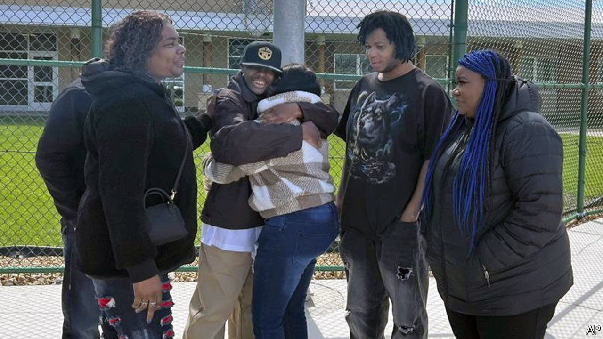
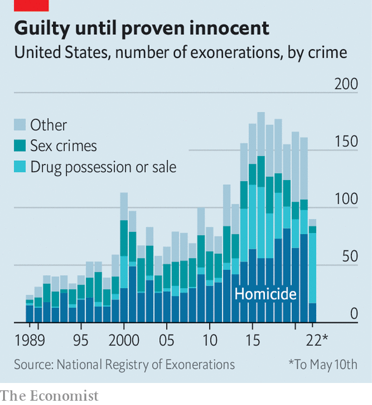

###### 27,080 years of lost freedom, and counting

# Exonerations in America have risen, and their pattern is revealing 

##### “Professional exonerators” were responsible for 60% of overturned convictions last year 

 

> May 14th 2022 

IN THE AUTUMN of 2006, two teenage girls were sexually assaulted in Detroit. Within weeks, the police had their man. Terance Calhoun, a local 19-year-old, was spotted in a liquor store nearby and appeared to match the composite sketch the police had produced. He pleaded no-contest in February 2007 and was dispatched to prison.

There was just one problem: he didn’t do it. A follow-up investigation in 2019 found a litany of red flags in how the case was handled, including an unrecorded police interrogation and the fact that Mr Calhoun, who was found to be cognitively deficient, had been questioned without a lawyer present. On April 27th, after 15 years behind bars, he was exonerated.

 


He was not alone. The government does not record figures, but in 2012 a pair of professors founded the National Registry of Exonerations (NRE) to keep track. It counted 161 exonerations last year, up more than sixfold compared with 1989, when there were just 24 (see chart). These shed light on weak spots in America’s justice system.


An exoneration “doesn’t just happen on its own”, says Barbara O’Brien of Michigan State University, who runs the NRE. A crucial development has been the rise of “professional exonerators”. These were spurred by improvements in DNA testing, which spread public awareness of mistakes, and can take two forms. First, advocacy groups such as the Innocence Project play a role in lobbying for individual cases. The WMU-Cooley Innocence Project, a part of Western Michigan University’s law school, was a critical component in Mr Calhoun’s case. Second, and perhaps more important, are Conviction Integrity Units (CIUs), branches of prosecutors’ offices tasked with investigating possible miscarriages of justice. Together, these professional exonerators were responsible for 60% of overturned convictions last year.

Some CIUs require cases to be DNA-based; a few consider only cases which have been tried (as opposed to ones with guilty pleas); others look at every application. Once it takes on a case, a CIU combs through police files, court transcripts and lab results, in search of flaws. The CIU in Wayne County, Michigan, pieced together the alarming story of Mr Calhoun’s conviction. It found that the DNA analysis of a condom at the second crime scene, completed just three months after his conviction, had excluded him as its potential donor. This result was apparently never shown to Mr Calhoun’s lawyers. Other discoveries included the fact that one of the victims had clearly described a perpetrator with “braids” and a distinctive “puzzle tattoo”, neither of which Mr Calhoun had.

Since the first CIUs were established in the early 2000s, 93 other jurisdictions have followed. Last year 16 were formed, from Bessemer, Alabama, to Monterey, California. Minnesota set up a statewide CIU last August. Yet many are understaffed and under funded, and they remain few in number relative to the more than 2,400 elected prosecutors across the country.

Official misconduct is the main reason behind most exonerations: it played a role in 102 of the 161 cases last year. In 2012, for example, Ronald Watts, a Chicago police sergeant, was arrested for stealing federal funds from an undercover FBI informant. It gradually emerged that he had been planting drugs and extorting victims over the course of a decade, stitching them up on bogus charges if they refused to pay. Starting in 2016, the CIU in Illinois’s Cook County began identifying and tossing out all convictions linked to him. So far over 100 have been overturned.

Mistaken eyewitness identification accounts for about a third of exonerations. Misleading forensic evidence is relatively rare, responsible for roughly 20% of wrongful convictions. Other factors include perjury and, as in Mr Calhoun’s case, false or coerced confessions. Nearly three-quarters of the exonerated who falsely confess have been found to be mentally ill or intellectually disabled.

Since 1989 the NRE has recorded more than 3,000 exonerations in America, amounting to 27,080 years of lost freedom. That is just the tip of the iceberg. Samuel Gross, one of the project’s co-founders, estimates that the wrongful-conviction rate may be as high as 2%, or some 20,000 false felony convictions a year. Finding and overturning those injustices is essential work—for Mr Calhoun, now in his mid-30s, and the many others like him. ■

For exclusive insight and reading recommendations from our correspondents in America, , our weekly newsletter.

