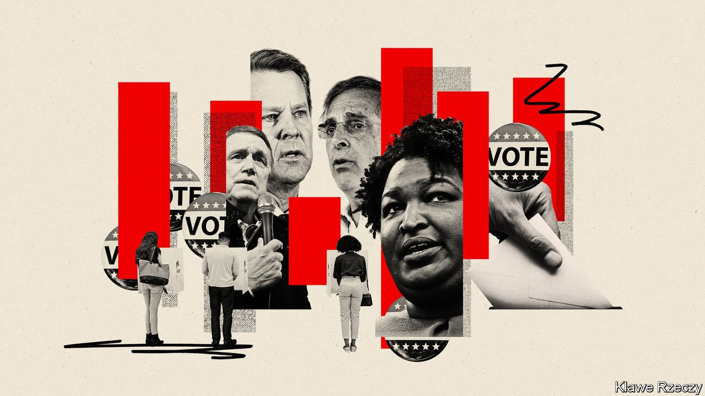

###### America’s mid-term elections

# Georgia will again be at the centre of fights over electoral fairness 

##### The state is perhaps the most important case of Republicans’ intra-party struggle, nationwide 

 

> May 14th 2022 

THE CENTRAL schism of the Republican Party is not particularly well-concealed. In the first primary debate to be the party’s nominee for governor of Georgia, held on April 24th in Atlanta, it came into stark relief from the opening sentence. “First off, let me be very clear tonight. The election in 2020 was rigged and stolen,” said David Perdue.

The ex-senator,  in January 2021, is now trying to resurrect his fortunes by playing Donald Trump’s anointed avenger against Brian Kemp, the incumbent governor. Mr Kemp is hardly a weak-wristed moderate. In 2018 he was the politically incorrect (and Trump-endorsed) candidate who won his primary by running ads  “criminal illegals” in his pickup truck and exhibiting an impressive gun collection to a nervous suitor of his daughter. Yet in 2022 he is being denounced by Mr Trump as a “ RINO [Republican in name only] sell-out”. His sin: not overturning the 2020 election after the former president’s spurious claims of voter fraud.


Mr Trump’s  is clear, even in the aftermath of the attack by his supporters on Congress on January 6th 2021. But the extent of his kingmaking powers is being closely scrutinised in the mid-term party primaries. Among Republicans, the main prerequisite for securing Mr Trump’s approval is not any policy commitment but perceived fealty to him and his lost cause. He has solicited primary challengers against many of the ten Republican members of the House of Representatives who voted to impeach him after the January 6th attack—most will probably be out of office by year’s end. In Michigan, acolytes of his “stop the steal” faction have already won the party’s nomination to be attorney-general and secretary of state (the chief elections officer).

Georgia is perhaps the most important case of the nationwide intraparty struggle. In 2020 the presidential-election results were the tightest in the country. Just 0.24% of the vote separated President Joe Biden from Mr Trump, a remarkable upset in a state which no Democrat had won since 1992. Mr Trump and his proxies waged  on fellow Republicans like Mr Kemp and Brad Raffensperger, the secretary of state, to manufacture evidence to overturn his loss. When multiple audits failed to turn up any such evidence, Mr Trump, in a now infamous phone call, asked for Mr Raffensperger to help “find 11,780 votes”.

For refusing his overtures, the president placed both men on his enemies list. As early as December 2020, Mr Trump was encouraging primary challenges to Mr Kemp. Defying the president was thought to have doomed both as dead men walking, politically speaking. In the immediate aftermath, state and local Republican committees booed both and passed resolutions of censure. And yet, remarkably, both are standing again—and have a reasonable chance of survival. The polls show Mr Kemp leading by enough to win an outright majority on May 24th and avoid a run-off.

“My job is to make sure that Brad can look in the mirror every day, knowing that I fought for integrity. And I have walked the line to make sure that I followed the constitution,” says Mr Raffensperger, sitting in the headquarters of the engineering-design firm he founded in a town called Suwanee. (Before the hoopla of 2020, he was a little-noticed and soft-spoken structural engineer.) He is hoping to stave off a Trump-endorsed, stop-the-steal enthusiast, Jody Hice, a congressman who aims to “to stop Democrats before they rig and ruin our democracy for ever”. The two are in a tight race that is likely to require a run-off on June 21st.

Neither Mr Raffensperger nor Mr Kemp is adopting the position of Never Trumper or party dissident, however. Asked why he is standing for re-election, Mr Raffensperger replies that, “for Georgia voters, the number-one issue is to make sure that only Americans vote in our elections”. When asked why he does not make much of the stand that made him a (relatively hard to pronounce) household name, Mr Raffensperger says that is “because America always looks forward”. His references to it are unmistakable but oblique: “History has shown that good always triumphs over evil. And truth always triumphs over untruth…I don’t mean to be philosophical about it,” he says, almost apologetically.

Both Mr Kemp and Mr Raffensperger prefer to spend their time criticising Stacey Abrams, a progressive icon who will again be  for governor. Mr Kemp argues that he is the best placed to spoil her chances of becoming governor—or even president after that. Mr Raffensperger claims she is agitating for changes to election administration that will leave it susceptible to fraudulent votes by non-citizens. Ms Abrams narrowly lost her election in 2018 to Mr Kemp, but refused to concede, blaming voter suppression for her loss and firing off a federal lawsuit, which is still ongoing. In his book, Mr Raffensperger writes about his “unshakable sense of déjà vu” in 2020 after his experience of the 2018 election.

Controversial new rules are in place, too. In 2021 the Republican-controlled Georgia legislature passed SB202, a law making changes to rules on drop boxes for absentee ballots, early voting and mail-in voting. It also, seemingly punitively, removed Mr Raffensperger as chair of the state elections board, and made it easier for the state to take over county election boards it deemed to be failing.

Progressive legal groups are arguing in court that the tactics amount to voter suppression. “ SB202 has made it worse in my mind because one tactic of voter suppression that has been effective is confusion,” says Nsé Ufot, chief executive officer of the New Georgia Project, a voter-registration outfit founded by Ms Abrams. The organisation has set ambitious aims for itself: to register 55,000 new young and minority voters and turn out an additional 150,000 citizens who have not voted before. For Ms Ufot, the stakes feel downright existential. “There’s a clarity among people who run elections about what is at stake,” she says. “Trying to avoid a constitutional crisis focuses the mind in a real way.”

The bad blood between old rivals and the bipartisan tradition of crying foul augur a particularly contentious general election in Georgia. The primary may be more important still: Republicans who believe, against all available evidence, that the past election was stolen because their champion did not win are vying to be in place to certify the next presidential vote. Not long ago, a rematch between Mr Kemp and Ms Abrams might have been seen as a fiendishly fraught outcome. Somehow, it now appears to be the tamer option. ■

For exclusive insight and reading recommendations from our correspondents in America, , our weekly newsletter.

