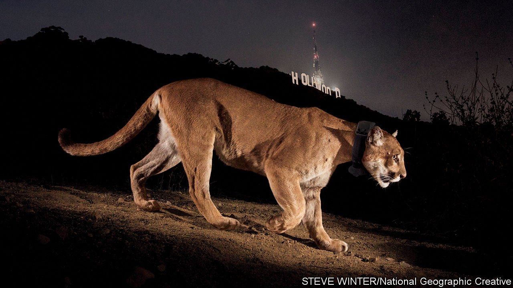

###### The concrete jungle

# How Los Angeles hopes to save its endangered mountain lions 

##### High above Route 101, the city is building the biggest wildlife corridor in the world 

 

> May 14th 2022 

LOS ANGELES, as everyone knows, is a noodle bowl of highways. As everyone may not know, it is also one of only two cities in the world where big cats roam wild inside the city boundaries (the other is Mumbai). One even took up residence near the Hollywood sign. But big cats and highways do not mix, which is why Los Angeles will soon be home to one of the world’s biggest wildlife corridors.

The cats in question are mountain lions. They live in the Santa Monica Mountains. Their numbers are stable. Their habitat is mostly pristine wilderness, full of deer, the lions’ prey. The ecology of their range, the largest urban national park in the world, is healthy, thanks in part to their presence as an apex predator. Yet animals can come under threat without habitat loss. Genetic degradation can be just as deadly.


Slicing through the mountains is Route 101, carrying up to 10,000 vehicles an hour. It cuts the Santa Monica range off from a larger wilderness to the north. The southern tract is not big enough for all the lions, which each require hunting grounds of 60-150 square miles (160-390 square kilometres). The result is a population trapped on an environmental island, with inbreeding and genetic degradation. A study in 2016 found that, given their environment, the Santa Monica mountain lions’ chances of extinction in 50 years would be 15-22%; because of their genetic deterioration, the chance of extinction was more like 99.7%.

Four years after that study came the first evidence that the big cats were suffering physical damage: a young male was found with a 90-degree kink in his tail and with only one testicle descended. Researchers had seen that before. In the early 1990s biologists studying the Florida panther, a closely related animal, found that many of the males had the same genetic flaws. The Florida panther escaped extinction only thanks to the introduction of females brought from Texas to refresh the gene pool.

California does not need to go that far. There are healthy mountain-lion populations north of the Santa Monica range, separated by the ribbon of road. Hidden cameras show the animals crouched at the side of the highway, not daring to cross. The solution is a 165-foot-wide (50-metre) dirt bridge which would allow them to pad high over the traffic.

Such corridors have worked elsewhere, from large spans for elk over the Trans-Canada Highway to a dinky clawbridge for migrating red crabs on Christmas Island. Angelenos raised money for theirs in a campaign that dubbed the animal in the Hollywood Hills the “Brad Pitt of mountain lions” (handsome, ageing, single). Last month the governor, Gavin Newsom, launched construction.

The animals become sexually mature at 2½ to 3 years and have cubs every other year. So within ten years of the corridor’s completion the great-grandchildren of the first mating beyond the mountains could have cubs. Genetically, even a few matings would make a difference. “We’ll definitely save the mountain lion,” thinks Paul Edelman of the Mountains Recreation and Conservation Authority. “It’s just a matter of how long it takes.”

For exclusive insight and reading recommendations from our correspondents in America, , our weekly newsletter.

