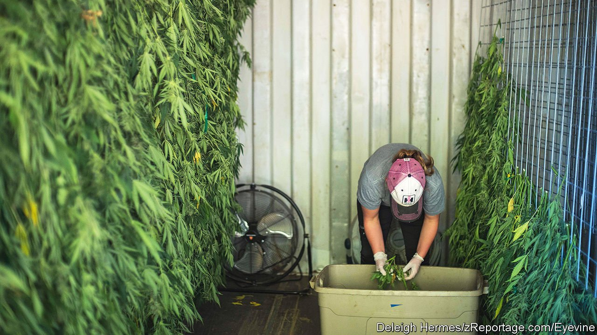

###### High maintenance

# In California, the world’s largest legal weed market is going up in smoke 

##### The state’s pot industry hopes federal legalisation will help. It may instead be its death knell 

 

> May 14th 2022 

KAREN AND TOM HESSLER moved to their remote corner of Humboldt County, California, in 1971. Distrust of the government during the Vietnam war and a desire to live off the land drove them to settle in Ettersburg, some 225 miles (360km) north of San Francisco. “We thought we’d come out into the wilderness, and we could just do our thing,” Mrs Hessler says. The only way to get to the Hesslers’ farm is to navigate miles of serpentine dirt roads through northern California’s towering redwoods. The isolation that so intrigued “back to the land” hippies like the Hesslers also turned Humboldt County into the cannabis capital of California—and, therefore, America.

Humboldt, Mendocino and Trinity counties make up the “Emerald Triangle”, an area roughly the size of Massachusetts famous for growing weed. Locals say the dense forests act as a “redwood curtain”, affording farmers seclusion when cannabis was still illegal. For decades cannabis farmers were seeing green. Johnny Casali, a small farmer in Humboldt County, says he remembers selling some of his crop for $5,800 a pound ($2,600 a kg) in 1990.


California legalised medical marijuana in 1996 and recreational cannabis in 2016. The state is now the largest legal weed market in the world, raking in $5.2bn in sales in 2021. Proposition 64, the ballot measure that allowed recreational weed, was heralded as a way to shrink the illicit market, and give those harmed by the war on drugs a chance to join the legal economy. Some of that has happened. Mr Casali was released in 2004 after serving eight years in prison. He now runs a legal cannabis farm.

However, many cannabis businesses in California are floundering. Supply surged as more growers entered the legal market. In 2017 ERA Economics, a consultancy, estimated that California consumes 2.5m pounds of the 13.5m-15.6m pounds of weed produced there each year. Farmers and shop owners complain that onerous taxes and rules make running a profitable legal weed business nearly impossible. Last autumn was “a perfect storm of everything that could have gone wrong”, says Nicole Elliott, California’s top pot regulator. Prices fell to $400 a pound; the cultivation tax, of $161 a pound for buds, was raised because of inflation; and labour was scarce.

The price has recovered somewhat; in April it was about $800 a pound. But the legal framework set up by Proposition 64 spells long-term trouble. It gave local municipalities the power to decide whether they would allow cannabis to be grown and sold. In their forthcoming book “Can Legal Weed Win?” two economists, Robin Goldstein and Daniel Sumner, argue that local control ensured that the illegal market would continue to flourish in places where legal weed was banned. Local control also helps explain why California lags behind nine states in weed shops per person. By comparing sales figures with drug-use surveys, Messrs Goldstein and Sumner estimate that only about 25% of the weed sold and consumed within California is legal. Many pot farmers in Humboldt say that some of their fellow growers have gone back underground to make a profit.

One way to try to stamp out the illegal market, including the organised-crime groups which have set up shop in the Emerald Triangle, is to ramp up enforcement. But that is not popular among officials who want to make up for the trauma inflicted during the war on drugs. In the 1980s, “it was like the military coming in,” says William Honsal, Humboldt County’s sheriff. “A lot of the old farmers still have PTSD based upon the helicopters flying low.” He says his department doesn’t have the resources anymore to go after illegal farmers even if it wanted to. Of the 120 deputies that roam Humboldt, only four are devoted to smoking out illegal cannabis.

Programmes to help former offenders have fallen short. An investigation by the Los Angeles Times, published in January, found that at least 34,000 old drug charges for marijuana had yet to be cleared.

Wake up and smell the weed

Chipping away at local control by incentivising—or compelling—cities to join the legal market might help the industry. But the change farmers want most is tax reform. Some cities and counties have suspended local taxes on cannabis. Gavin Newsom, California’s Democratic governor, has promised to “look at tax policy to stabilise the market”. Meanwhile, Humboldt farmers are getting crafty to keep their businesses afloat. Some take part in cannabis tours, where Bay Area potheads are whisked to different farms to see what happens behind the redwood curtain.

Humboldt farmers hope federal legalisation will save them by creating a national market. “When California cannabis becomes legal”, says Mr Casali, “the Emerald Triangle will be the Napa Valley of weed.” They might be disappointed. Because interstate commerce is banned, states that might have bought California pot have instead built their own industries. If and when weed is legalised, these states may strive to prop up their local businesses.

California may also have trouble competing with lower-cost states. Industrial, indoor farms have proliferated as the cannabis industry has begun to resemble Big Ag. But the state’s high energy costs make growing pot indoors expensive. In future farmers may choose to grow in somewhere like Oklahoma—a medical-only state that licenses new businesses quickly—rather than California, where they must also contend with high taxes and burdensome regulations. “People gotta wake up in California, man,” warns Mr Hessler, “before it’s way too late.” ■

For exclusive insight and reading recommendations from our correspondents in America, , our weekly newsletter.

