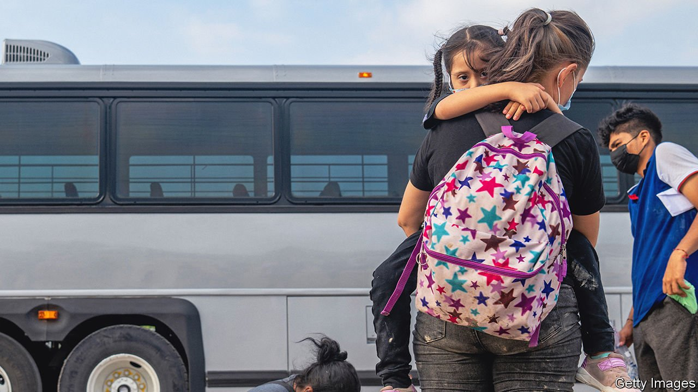

###### Meanness to migrants

# Texas’s governor wants to deny education to undocumented migrants 

##### How serious is Greg Abbott about challenging a 40-year-old federal precedent? 

 

> May 14th 2022 

AMERICA GUARANTEES every child living within its borders a free public education. This could change if Greg Abbott, Texas’s Republican governor, has his way. He has said he intends to challenge a Supreme Court ruling that obliges states to provide free schooling to undocumented immigrants. Perhaps as many as 183,000 pupils are currently in Texas’s schools.

For nearly a century every state has required children to attend school. Compulsory-education laws began in colonial days. The rationale was that an educated citizenry was needed for a democracy.


In 1975 Texas revised a law to prevent undocumented children from enrolling in public schools and to allow the state to withhold state funds from districts that educated them. A class-action lawsuit was filed on behalf of Mexican children in Texas who were unable to prove they had come to America legally. Texas lost in the district court, appealed, and the case (called Plyler v Doe) was argued before the Supreme Court in 1981. The state lost again: in 1982 the court ruled 5-4 that undocumented children had a right to attend free public school under the Equal Protection Clause of the Fourteenth Amendment. But in a radio interview on May 4th, Mr Abbott said that he plans to challenge this ruling.

About 1.7m undocumented immigrants live in Texas, estimates the Migration Policy Institute, a think-tank in Washington, DC. Texas experienced the second-largest absolute growth of immigrants (after Florida) between 2010 and 2019. Mr Abbott may see an opportunity for his upcoming gubernatorial race. According to polling by The Economist/YouGov, 95% of Republicans say that the issue of immigration is important. Appearing tough on immigrants could be politically advantageous.

The controversy over a leaked Supreme Court draft opinion to overturn the constitutional right to abortion established in Roe v Wade may also provide an opening. “Conservatives have long wished to get out of providing state services of all kinds to illegal immigrants,” says Geoff Kabaservice, a historian at the Niskanen Centre, a centre-right think-tank. Given the likely reversal of 50 years of settled law, Mr Kabaservice reckons, Mr Abbott thinks now is a good time to “overturn as many of these kinds of precedents that apply to public services as he can”.

Undocumented immigrants have continued to face barriers in education. A study from Stanford University found that local police partnerships with Immigration and Customs Enforcement, America’s immigration-enforcement agency, reduced school enrolment within two years among Hispanic pupils by nearly 10% compared with districts without such policies. The programme displaced over 300,000 Hispanic pupils in America between 2005 and 2011. In 2011 a new law in Alabama required public schools to determine the citizenship and immigration status of children enrolling in school. (It was eventually blocked.) The Trump administration sought ways to prevent undocumented children from enrolling in school, but gave up on the effort.

Mr Abbott thinks Texas spends too much educating such children. Rice University’s Baker Institute for Public Policy estimates the cost at $1.5bn in 2018 (less than 3% of the state’s outlays on education). This may be an overestimate. “Marginal cost might be a better way to look at it,” notes Alex Nowrasteh of the Cato Institute, a libertarian think-tank. “Adding one more student does not increase cost very much…It’s not like they are going to shut down a school.” A full calculation should also consider tax revenues. The Baker Institute estimates that revenue collected from undocumented immigrants exceeds state expenditures on them by $421m.

How serious is Mr Abbott’s intent? A successful challenge to Plyler would take years, from passing state legislation to the subsequent legal challenges and an eventual Supreme Court decision. “This is a 40-year-old precedent at this time on the federal level. I don’t think there’s a lot of appetite to pursue this,” says Mr Nowrasteh. Maybe, but there is appetite for the politics of it—and conservatives have Supreme Court precedents in their sights. ■

For exclusive insight and reading recommendations from our correspondents in America, , our weekly newsletter.

