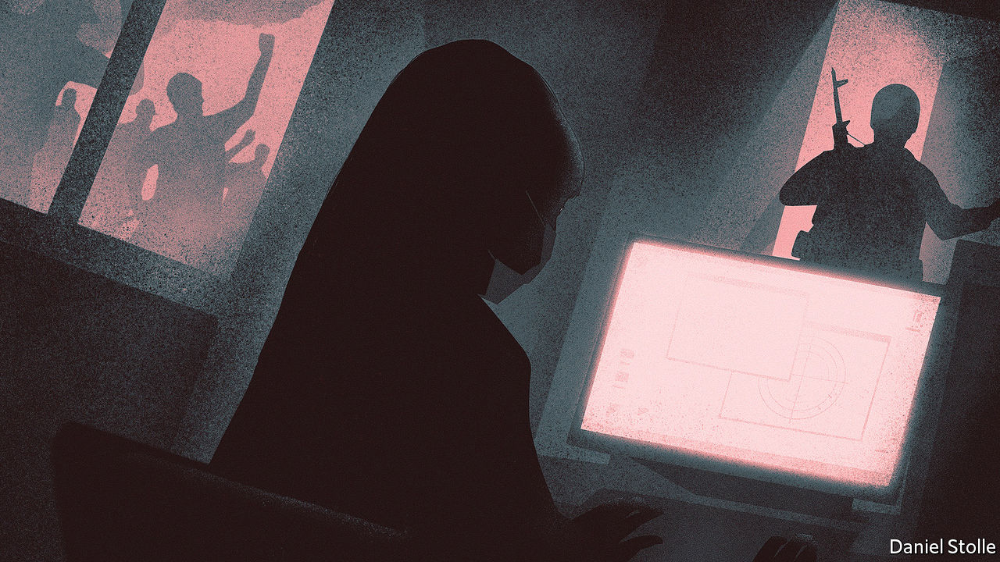

###### These new puritans

# Burmese civilians are caught between the junta and the resistance 

##### The righteous fury of the revolutionaries is robbing some people of the last remaining shred of normalcy 

 

> May 19th 2022 

When moe moe and hundreds of thousands of public-sector workers just like her went on strike after the Burmese army launched a coup in February 2021, they were promised that the resistance would take care of them. As the movement opposing the putsch became more organised, forming a shadow administration called the National Unity Government (nug), it raised $120,000 to support some 360,000 public-sector workers who were shunning their desks. Yet Ms Moe Moe (not her real name), who worked as a teacher at a state school, never saw a kyat. 

That did not matter at first. Many ordinary Burmese predicted that the revolutionary movement to oust the army would succeed within a few weeks or months. But as time wore on, economic realities began to sink in. Some strikers found new jobs. Ms Moe Moe, who is 36, began to tire of having to ask her mother for money all the time. Five months after the coup, she started thinking about returning to school. 

She did not. “I don’t dare to return,” she says. She feared she would be attacked on social media for being too weak to endure the hardships thought necessary to prevail against the army. When a friend of Ms Moe Moe’s went back to her job at a state school, because she had exhausted her savings and needed to buy medicine for her ailing father, she received death threats and the address of her school was posted online. 

The terror the junta has unleashed in an effort to stamp out the resistance has radicalised Burmese society. The radicalisation is illustrated by the changing tactics of the opposition. At first its members gambled that they could persuade the army to return to the barracks by encouraging civil servants and private-sector bankers to abandon their posts, bringing the economy and the running of the state to a halt. 

Instead, the army escalated its violence, so the resistance shifted its focus. In September Duwa Lashi La, the nug’s acting president, formally declared war on the army, giving his imprimatur to the freshly raised militias which had been battling the armed forces for months. He exhorted all Burmese to join the struggle: “We have to initiate a nationwide uprising in every village, town and city in the entire country.”

The shadow government has urged the public to sever all ties with the regime. This instruction applies not just to people who are employed by the state, but also to companies and foreign aid agencies. The nug has asked students at state schools to stop attending, and ordinary citizens to stop paying tax or utility bills. Even holidays have been politicised. In April the nug asked citizens to boycott festivities during Thingyan, the Burmese New Year, because it feared that the junta would seize on pictures of people enjoying themselves as a . “Revolution will become a way of life, that’s the rhetoric,” says Min Zin of the Institute for Strategy and Policy, a Burmese think-tank. 

An inspiring number of Burmese have thrown themselves into this struggle, sacrificing income and risking their lives to express their anger at the army. Those who cannot or will not comply with the new norms of behaviour are named and shamed. When 1 Stop Mart, a retail chain, stayed open during a strike in March 2021, the backlash was so fierce that employees reportedly feared for their lives. More recently, the student union of a public university in Mandalay, Myanmar’s second city, branded seven students who attended their graduation ceremony as “traitors”. 

Those who do not abide by the instructions of the resistance may be at risk of reprisals. People’s Defence Forces (pdfs), guerrilla outfits that are loyal to the shadow government though not under its command, mostly target government offices and army checkpoints. But they have also hit civilian structures (which violates the nug’s code of conduct). When the junta tried to reopen schools last June, guerrillas planted bombs at scores of them, hoping to kill the soldiers stationed there. Any interaction with the regime is risky, no matter how innocent the reason. “If a pdf sees you talking to a township administrator [a local government official], even if the work is to help communities, they could react in a very negative way,” says the local boss of an international agency. 

Some expectations held by the resistance and its supporters are unrealistic. Businesses cannot refuse to pay tax. “It’s not about political legitimation, it’s about rule of law,” says an analyst based in Myanmar. The head of the international agency says that it stopped working with the government after the coup, but does inform it of its activities. Otherwise, he says, it might get thrown out of the country. Still, two big international donors have stopped funding his agency, because sponsoring development projects in Myanmar has become politically unpalatable. 

Zeya Thu (not his real name and some details have been changed) works at a microfinance company which lends to poor households. Friends who have left Myanmar since the coup, he says, accuse him of “being a supporter of the military”, because his company regularly meets officials at the central bank. “I’m helping poor people here,” he says, “but they say helping the poor is helping the military.” 

The resistance believes that working-class people “will voluntarily embrace total deprivation”, says Mr Min Zin. Yet this, too, is an impossible ask. The number of strikers has declined by more than half, because many can no longer afford to stay away from work. (Some others were forced to return by the junta.) The zealousness with which activists, who are often middle-class, attack those who give in may end up sapping enthusiasm for their cause. 

Ms Moe Moe remains an ardent supporter of the nug, yet she is now more frightened of her fellow resisters than of the army. That is extraordinary, given that the army routinely slaughters civilians, razes villages, tortures prisoners and rapes women. “I have managed to hide from the military all this time,” she explains. “But it is really hard to evade the spotlight of the people, of the community around me.” ■


