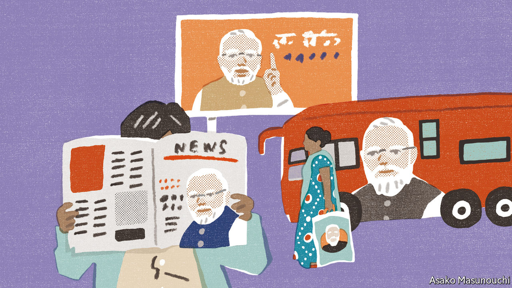

###### Banyan

# India’s politicians have figured out how to turn welfare into votes 

##### Plastering the leader’s name and face on every handout helps 

 

> May 19th 2022 

It is the middle of 2021. An Indian woman on her way to London approaches the customer-service desk at Frankfurt airport and presents her vaccination certificate. The airline agent looks at the document, at the woman, at the document again, and frowns. Something is fishy. An accusation of fraud is hurled at the passenger: the certificate is an obvious fake, the photo on it is clearly of someone else—a bearded man! Ah, the passenger explains: that is Narendra Modi, our prime minister. He is on every one of the billion-odd vaccine certificates issued by the Indian government. Hilarity ensues. 

The story, probably apocryphal, went viral on Indian social media last year because it gets at a truth known to all Indians: that the prime minister is inescapable. He peers out from newspaper advertisements extolling his achievements. He adorns the homepages of government websites. He beams down from billboards across the country. 

But for the vast majority of Indians who do not read the papers or access government websites, it is in the provision of welfare that the prime minister’s stamp is most clearly visible. The names of most new schemes bear the prefix , or prime minister. Bags of government-sponsored grain delivered to poor villagers during the pandemic came emblazoned with his smiling face. A housing programme named after Indira Gandhi, a former prime minister, was expanded and relaunched under Mr Modi as the “Prime Minister’s Housing Scheme”. 

For those who liked and shared the Frankfurt airport story, the prime minister’s tendency to put his name on everything is a sign of megalomania, or a sinister attempt to build a personality cult. The reality is more sophisticated: Mr Modi’s Bharatiya Janata Party (bjp) has worked out how to claim credit for things people like.

In 2014, as the bjp took power after years in opposition, Lokniti-csds, a polling group, asked Indians whom they credited for welfare programmes. Just over a fifth pointed to the federal government in Delhi for a housing scheme, and a little more than a quarter did so for a rural jobs guarantee. By the time of the 2019 election, after Mr Modi’s first term, more than half of all respondents attributed both to the central government. For newer schemes, such as to provide cooking gas or bank accounts, 70% correctly credited Delhi. 

Opposition parties running state governments are learning from Mr Modi that they should associate themselves with their handouts. In newspaper ads Uddhav Thackeray, the chief minister of Maharashtra, highlights cash payments to families of covid-19 victims. The head of Rajasthan points to his state’s “model of health care”. It is “clearly copycatting what they did on the national level”, says Neelanjan Sircar of the Centre for Policy Research, a think-tank in Delhi. 

For poor Indians, the benefits are clear. Not only does the central government have a bigger incentive to improve their lives; states also feel the need to compete with it in munificence. It is better, too, for Indian democracy for politicians to pitch for votes based on the services they provide rather than on the grievances they stoke. Despite the bjp’s constant drumbeat of Hindu majoritarianism, it is the party’s record of providing basic goods that appeals to many more voters, including Muslims. 

But there are pitfalls, too, notes Milan Vaishnav of the Carnegie Endowment for International Peace, an American think-tank. It is easier to run schemes that yield quick, concrete results, such as building toilets or opening bank accounts. Investments in intangible goods, such as education and health, take longer to pay off. And it is hard to withdraw or curb handouts, making them a neverending, ever-expanding fiscal liability. 

A third danger is that funnelling all credit to the top robs local mps of their connection with voters and centralises power. Party defections are thus common. Indeed, even chief ministers of bjp-run states have to be content with being the supporting act in their own regions: it is Mr Modi’s image that looms large. That may not be a huge concern for either voters or senior leaders today. But it means that little thought is given to developing future talent. 

Lacking a charismatic leader, the Congress party for years named its welfare schemes after dead luminaries, reaping little reward. Today, the bjp has no star besides Mr Modi. When he is gone, his heir may have to keep relying on that ubiquitous bearded visage. 


