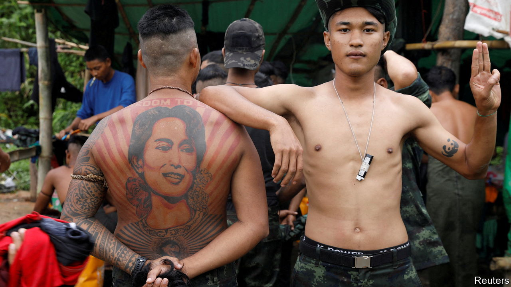
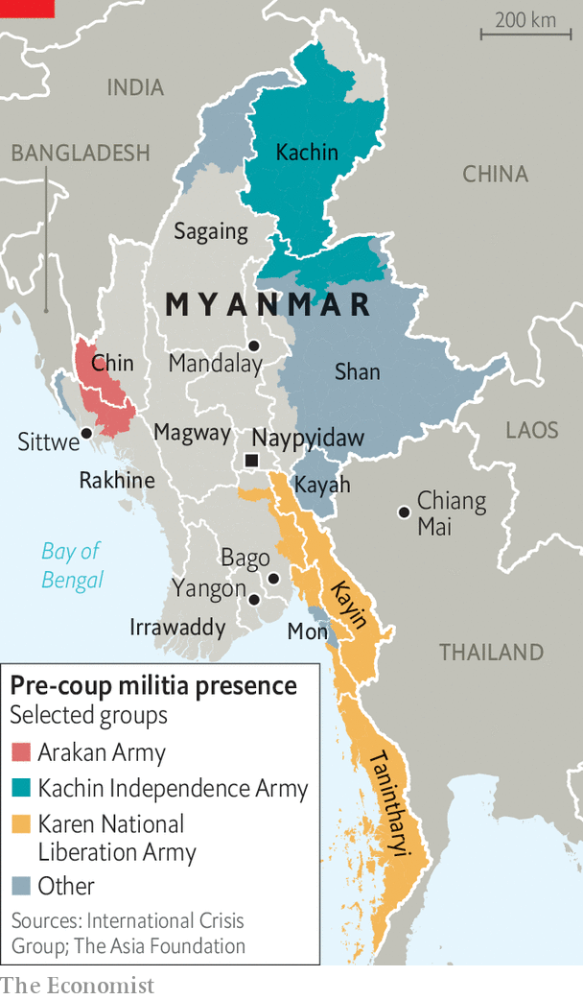

###### Pass the Kool-Aid

# Myanmar’s resistance is at risk of believing its own propaganda 

##### Burmese media are painting an overly optimistic picture of the war 

 

> May 19th 2022 

To spend time on Burmese social media or online news sites is to think the end is near for Myanmar’s military junta, which seized power in a coup last February. Resistance groups, it would appear, are slaughtering the army’s men and occupying the countryside. The regime is seemingly struggling to conduct basic administrative tasks or secure any international recognition. The underground National Unity Government (nug), which leads the resistance, said last month that anti-junta forces control half the country’s territory. Defectors talk of a crisis of morale in the armed forces. 

But peer past the virtual fog, and a far bleaker picture emerges. Although it can barely keep the lights on in Yangon, the commercial capital, the junta controls Myanmar’s cities and most of its natural resources, including mines containing the world’s finest jade. China recently hosted its foreign minister. Armed anti-regime groups are fragmented, with up to a dozen in a single district. A paucity of weapons has left them unable to go beyond guerrilla ambushes and assassinations.

Bajar, the  of a member of an anti-regime militia in the arid central region of Sagaing, says his group can arm only 20% of its 2,000 men using public donations. He says groups like his command half of his township’s rural hinterland, but this holds only so long as the junta’s soldiers stay in their urban bases. “If they advance, we have to retreat and come back when they leave,” he says.

 


These advances have been regular and devastating. In Sagaing alone, junta forces have burnt down more than 7,500 houses, according to Data for Myanmar, a monitoring group. More than 230,000 people in the region have been displaced, reckons the un. A resident of the area says that, although a resistance group now runs her village, it “can’t protect the villagers because it has so few weapons”. 

Despite this brutal toll, Myanmar’s rebels maintain an upbeat message that Burmese media are quick to amplify, with headlines such as “Myanmar coup leader reveals his desperation”. Many of these outlets reproduce the claims of resistance groups. Their narrative of imminent victory is embraced on social media. 

“We’re not getting the full story from the local media, who often aren’t reporting the defeats,” says a Burmese journalist who goes by Cape Diamond, a pseudonym. Media outlets are unable to send reporters to find out facts on the ground. This is partly because journalists risk arrest, or worse, if they try to work openly. “Instead, they rely on citizen journalists and locals who are also revolutionaries,” he says. Even professional journalists find it hard to be objective in the face of the junta’s violence and oppression. They “want to use their pen for the revolution”, says Mr Diamond. 

These outlets are also countering the lies and fantasies of the regime. General Min Aung Hlaing, the country’s de facto leader, heralded a “year of peace” during Thingyan, Myanmar’s traditional new year festival, last month. He then launched peace talks with several long-established ethnic rebel groups based along the Thai and Chinese borders, none of which is actually fighting the regime at the moment. 

Junta-controlled state media depict a country of bustling markets, joyful Buddhist festivals and farmers producing bumper crops, disturbed only by a few isolated “terrorist” attacks. In the second week of May, when the armed forces spent each day torching villages and murdering civilians, , a state-run daily, ran front pages on “virgin islands” ripe for tourism, the annual migration of birds and the cultivation of elephant yams—“a gift of nature”. 

The difference is that few Burmese accept the junta’s otherworldly fake news, while many are eager to believe that the resistance is close to victory. Yet self-deception is a poor military strategy. “If you want to win,” says Mr Diamond, “you’ve got to keep your eyes open.” ■


