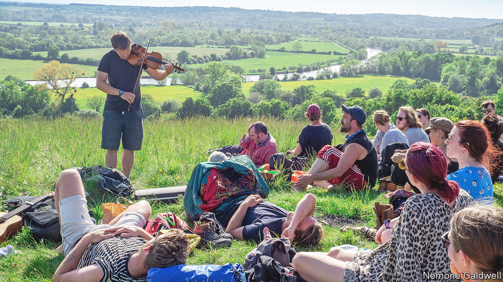

###### Forgive us our trespasses

# A radical group of ramblers roams the British countryside 

##### A summer of genteel protest is under way 

 

> May 19th 2022 

“This is not a Marxist revolution,” Nick Hayes tells the 100 people assembled in a wooded clearing near Pangbourne, a Berkshire village. Some look disappointed. “Necessarily,” adds Mr Hayes, with timing that makes the crowd laugh. He is the de facto leader of Right to Roam, a protest group that thinks the countryside should be open to all. The group then treks through a forest before they reach an estate they should not enter, and cross a trampled wire fence for a picnic. “It’s mental that this is illegal,” says a protester. “It’s just so quintessentially British.” 

Britain might be famed for its pleasant pastures and rolling hills but only in Scotland do people have the right to roam freely on most private land. Landowners in England have made around 8% of land accessible to the public. In 1949 a footpath network was created; it was expanded in 2000. These strides were made by the Ramblers’ Association, a lobby group that cares for the footpaths. But some want to go further. 

Radical ramblers, as you might perhaps expect, make for a curious blend of conservative rule-breaking. Right to Roam, which organises mass trespasses, argues that the physical and mental-health benefits of accessing nature could change society. It shares many acolytes with Extinction Rebellion (xr), a climate-change movement, but it favours genteel picnics over disrupting city centres, guitars over glue. On April 24th the group’s Bristol branch trespassed on Sir James Dyson’s estate in Gloucestershire and swam in his lake. On May 8th a trespass by 200 people on land owned by the Duke of Somerset in Totnes uncovered a mass grave—of dumped pheasants. 

The alleged villains of this piece are the aristocracy. Guy Shrubsole, a figurehead in the group, and author of “Who Owns England?”, reckons that half of England is owned by 25,000 landowners. Some of the Pangbourne marchers had rubbed shoulders, and more, with the enemy. “The woman that took my virginity, her father had 19,000 acres,” bragged one protester. “They are the dying dinosaurs of the archaic aristocratic hegemony.”

But class hatred is not encouraged; Mr Hayes’s patience for the far-left is wearing thin. “They want us to quote Proudhon as we are marching across the countryside. Personally, I don’t care about French anarchist philosophers. I just want to swim in the River Loddon.” 

The countryside is unlikely to be opened up anytime soon. In January 2021 the government commissioned a report into increasing access to the outdoors. Last month it said the report will not be released but that it is investing £30m ($37m) to improve public access to green spaces. Unimpressed, Right to Roam is now approaching landowners directly to persuade them to open up. It is also plotting more take-no-prisoners trespasses, including art lessons with an illustrator on the River Monnow in Wales and foraging for natural foods in a forbidden West Country forest. If that doesn’t force change, it is hard to know what would.

