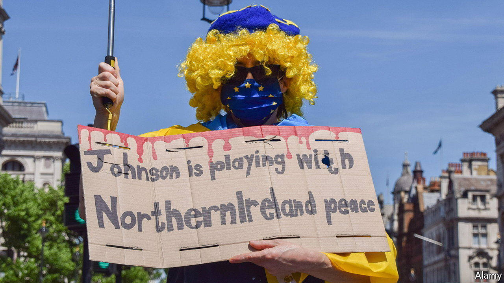

###### Here we go again

# Britain and the EU head towards a showdown over the Northern Ireland protocol 

##### But it is possible to make some compromises without rewriting the withdrawal treaty 

 

> May 18th 2022 

This week’s announcement by Liz Truss, the foreign secretary, of a proposed bill that would give the government powers to override the Northern Ireland protocol was not a surprise. In order to keep the province in the eu’s single market, the protocol imposes customs checks on goods moving across the Irish Sea. Threats to change it unilaterally, if negotiations with the bloc do not yield compromise, were heavily trailed. But it is still shocking that any British government is ready to renege on an international treaty. The claim by Ms Truss that the bill will be legal under international law is unconvincing even to many Tory mps. 

The gambit also looks unlikely to achieve the two goals that she set out for it. The first is to persuade the Democratic Unionist Party (dup) to return to Northern Ireland’s power-sharing executive, which is in limbo until it does. But the dup, which says it will return only if the protocol is scrapped or fundamentally changed, is unlikely to move quickly; it distrusts the British government and it knows the bill would struggle to get through Parliament. 

The second goal is to extract concessions from Brussels. The European Union’s response was measured but emphatic: national governments are not prepared to renegotiate the Brexit withdrawal treaty, which includes the protocol and required ratification by all their parliaments. The eu also made plain that it is prepared to deploy retaliatory trade measures, including scrapping the entire post-Brexit trade deal, if Britain legislates unilaterally.

That still leaves scope for compromise in some areas. It ought to be possible to smooth the application of border and customs checks through negotiation in the joint committee set up to manage the protocol, without having to change the treaty text. The eu’s proposals put forward last October, to simplify or scrap some of the checks required to protect its single market, could also be expanded. 

It should therefore be possible to establish “green” express lanes for goods that go only to the province and are deemed unlikely to cross into Ireland. The existing scheme for trusted traders that promise not to stray into the republic could be enlarged to cover more firms that are based in Great Britain as well as those in Northern Ireland. And the current grace periods that postpone checks for most supermarket produce, live animals and parcels entering the province could be extended or even made permanent, as has already been done for medicines.

It is trickier to do away with more sensitive food-safety checks. The government wants the eu simply to recognise Britain’s food-safety regime, but the bloc frets that Britain could diverge sharply on such things as hormone-treated meat or genetically modified crops. The cleanest way to eliminate these checks would be for Britain to align with the eu’s standards. The government is against this on sovereignty grounds and because it would scupper any chance of a trade deal with America. Since no such deal is on the horizon, however, some temporary period of alignment might be politically feasible.

Anything that requires a treaty rewrite is far less plausible. Catherine Barnard, a Cambridge professor who is part of the uk in a Changing Europe think-tank, notes that this category would include altering the presumption that all goods going to Northern Ireland are at risk of entering the single market and getting rid of the eu’s customs procedures. Both of these are specified in the treaty. So are clauses applying eu tax and state-aid rules to Northern Ireland and putting the protocol under the European Court of Justice. Britain now wants to change all these, even if not many businesses in the province care that much.

Indeed, despite the dup’s hostility to the protocol, most opinion polls find that a majority in Northern Ireland are in favour of retaining it. It is partly because of the protocol that the economy has been slightly outperforming the national average, says the National Institute of Economic and Social Research, another think-tank. The biggest obstacle to smoothing the protocol is a lack of trust between Britain and the eu. Threats of unilateral action to rewrite a treaty signed barely two years ago serve only to aggravate suspicion.■

