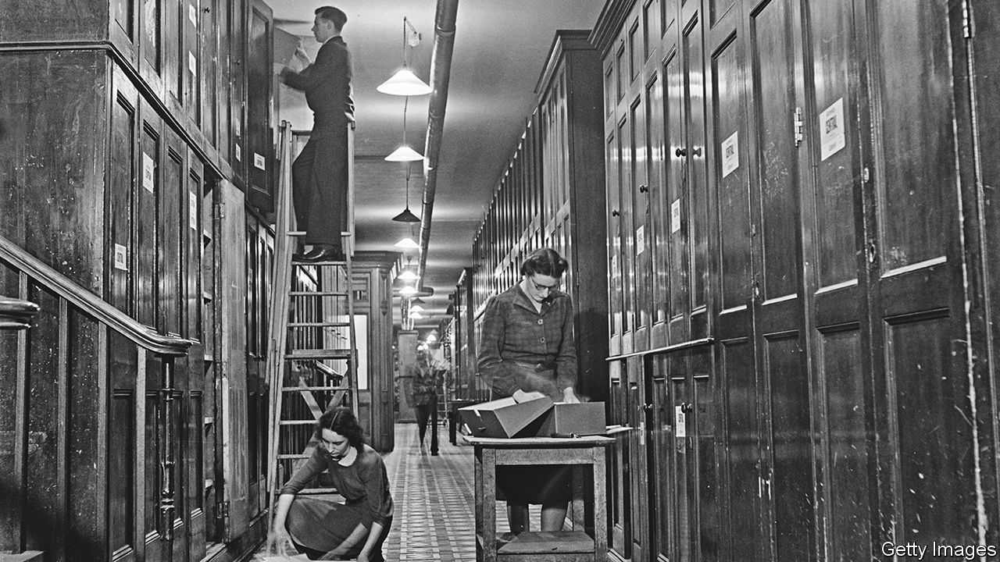

###### Get with the program

# How government IT systems affect the cost-of-living crisis in Britain 

##### Old computer systems make it difficult to raise benefits, but not impossible 

 

> May 16th 2022 

Up and up it goes. Consumer-price inflation in Britain hit 9% in April, its highest rate since 1982. It will rise further. On May 16th Andrew Bailey, the governor of the Bank of England, said that he could not prevent inflation from hitting double digits later this year, when a cap on household energy bills will jump again. The cost-of-living squeeze is putting pressure not just on households, but also on the government to act. Talk swirls of windfall taxes on energy firms and of income-tax cuts. 

The most urgent need is to help poorer Britons, particularly those on benefits. Yet in an interview on Bloomberg tv on May 13th, Rishi Sunak, Britain’s chancellor of the exchequer, gave a surprising reason for why it would be difficult to raise welfare payments quickly. Typically benefits change once a year, in April, based on an inflation forecast made the previous September. Last month’s 3.1% rise already falls hopelessly short. Why not bring forward the next increase and help people out now? 

The problem, Mr Sunak said, is that the computer systems used to administer many of Britain’s welfare programmes are so old and dysfunctional that they can only be updated once a year, in that September-to-April window. Acknowledging that it “sounded like an excuse”, Mr Sunak said that these technical issues mean that it is “not necessarily possible” to raise benefits “for everyone”. The chancellor was right on one count: the government it systems that control some welfare payments are a constraint. But it is not much of an excuse. 

Not every system is a problem. Payments to the largest bloc of working-age benefits claimants in Britain, the roughly 5.6m people on the government’s newish Universal Credit welfare payment, can be tweaked at will (as shown by the recent cessation of a pandemic-era increase). But the government is still running schemes that affect a couple of million claimants—Employment Support for the injured or disabled, and Jobseekers’ Allowance for people hunting for work—on older computer systems. Mr Sunak’s position is that because these systems prevent him from raising benefits for everyone, they therefore cannot be raised for anyone. 

The older systems are indeed complicated. One former techie at the Department of Work and Pensions (dwp) calls them “a right old mess, fiddles on fiddles, accreted nonsense”. They were built piece by piece, using outside contractors like Capita and Atos; each piece was supplied as a finished program, giving the dwp no ability to make changes without going back to the contractor to do more work. Different pieces from different contractors are connected to each other in an ad hoc manner. A small change in one, to calculate how much benefit is due to an individual, for instance, must feed through into a separate program which sends out the money. 

Yet this continued reliance on old technology is not quite the excuse Mr Sunak thinks it is, for two reasons. First, the government could have done something about it before now. Much of the Universal Credit system was put together in-house by a cross-government team, after a system built by contractors flopped. Yet civil-service bosses often prefer to work with external contractors they know and can control. As a result, the pace of change can be glacial. On April 25th the government said it expected all benefits claimants to be moved onto the new, snazzier system by the end of 2024; the vote to start that migration was taken way back in 2012.

Second, although it is difficult and expensive to push through changes under a contracting model, it is not impossible. Mr Sunak may well be justified in thinking that the time and cost of doing this work, which would surely land the government with a bill running into the tens of millions, is not worth it. (The longest part of the process, according to another ex-techie at the dwp, would be testing the changes to make sure that they do not knock the whole system offline.) There are faster ways of getting money to people, such as the “warm-homes discount” on energy bills that can be administered by the utility companies. But claiming that technical problems make it impossible to increase legacy welfare payments does not hold water. It would ultimately be Mr Sunak, not the computer, who is saying “no”. ■

