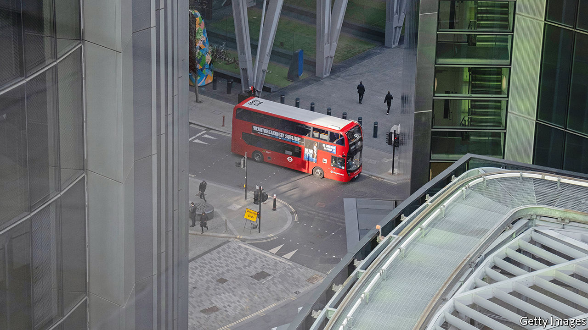
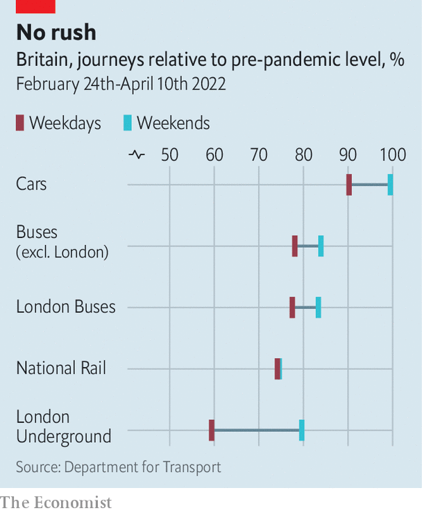
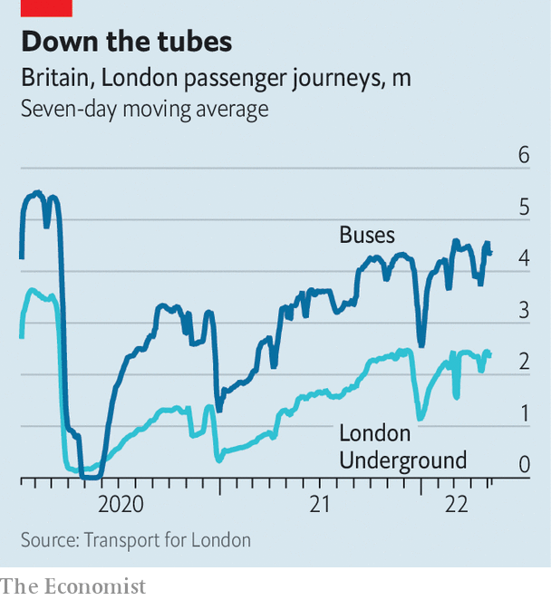

###### The road not taken

# The future of public transport in Britain 

##### The pandemic seems to have changed travel patterns for good 

 

> May 19th 2022 

On may 24th a wonderful new railway will begin operating in London. The Elizabeth line crosses the city and its suburbs in an east-west direction, making stops in the financial district, the West End and Heathrow Airport. The trains running along it will be 205m-long monsters. The project is an engineering feat, and will be admired by Londoners. It also seems extremely lavish, considering how travel patterns have changed. 

Since last September the daily number of public-transport trips taken in London has hardly changed, even as pandemicrelated restrictions have been lifted. The Tube is about three-quarters as busy as it was before covid-19 hit, buses about four-fifths as busy. Travel behaviour seems to be stabilising around the country. “We’re approaching a steady state,” says Jonathan Spruce, a trustee of the Institution of Civil Engineers. People have settled into a new pattern, which is drastically different from the pre-pandemic one. 

 


Apart from electric bicycles and scooters, which are hard to measure, Britons have cut back on all kinds of powered transport (see chart). The London Underground is particularly quiet, the railway network almost as subdued. People are even driving less than they used to, and buying fewer cars. Just 536,727 new cars were registered in the first four months of this year, down from 862,100 in the equivalent period three years earlier. 

Weekday travel is down by more than weekend travel, suggesting—astonishingly—that people are more reluctant to go to work than to go shopping or drinking. Rush-hour travel has declined most. The Office of Road and Rail found that sales of peak-time railway tickets between October and December 2021 (when some restrictions were in place) were only 70% of the pre-pandemic level. But off-peak ticket sales were 82% of normal, and advance tickets, which are bought by holidaymakers, were 95% of normal. 

A similar thing has occurred on the London Underground. The number of people passing through ticket barriers between 8am and 9am on May 12th was 33% lower than three years earlier, while travel between 3pm and 4pm was down by 21%, and travel between 10pm and 11pm just 7% lower. Londoners are making different journeys, too. Trips within the city became shorter in the first year of the pandemic; the average distance fell from 4.4km to 2.8km. People seem to be pootling about suburbia but going into the centre less. 

Early in the pandemic it was thought that people might avoid modes of transport that seem claustrophobic and potentially germy. But fear of contagion no longer seems to sway travel behaviour much. Transport Focus, a passenger watchdog which conducts regular surveys, finds that 76% of Britons who did not travel by train in the previous week, and 70% who did not travel by bus, would nonetheless feel safe doing so. Over a third of people claim they will never feel safe using public transport again, but some of them probably felt that way before the pandemic. 

Commutatis commutandis

Instead, the differing fortunes of public-transport networks can be explained by who uses them and how. Services designed to carry white-collar workers into city centres, such as the London Underground and commuter railway lines, are quiet because more of those people now toil in spare bedrooms and garden offices. Buses are busier because they are used by students, shoppers and manual workers who cannot avoid travelling. “A lot of people here are still having to go into work,” says Martijn Gilbert, the chief executive of Go North East, which runs buses in and around Tyneside. Mr Gilbert says that passenger numbers in his patch are down by 15-20%, which is less than the decline nationally. 

 


Like Wile E. Coyote running off a cliff, politicians tend to talk as though nothing has changed. “The government continues to believe that going forward, many firms and individuals will value the benefits of working face to face,” it blithely stated in an integrated rail plan for the Midlands and north of England last November. Jacob Rees-Mogg, a government minister, has left notes on civil servants’ desks chiding them for being absent, as though home working is a momentary lapse. 

But changes in working habits are likely to endure. A survey by the Office for National Statistics in early April found that 23% of all businesses and 43% of professional-services firms expect a permanent increase in home working. Both those proportions are the highest they have been since the ons began asking this question in September 2020. Companies are trying to entice workers back by making offices more alluring. But home working will improve, too: Nicholas Bloom at Stanford University notes that patent applications for remote-working technology shot up after the pandemic hit. 

Some transport operators have acknowledged as much. Transport Scotland announced last October that it was scrapping a plan to double the number of tracks around East Kilbride railway station, which would have allowed more commuters to reach Glasgow at rush hour. The revised business case explained that rush hour is not what it was, and that the link between job growth and transport use had been broken. It pointed out that even before the pandemic, polling showed that train commuters wanted to work from home a few days a week. Now they can. 

Other transport operators are quietly trimming their timetables, sometimes making the excuse that covid-19 has knocked out many of their staff. More cuts are coming. Bus operators have been given emergency operating grants, but these are supposed to end in October. “We’ve lost quite a few services and will lose more,” says Greg Marsden at the Institute for Transport Studies in Leeds. 

If public transport worsens, people are likely to work from home more, or jump in their cars. A survey of railway users by London Travelwatch, an official watchdog, found that 64% agreed that a less frequent service would deter them from taking trains. Cuts may also provoke strikes. 

The Elizabeth line is a colossal achievement—among other things, it necessitated one of Britain’s biggest archaeological digs. Compared with the task of maintaining a decent public-transport service over the next few years, it will seem easy. ■


