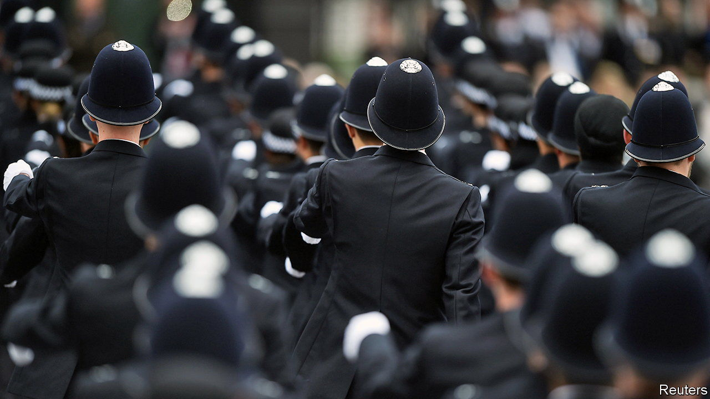

###### The beat has changed

# The wrong sort of police are being hired 

##### Fraud is the biggest crime in Britain. Recruitment does not reflect that 

 

> May 19th 2022 

“Be the difference”, reads the Home Office’s advertisements for its hiring campaign for police officers. Launched in 2019 to return the number of police to pre-austerity levels, the initiative seeks to fill 20,000 new positions across 43 forces in England and Wales by March 2023. In general hiring is going well. Police forces have exceeded the interim target of 12,000 new hires by March 2022; the remainder will be brought on board later this year and early next. The problem is that the wrong sort of police are being hired. 

The new recruits will mostly be constables who respond to emergency calls. The Home Office estimates that these hires will prevent half a million crimes per year. The National Audit Office, a spending watchdog, calls those claims optimistic, since they do not take into account changes in the types of crime that are being committed. Taken as a group, traditional crimes like theft, burglary and violence have fallen by three-quarters since 1995. The crime wave of today is happening not on British streets but on people’s devices. 

Fraud and computer misuse made up 60% of all estimated crimes in 2021; fraud alone accounted for two in every five crimes. And these types of offence are rising fast; there were 5.2m estimated cases of fraud last year, an increase of 41% on 2019 (see chart). Online credit-card fraud is the archetypal scam, but far from the only kind; pension swindles, in which pensioners are coaxed into transferring savings into dud schemes, can be devastating. 

 


The police are ill-equipped to cope. Investigations are mostly done by local officers, who do not have the time or training to look into cases properly. One analysis found that only 18% of frauds were reported, and just 3% of these were investigated. In the year to March 2021 only 0.6% of reported frauds led to a charge or summons. 

A review in 2018 by the Police Foundation, a think-tank, recommended creating regional units to manage fraud, as perpetrators and victims often span more than one police force. Staff of these regional units would not need to be warranted officers, with the power to arrest people. The review recommended hiring desk staff, who do not have to learn how to fire Tasers and could concentrate on fraud instead. 

However, the current hiring push does not allow police forces to recruit specialist desk staff. The Metropolitan Police is instead relying on scooping up so many applicants for the constable roles that it is bound to net some people with the right skills to investigate fraud, said Robin Wilkinson, the Met’s chief of corporate services, at a meeting in March of the London Assembly’s Police and Crime Committee.

The job of policing has changed in other ways, too, most obviously by expanding into social care. The years of austerity in the early 2010s did not just cut police numbers, but also beds and counselling for the mentally ill and places in decent care homes for vulnerable children. Constables often pick up the slack, whether returning teenagers to care homes after a missing-persons report or responding to calls asking for a check-up on a neighbour in distress. The number of police incidents that were tagged as mental-health-related rose by 28% between 2014 and 2018.

Police are better positioned than most to respond to a potentially dangerous call, so they should be used in some circumstances outside crime work, says Andy Higgins of the Police Foundation. But other agencies should ensure that the same people do not repeatedly need police help, he adds. A review published by the think-tank in March also recommended better co-ordination at mayoral level, so that someone calling an emergency number could be referred to different sources of support when appropriate. More police officers could help, says Pavan Dhaliwal of Revolving Doors, a charity, but without specialist training and other services to call on, they will not be able to get vulnerable people the support they need.

The police-recruitment drive is going to continue as it is. Putting more bobbies on the beat is popular with the public: surveys show that Britons value seeing constables on their local streets. The government happily vaunts its progress in hiring (and efforts to increase the diversity of recruits are indeed welcome). But more uniforms is not the same thing as reducing crime. ■

