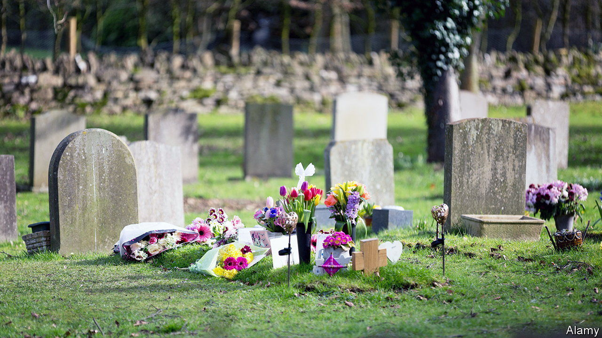

###### Silent as the grave

# Too many Britons die from medical mistakes 

##### Fixing the problem is complex. Talking about it is a start 

 

> May 19th 2022 

Speak to doctors and, if they are being truthful, they will tell you about the dead people: the patients who could have lived had they been treated in another way. Different doctors envisage these dead people in different ways. One surgeon says that he, and all surgeons, have in their minds their own private graveyard. In it lie their mistakes. 

Adam Kay, a writer and former doctor, has written of an obstetrics consultant who used a brasher analogy. She used to tell her trainees “that by the time they retire there’ll be a bus full of dead kids and kids with cerebral palsy, and that bus is going to have their name on the side.”

Whatever the image, the point is the same: doctors kill people—by accident, but in quite large numbers. A 2015 study by doctors from the London School of Hygiene &amp; Tropical Medicine (lshtm) looked at the deaths of 3,400 patients in the National Health Service (nhs) and found that of those deaths, 3.6% were “avoidable”; they had happened because a health-care professional had either done something actively wrong or failed to do something right. If this figure is typical then, on average, around 150 people are dying unnecessarily in nhs hospitals every week; that is more than 1% of all deaths in the country. 

This problem isn’t confined to Britain. “I will do no harm” is the Hippocratic Oath. But according to the World Health Organisation (who), lots of doctors do lots of harm all the time. Similar studies run in New Zealand, the Netherlands and America found similar figures. There is, the who observes, “a 1 in 3 million risk of dying while travelling by aeroplane”. In contrast, it estimates that one in ten patients are harmed accidentally while receiving health care, and 1 in 300 die. 

Jeremy Hunt, an mp, former health secretary and current head of the health select committee, has just written a book on this topic. He says such numbers should be a scandal but aren’t. “We’ve come to accept it as inevitable.” Health-care systems worldwide, says Mr Hunt, argue that “this is the price of doing business”. His book is called “Zero” because he thinks it should be the nhs’s ambition (he eschews the word “target”) to reach this level of avoidable deaths. You might not get there. But you should try. 

One reason for the lack of drama around such numbers is that, on the whole, these deaths lack just that: drama. Most, says Sir Nick Black, one of the lshtm doctors involved in the 2015 study, are not due to “the surgeon who cuts the wrong thing, or the drug that’s given in a hundred times the dose it should”. Instead, most are elderly patients who die without herald or headlines, their lives ended not by sudden calamitous mistakes but slow cumulative ones. They die when this nurse forgets to check on that elderly patient, or when that drug interacts with this one. 

Health-care professionals might consider some deaths of this sort inevitable. Bereaved families might argue otherwise—and frequently do, in court. The nhs paid £2.2bn ($2.7bn) in settlements for medical error in 2020-21. Doctors found guilty are treated with severity . They face public shaming, career ruination and even convictions for manslaughter. This in turn causes what Mr Hunt calls “a kind of  around avoidable deaths in the nhs”, which has been found at the root of one scandal after another, including an appalling and sustained failure of maternity services at Shropshire and Telford Hospital nhs Trust. 

Campaigners have several ideas for how to improve things. To change the culture of blaming and cover-ups, the law should be changed so that it distinguishes between gross negligence by health-care professionals and ordinary human error. Targets should never—as they were in Shropshire—be put above patients. Continuity of care should be increased. Mistakes often appear in the interstices, during handovers and changes when information can be lost. Returning to a system where each gp has their own patient list who they look after for years would help. The Ockenden Report into maternity services in Shropshire, which was published in March, recommended that mothers have a single, named midwife responsible for their care.

Comparison with other industries would suggest that things can improve. Mr Hunt is not the first author to point out that the medical industry would do well to learn from aviation. Flying became safer when blame for human errors was shelved and airlines learned from pilots’ mistakes rather than pillorying them for them. In 2017, even though record numbers flew (over 4bn), the number of passenger deaths in the industry fell to zero. 

In health care, too, transparency should be encouraged. When hospitals share and analyse data—good and bad—aberrations can be spotted, and best practice transferred. Above all, doctors need to be encouraged to speak up. The graveyards within their hearts should not remain buried; they should be exhumed, studied and learnt from. Potential good has been interred with those bones. ■

