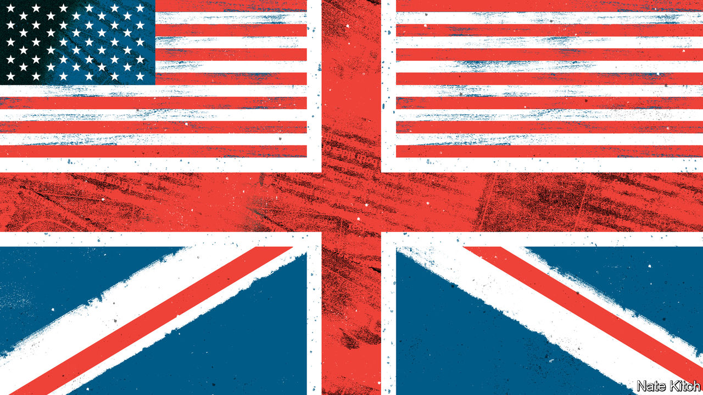

###### Bagehot

# UKSA! An obsession with America pollutes British politics 

##### It leads to bad policy, dull conversation and homogeneous bookshelves 

 

> May 19th 2022 

When in the home of a Westminster politico, why not play a game of Bookshelf Bingo? Head to their study and tick off what you see. Robert Caro’s “The Power Broker”, an account of Robert Moses’s post-war reshaping of New York, earns a point, as does any volume of Mr Caro’s weighty biography of Lyndon Johnson, the former president. Any of “The Big Sort”, “Bowling Alone” and “The Coddling of the American Mind” also count. “Team of Rivals”, an account of Abraham Lincoln’s cabinet, is a must, as are all of Barack Obama’s memoirs. A dusty dvd box-set of “The West Wing” completes the set and you win. House! 

British politics is obsessed with America. mps, wonks and journalists gorge on American history and follow its politics in fine detail. They also ape its language. Local elections, when council voters decide who has the privilege of collecting bins and cutting services to pay for social care, are sometimes called “mid-terms”. Parts of Britain are occasionally labelled “flyover country”, even if 90% of the population lives within a four-hour drive of Northampton. Commentators ape the 1980s political slogan of “Let Reagan be Reagan” (mainly because it was repeated in “The West Wing”). Readers have been treated to “Let Gordon be Gordon”, “Let Boris be Boris” and, worst of all, “Let Theresa be Theresa”. The obsession leads to dull conversation. But it also leads to bad policy. 

Britain’s economic debate exists somewhere in the mid-Atlantic. British policymakers sometimes appear to think that inflation emerged from overgenerous government spending, as in America, rather than a supply shock, as their European peers accept. In America, a country the size of a continent, concepts such as “left behind” regions make sense. When economic tides shift, it is possible to be high and dry in the middle of nowhere, hundreds of miles from opportunity. In Britain it is seen as a socio-economic catastrophe that someone in Wigan may have to commute 20-odd miles to a job in Manchester.

Arguments over public policy are complicated by comparisons with America. Debates about the future of the National Health Service are polluted by the extreme and weird example across the ocean. The plethora of publicly funded health-care options in Europe is largely ignored. Liz Truss, now the foreign secretary, once campaigned against occupational licensing. It is a worthy aim, but the problem barely exists in Britain. In America a hairdresser faces at least 1,000 hours of training before being granted a licence; in Britain a fresh Kurdish arrival can set up shop and shear people for £8 ($10), communicating only with hand gestures. Worrying about occupational licensing in Britain is akin to an American senator having strident views on fox-hunting with hounds.

The same happens across the political spectrum. British campaigners alighted on a minimum-wage demand of £15 for little reason other than that American ones had demanded a $15 wage. “Abolish ice” (the American border force) became a slogan among left-wing Democrats calling for a less cruel immigration system; “Abolish the Home Office” was swiftly adopted in Britain. “Defund the Police” made little sense even in America, where law enforcement can call on enough munitions for a Latin American coup, let alone in Britain, where the police are largely unarmed. Fewer resources are the last thing the service needs. 

Even Britain’s idiomatic constitution is viewed through an American lens. Michael Gove, the minister responsible for devolution and an American history buff, has suggested calling the heads of new regions “governors”. America’s complicated separation of powers is invoked without regard for Britain’s centralised system of government. This leads to the absurd spectacle of liberal critics demanding that Boris Johnson should be impeached, when the benefit of a parliamentary democracy is that mps can hoof a prime minister from power whenever they like. 

Self-perception is distorted by the mirror of America. When the Archbishop of Canterbury recently criticised the government’s asylum policy, one mp complained that Britain separated church and state long ago. Wrong. When it comes to religion Britain, which gives bishops seats in its upper chamber and whose head of state sits atop the established church, is constitutionally closer to Iran. A sturdy right to free speech, à la First Amendment, is taken for granted when Britain is actually one of the few democratic countries where it is possible to be jailed for being “grossly offensive”—in effect, for being rude.

Okay by me in America 

It is on social issues that America looms largest. A common language allows American ideas to inject themselves into the British discourse with alarming speed. Twitter, a Silicon Valley service to which Westminster has a chronic addiction, is an intravenous drip for doctrine. “Woke”, originally an American term, now regularly crops up in the House of Commons. Concern about ideological excesses on American campuses is reflected onto British ones, where they are less present. 

Already delicate debates, such as on race relations, are confused by America’s extreme experience. Some of this is harmless. American vernacular, such as “people of colour”, is now common in the British debate. Some of it is harmful. Britain’s history of race is a tangled tale of empire and voluntary post-war immigration, which is quite different from America’s. Yet the stories are often mushed together, blurring an understanding of Britain’s past. 

Comparisons between countries are healthy, but America is not the only benchmark. British politicians and policymakers can learn from nearer neighbours, too. France, a post-imperial power with the same level of population and wealth, offers an obvious analogue. Yet although the typical inhabitant of sw1 could regale someone with the life story of a 1950s planner from New York, he probably thinks Georges Pompidou was a painter. Bookshelf bingo needs new rules. ■


