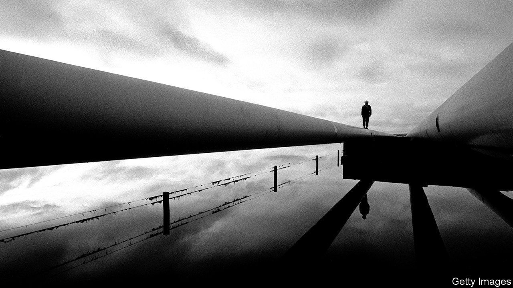
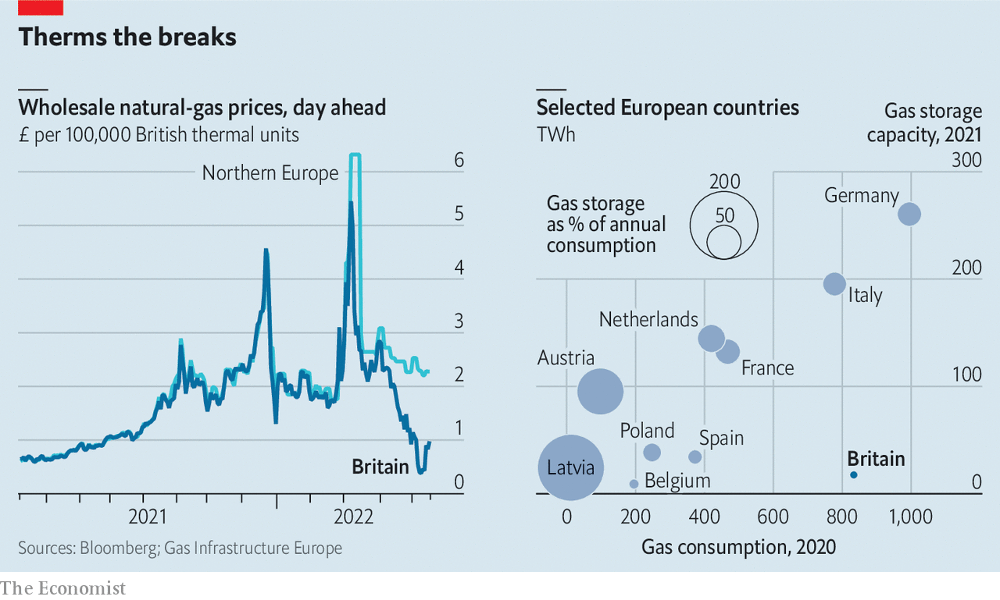

###### Store flaw

# Wholesale gas prices in Britain have collapsed 

##### But it will not do much to alleviate the cost-of-living crisis 

 

> May 19th 2022 

 


Liquefied natural gas (lng) is pouring into Britain’s regasification terminals. The glut has squashed gas prices on the spot market in Britain compared with northern Europe, which lacks such facilities (see left-hand chart). That sounds like good news for consumers struggling with high bills. But energy suppliers buy gas on longer-term contracts, where the price has not fallen. And Britain’s storage capacity is piddling (see right-hand chart), even more so since Rough, its largest facility, closed in 2017. With nowhere to put the gas, it is being exported to Europe or used to generate electricity. 

