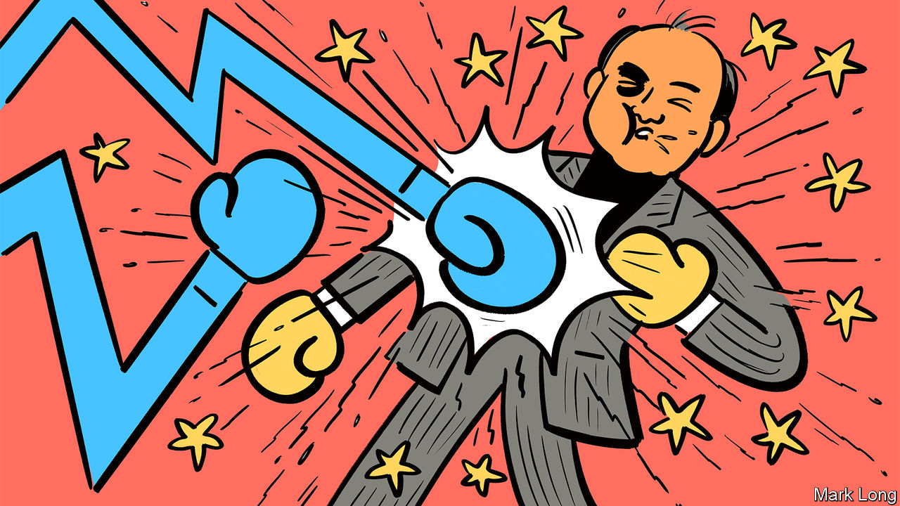
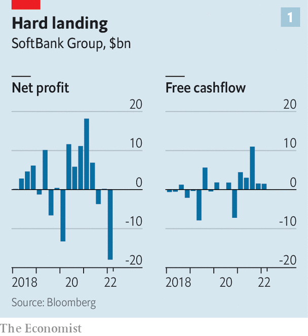
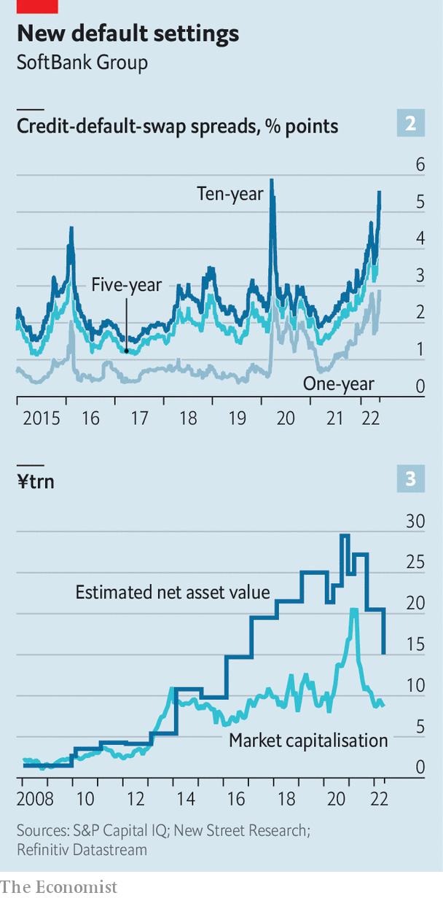

###### The Masa seesaw

# After a bruising year, SoftBank braces for more pain 

##### The Japanese investment group is global tech in a nutshell 

 

> May 16th 2022 

A year ago, at the height of the pandemic boom in all things digital, Son Masayoshi embodied the futuristic promise of global techdom. The flamboyant founder of SoftBank Group, a telecoms-and-software firm turned investment powerhouse, reported the highest ever annual profit for a Japanese company, driven by soaring valuations of the public and private technology darlings in its vast portfolio. 

Twelve months later SoftBank and Masa, as Mr Son is known for short, are once again the face of tech. Now both he and the industry are dealing with rising interest rates, deteriorating balance-sheets, investor disillusionment and, for good measure, China’s crackdown on its digital champions and reinvigorated trustbusters in the West. What happens next to the Masa-verse is thus of interest not just to SoftBank’s ailing shareholders, who have collectively lost $140bn or so in stockmarket value since its share price peaked in February 2021, but also to anyone interested in the fate of tech more broadly. 

On May 12th SoftBank reported a net loss of ¥1.7trn ($15bn) for the latest financial year ending in March, caused primarily by a ¥3.7trn write-down in the net value of its flagship tech investments (see chart 1). Its public holdings, most notably in Alibaba, a Chinese e-commerce giant pummelled by the Communist Party’s crackdown on China’s big tech, are losing their shine. Northstar, an ill-fated trading unit which funnelled surplus funds from the parent company mainly into American tech stocks, has been all but wound down after losing ¥670bn last year. 

 


SoftBank’s vast private investments, in loss-making startups with unproven business models, are being rapidly repriced as higher interest rates make firms whose profits lie mostly far in the future look less attractive to investors. Competition authorities have halted the $66bn sale of Arm, a British chipmaker, to Nvidia, a bigger American one. All this is making SoftBank’s net debt of $140bn, the sixth-largest pile for any listed non-financial firm in the world, harder to manage. And there may be more pain to come, for the tech sell-off has accelerated since March, when SoftBank closed the books on its financial year. 

SoftBank’s first big challenge has to do with its assets—and in particular its ability to monetise them. The pipeline of initial public offerings (ipos) from its $100bn Vision Fund and its smaller sister, Vision Fund 2, is drying up. That makes it harder for Mr Son to realise gains on early investments in a string of sexy startups. Oyo, an Indian hotel firm backed by SoftBank, unveiled plans in October to raise $1.1bn from a listing, but more recent reports suggest that the company could cut the fundraising target or shelve the plan altogether. Other holdings, including ByteDance (TikTok’s Chinese parent company), Rappi (a Colombian delivery giant) and Klarna (a Swedish buy-now-pay-later firm) were all rumoured to be plausible ipo candidates for 2022. None has announced that it intends to list and that may not change while market conditions remain rough—which could be for some time. 

Arm, which is now expected to launch an ipo, may offer a reprieve. Mr Son wants to list the chipmaker by the middle of next year. But even optimists doubt a flotation can fetch anything like the sum Nvidia was offering before regulators stepped in. At the bullish end, Pierre Ferragu of New Street Research, an investment firm, suggests Arm may be valued at or above $45bn in the public market—$13bn more than SoftBank paid for it in 2016 but well shy of Nvidia’s bid. More bearishly, Mio Kato of Lightstream Research, a firm of analysts in Tokyo, says he struggles to imagine that the chip firm is worth more than $8bn.

Mr Son’s problems do not end with the asset side of his company’s balance-sheet. Its debt, too, looks problematic. In the near term, it appears manageable enough. SoftBank’s bond redemptions in the coming 12 months are modest: $3.3bn-worth will mature in the current financial year, and another $6.8bn between April 2023 and March 2024. SoftBank’s $21.3bn in cash would be more than adequate to cover those repayments. Mr Son has pointed out that despite the heavy investment losses his company’s net debt as a share of the equity value of its holdings has remained largely unchanged, at around 20%. 

The price of credit default swaps against SoftBank’s debt, which pay out if the company defaults, tell a different story. Across most maturities from one year to ten years, the swaps have only been more expensive once in the past decade—during the market turmoil of March 2020, as countries went into the first pandemic lockdowns (see chart 2). The group possesses other large liabilities: its original Vision Fund, a gigantic vehicle for speculative tech investments, has no short- or medium-term debt of its own but the holders of $18.5bn in preferred equity tied to it are entitled to a 7% coupon, regardless of the performance of the underlying holdings. 

 


Moreover, SoftBank does not include margin loans against holdings such as Alibaba in its preferred loan-to-value measure. The full details of such loans are not disclosed. On top of that, as of mid-March a third of Mr Son’s $18bn stake in SoftBank was pledged to a range of banks as collateral for his own borrowing. The detailed agreements that govern such deals aren’t public, so it is unclear when or whether margin calls that force sales of those shares could be triggered. That could put downward pressure on SoftBank’s share price. All this helps explain why SoftBank shares have consistently traded at a large discount to the net value of its assets (see chart 3).

Mr Son’s admirers, a vocal if dwindling bunch, point out that SoftBank still has plenty going in its favour. Its Japanese telecoms business, SoftBank Corp, remains profitable (and helped offset some investment losses). It has survived previous bear markets intact, including the dotcom bust at the turn of the century—not least thanks to Mr Son’s early bet on Alibaba. It is not inconceivable that one of SoftBank’s current wagers proves equally successful. 

As for future gambles, Mr Son struck an uncharacteristically sober note in the latest earnings call. Private firms adjust their valuations a year or two after the public market, he said, so they are still commanding high multiples. “The only cure is time,” he mused philosophically. Perhaps. Except that in other ways, time is not working in SoftBank’s favour. ■


