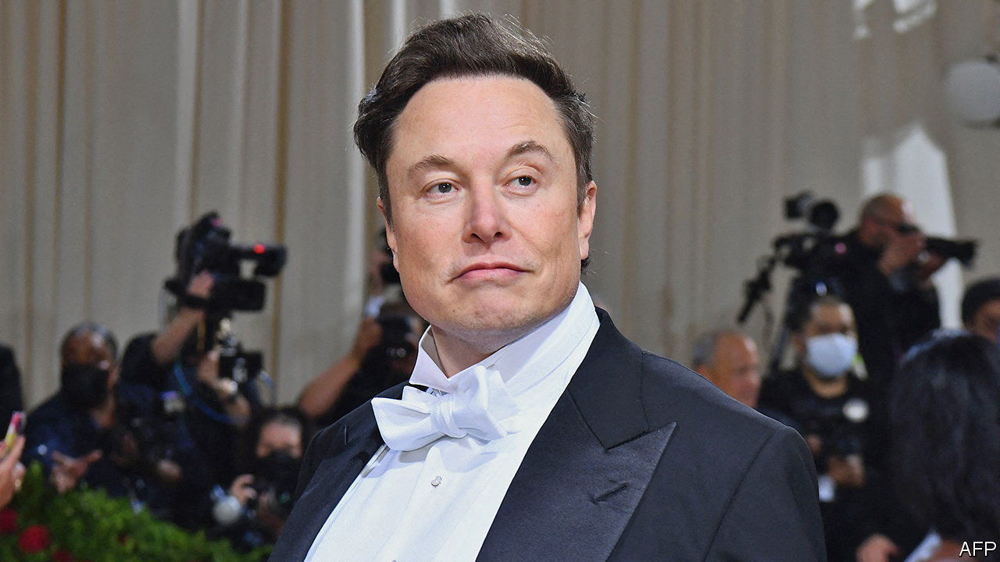

###### Trick or tweet?

# Elon Musk, Twitter and an epic case of buyer’s remorse 

##### The world’s richest man haggles for a discount 

 

> May 19th 2022 

Elon musk recently suggested he might introduce an edit button to Twitter, to let users revise injudicious tweets. He might wish such a thing already existed. Less than a month after tweeting that he looked forward to unlocking the social network’s “tremendous potential” as its incoming owner, on May 13th he told his 94m followers that the deal was “on hold”. 

Mr Musk says he needs time to check Twitter’s claim that no more than 5% of its users are bots, robot accounts used for spamming. Without proof of this, he said, the deal “cannot move forward”. Twitter’s ceo, Parag Agrawal, posted a long explanation of how the firm came up with the estimate. Mr Musk replied with a poo emoji.

Identifying bots is hard. They may well make up more than 5% of Twitter’s users. But it sounds like a “dog ate the homework” excuse for cancelling the $44bn acquisition, in the words of Dan Ives of Wedbush Securities, an investment firm. There are other reasons why Mr Musk may have got cold feet. The value of tech stocks has tumbled since the Twitter deal was announced on April 25th. Mr Musk agreed to pay $54.20 per share (an apparent reference to cannabis, which is associated with the number 420). This week Twitter’s shares have been trading as low as $37.

Not only may Mr Musk fear overpaying. The acquisition also risks harming his much bigger interests. Tesla, his electric-car company and source of most of his wealth, has lost 29% of its market value—$305bn—since the Twitter plan was hatched. Investors worry that the social network could prove a distraction for Mr Musk, who has indicated that he may serve as its interim chief executive. It could also harm Tesla’s business in China, where Twitter is banned. 

Twitter’s board says it intends to enforce the acquisition agreement. But it is in a tight spot. Compelling Mr Musk to make good on his offer would mean months in court, with no guarantee of success. There is no obvious alternative buyer. If the deal falls through, Twitter’s share price will drop below $30, thinks Mr Ives, who believes Mr Musk hopes to use this leverage to negotiate a lower price. Unlike with his tweets, the billionaire may yet be able to edit his contract.


