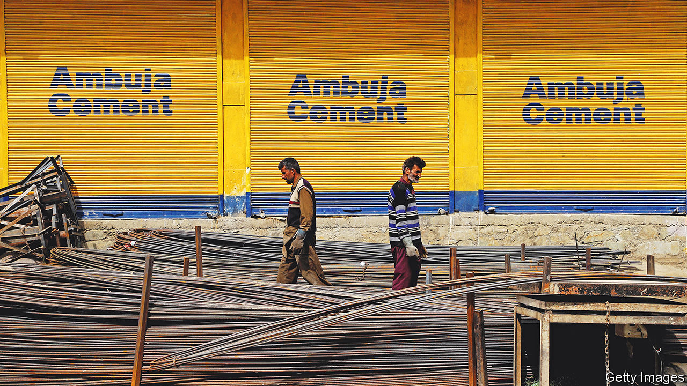

###### A new foundation

# Gautam Adani wants to cement his grip on India’s heavy industry 

##### Asia’s richest man buys a Swiss-controlled building-materials business for $10.5bn 

 

> May 19th 2022 

Gautam adani is a man of few words but, as Asia’s richest tycoon, plenty of means. On May 15th he agreed to pay $10.5bn for Ambuja Cement, India’s second-biggest cement-maker, controlled by Holcim, a Swiss building-materials behemoth. Mr Adani’s terse statement accompanying the deal belies its significance. It will be the largest outright acquisition of an Indian company since Walmart, an American supermarket titan, purchased Flipkart, an Indian e-merchant, in 2018.

Ambuja was founded by Narotam Sekhsaria, a Bombay cotton trader with a degree in chemical engineering but no background in cement. He managed to turn a commodity into a consumer product through a clever slogan (“giant strength”) and an eye-catching logo (a giant clutching a building). After courting Ambuja for years, Holcim succeeded only in 2005-07, as Mr Sekhsaria’s health began to fail. 

Since then the business has flailed. In the past decade, according to Kotak Securities, a broker, capacity at Holcim’s Indian holdings expanded by less than 2% a year, compared with a rate of 10% for UltraTech, India’s biggest cement-maker, and 13% for Shree Cement, an upstart. Holcim has not disclosed how much it paid for its Indian venture. One analyst puts the figure at around $2bn. Given that it will receive $6.4bn for its 63% stake, this would amount to an adequate but unexciting annual return of perhaps 8%. (The other $4bn or so Mr Adani is paying will go to Ambuja’s minority shareholders.)

The deal is more favourable for Holcim in other ways. It fits in with the firm’s broader shift towards a greener, less cement-centric business. In recent years it has sold cement units in Brazil, Indonesia, Malaysia, Russia, Sri Lanka and Vietnam. 

Critically, it shouldn’t attract antitrust scrutiny, whereas success by one of the two other bidders might well have raised trustbusters’ concerns. UltraTech, controlled by the Birla family, is India’s biggest cement-maker. The Jindals’ jsw Group, a big steel producer, has a growing cement business. The Competition Commission of India has been looking into a possible cement cartel since at least 2010. A case involving Holcim is before the Supreme Court. Another investigation was reportedly launched in 2020. As part of the sale, Holcim will be spared from any judgment, its chief executive, Jan Jenisch, told analysts. 

But it was not solely because Mr Adani has no existing cement operations that he prevailed in the fight for Ambuja. What he brought also mattered. The Adani Group owns power utilities, useful in running energy-hungry kilns, and India’s biggest network of ports to ship the stuff. Its coal-fired plants provide a by-product, fly-ash, required for cement-making. Most important, the tycoon displays an uncanny ability to raise capital. Paired with vaulting ambition, it is a hard mix to beat. ■


