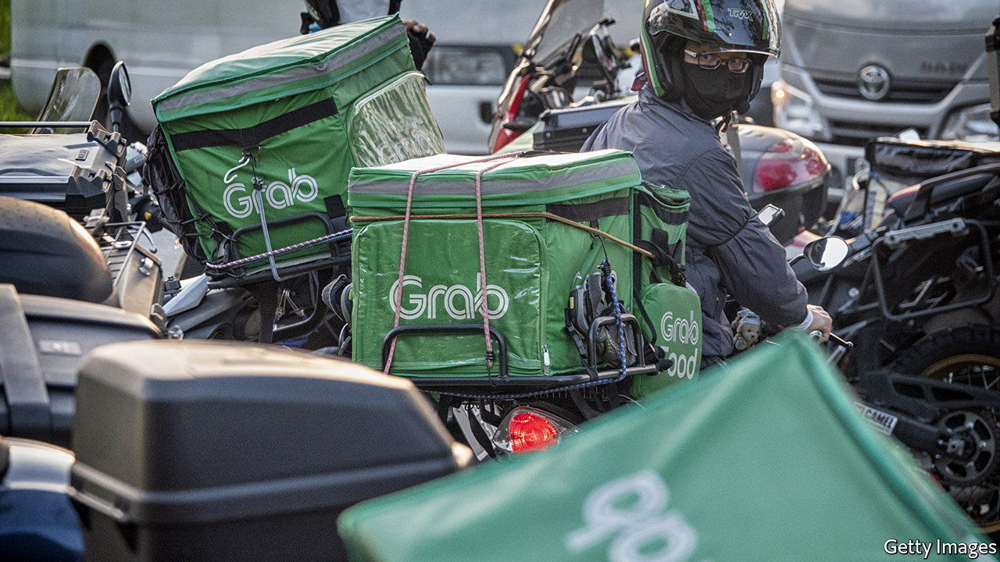
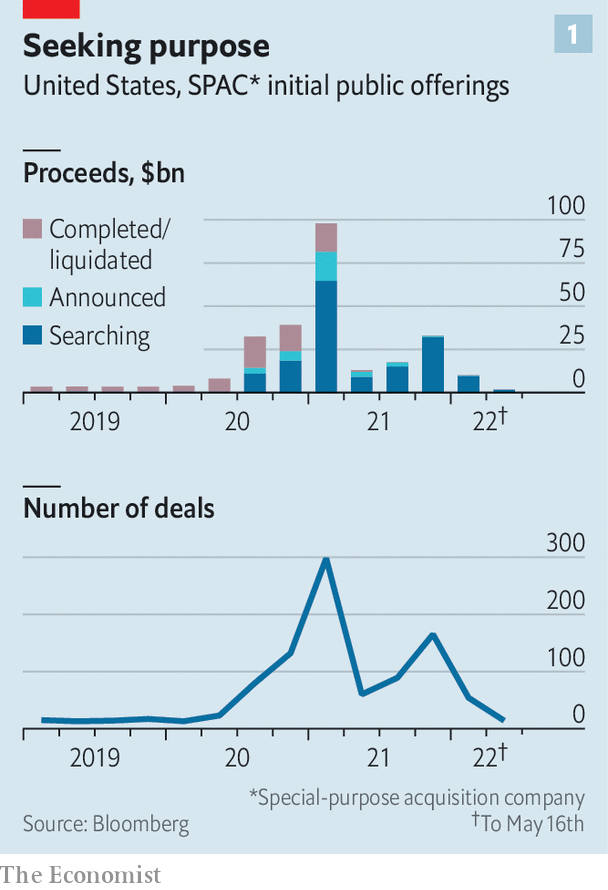
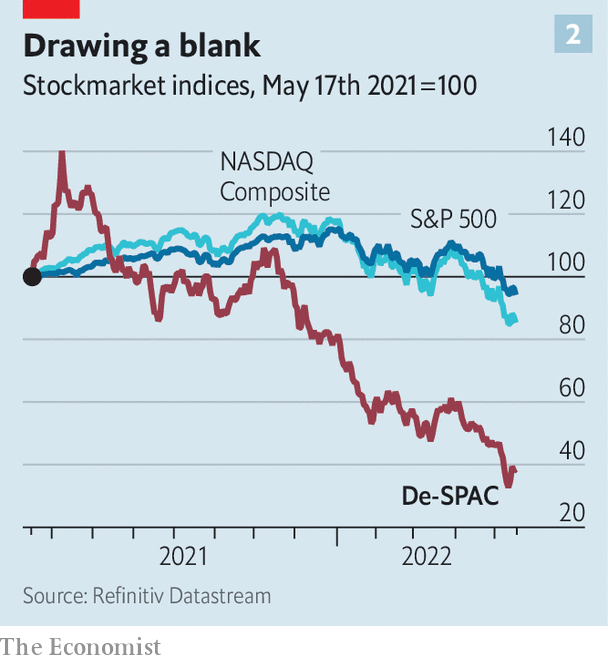

###### The great unSPACing

# SPACs raised billions. As mergers dry up, we follow the money 

##### It hasn’t gone where you think 

 

> May 19th 2022 

American capitalism has a special reverence for large numbers. They can frighten as debt or reassure as backstops. The $260bn raised by special-purpose acquisition companies (spacs) since the start of 2020 lacks the multitrillion-dollar aura of federal debt or America’s pandemic stimulus. It is nevertheless big enough to have become a defining symbol of recent market mania. 

spacs used to be a curious capital-markets sideshow: complex, obscure, hardly novel. A conventional initial public offering underwritten by investment banks was the marker of corporate maturity; merging with a pile of cash and entering the stockmarket by the backdoor was not. This changed when stockmarkets rallied from their covid-induced lows: more than 800 spacs raised capital between May 2020 and December 2021. Underwriting fees were collected; questionable incentives and complexity remained. 

This year investors appear to have remembered why some disliked spacs in the first place. Few new blank-cheque vehicles are being listed. Rising interest rates are chipping away at the present value of speculative firms’ future profits and investment banks are pulling back from this kind of faddish financial engineering in expectation of tough new due-diligence rules. 

 


At the same time, many existing spacs are having trouble finding merger targets. The big-shots (or “sponsors”) who erect the empty shells are typically given 24 months to find a business to acquire (or to de-spac, in Wall Street lingo). They are struggling: 27 such transactions were announced in the first three months of 2022, compared with 77 during the same period in 2021. Of the 298 spacs listed in the go-go first quarter of 2021, raising $97bn, 196 have yet to announce a de-spacing. In all, more than 600 American-listed spacs are still searching for a target. That is a lot of clocks counting down, and a lot of unspent cash. Where is it all now? 

Ironically, much of this money, once chasing some of the riskiest tech bets out there, has been parked in finance’s dullest quarter. Approximately $160bn currently sits in trust accounts, invested in risk-free Treasuries. It could be ploughed into the next white-hot tech stocks in early 2023, when the countdowns end and investors’ cash is returned. Until then, being locked up in a spac without the prospect of a merger resembles investing in a money-market fund. Investors profit from the difference between its trading price and the money returned upon its liquidation. At present, the average yield-to-maturity on these blank cheques is above 3%.

Astute investors know better than to hang around for the blank cheque to blossom into a real business. After a spac announces a merger, investors are given the chance to redeem their shares and have their investment returned. Average redemptions are running at more than 50%. Excluding additional funding and deals hanging in limbo between announcement and completion,  calculates that less than $40bn of capital invested in spacs since 2020 has found its way onto the balance-sheet of an operating company. That is roughly the valuation at which Grab, a South-East Asian super-app, tied up with a spac in December 2021.

Investors in de-spaced firms have fared far worse than those in spacs wanting for a target. One recent study finds that barely more than a third hit their revenue projections. Many are short of cash. Almost half of the companies included in the de-spac index are currently burning through cash fast enough to empty their coffers within two years. This month Canoo, an electric-vehicle maker whose investor presentation benchmarked its valuation to Netflix and Tesla, expressed “substantial doubt” about its future as a going concern. 

 


An index tracking 25 large companies which went public through de-spac transactions is down by 52% this year, compared with a 27% fall for the tech-heavy nasdaq (see chart 2). Grab is now worth $10bn. The dilution caused by free shares designed to compensate a spac’s sponsor magnifies the sector’s losses. 

Unsurprisingly, then, spacs are once again paraded as symbols of market excess, where moonshot assets were pursued at otherwordly valuations. In practice, a stockmarket correction and increased regulatory scrutiny means the majority of spac investors will never see their cash put to work. They are the lucky ones. ■


