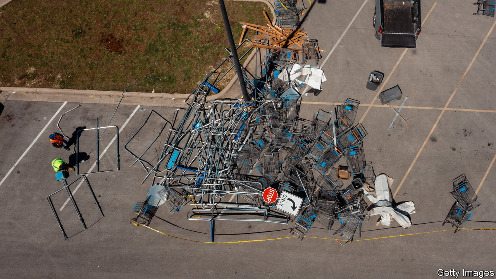

###### Supermarket crash

# Shares in America’s big retailers swoon 

##### Rising costs catch up with Walmart and Target 

 

> May 19th 2022 

Walmart went from strength to strength during the covid-19 pandemic. Its years-long investments in online fulfilment finally began to pay off as virus-wary shoppers swapped aisles for apps. As inflation picked up initially, its “everyday low prices” looked even more appealing than usual. And investors appeared to believe that it had the power to make those prices a bit less low, passing its own rising costs without putting off shoppers or sacrificing margins. 

On May 17th economic reality finally caught up with America’s supermarket titan. The company reported quarterly earnings that fell short of even the most conservative analysts’ estimates, blaming chiefly supply-chain snags and the rising cost of labour and transport. Its share price fell by 11%, a daily drop second only to the one the firm experienced in the trading session before the Black Monday stockmarket crash in 1987. A day later it slid by another 7%. The same day Target, another pandemic retail star, reported similarly disappointing results, wiping out 25% of its market value. The two companies shed a combined $65bn in market capitalisation in the space of two days.

Historically, inflation has often benefited big supermarkets. Elevated prices boost the nominal value of sales. As for higher unit costs, these could often be passed on to shoppers, who are likelier to keep needing supermarkets staples and less likely to gripe about higher bills if everything else they buy is also dearer. This time, though, the retailers are finding it harder to offset the steep increase in operating expenses. Target’s chief executive, Brian Cornell, anticipates an extra $1bn in transport costs this year as soaring energy prices dent profits. It is already raising prices in response—evidently not fast enough. 

Walmart, far bigger of the two, is better placed to absorb some of the higher costs. But even the Beast of Bentonville now expects earnings to decline by 1% this year. In addition to costlier transport, Walmart also reported higher wage costs, not least as a result of a hiring spree to ensure enough workers amid the Omicron wave of covid-19. It stocked too many clothes and home furnishings in order to avert a supply crunch, just as appetite for these products waned. And margins suffered as penny-pinching customers switched away from pricier premium brands to the supermarkets’ less lucrative own labels.

Neither firm is about to collapse. Target’s revenues rose year on year, in nominal terms at least. So did traffic in its stores—something that is “rare to find in retail these days”, according to Morgan Stanley, an investment bank. Walmart’s sales were up by 2.6%, to $142bn. Founded by a man who prized frugality, the bigger retailer has an established reputation for good value—a particular virtue in shoppers’ eyes during a , which can no longer be ruled out. Its large grocery business offers a hedge against a downturn. And wealthier shoppers with bigger savings may migrate to Walmart from higher-end retailers, which could help pad margins.

The question now is who will be the next to face a reckoning. The share prices of smaller retailers like Kroger and Dollar General, which have yet to report their first-quarter results, have been dragged down by association. Consumer-goods giants may be the next in line. Firms like Procter &amp; Gamble (p&amp;g) have been raising the prices of their premium brands to counter their own margin squeeze. Now they may think twice before doing so again, lest they lose sales. Such calculations diminish their pricing power, which markets have tended to reward handsomely. Investors may have taken note. On May 18th p&amp;g’s share price fell by 6%, even more than the wobbly stockmarket as a whole. ■


