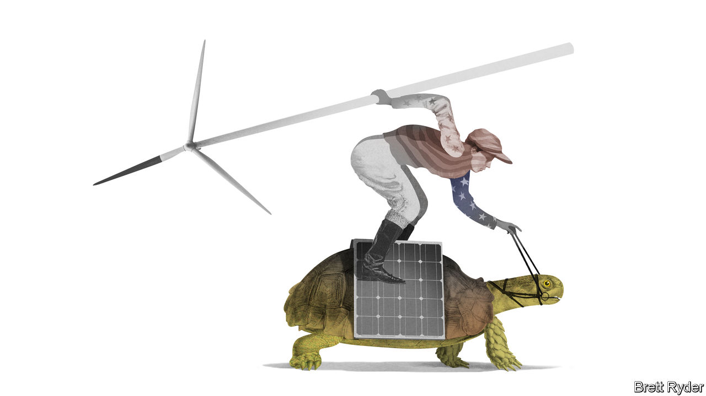

###### Schumpeter

# Why America’s clean-energy industry is stuck 

##### Blame in part its climate-friendly president 

 

> May 19th 2022 

America’s clean-energy bosses thought they would by now have more to celebrate. In the presidential campaign of 2020 Democrats tried to outbid one another on climate plans—Joe Biden offered $2trn, Bernie Sanders’s Green New Deal was $16trn—as if the nomination would go to the highest bidder. In the three months after Mr Biden defeated Donald Trump, an index of clean-energy firms jumped by about 60%. Goldman Sachs, a bank, forecast “a new era for green infrastructure” in America and beyond. 

Though Mr Biden’s infrastructure bill offered some help for clean energy, a giant climate bill now seems fantastical. Worse, green power is not just failing to boom. It is going bust. An array of American solar projects have been delayed or cancelled amid a federal probe into tariff evasion by manufacturers of solar panels and modules. The countries in question—Cambodia, Malaysia, Thailand and Vietnam—together produce about 80% of America’s solar-panel imports. Politics is stymying makers of wind turbines, builders of wind farms and the utilities that buy power from them. 

The results are stark. So far this year the clean-energy sector has lost about 25% of its market value, compared with an 18% drop for the benchmark s&amp;p 500 index of big American firms. Rystad Energy, a research firm, estimates that two-thirds of its forecast solar installations for this year are in doubt. According to Bloombergnef, a data provider, the capacity of new renewables projects in 2022 looks set to be a tenth lower than in 2020, under the windmill-hating Mr Trump. 

Two years ago clean-energy enthusiasts were right to feel bullish. In the decade to 2020 the levelised cost of electricity—which takes into account investment in equipment, construction, financing and maintenance—had fallen by 69% for onshore wind and 85% for solar projects, according to Lazard, an advisory firm. With renewables technologically mature and economically competitive, utilities and developers planned to pour money into solar and wind. NextEra Energy, a giant utility that in 2020 briefly overtook ExxonMobil to become America’s most valuable energy firm, said it would spend up to $14bn a year on capital projects in 2021 and 2022, calling it “the best renewables development environment in our history”. In the arduous effort to decarbonise America’s economy, building clean power would be the easy part. 

Turns out it isn’t. Some problems stem from the pandemic and gummed-up global supply chains. Pricey commodities helped push up the levelised cost of wind and solar in the second half of 2021 (though more slowly than for coal and gas). But many of the current woes are political in nature. Take restrictions on products from Xinjiang. Last year Mr Biden, seeking to limit imports made with forced labour, announced a ban on polysilicon coming from big companies producing in the Chinese region. American importers scrambled to present proof that they weren’t violating the ban. As customs officials pored over suppliers’ lengthy attestations, in Chinese, solar modules languished in ports. A lack of equipment forced developers to delay construction. 

That problem has now been dwarfed by a bigger one. In March the Commerce Department humoured a request by Auxin Solar, an American manufacturer, to check if Chinese companies were circumventing anti-dumping tariffs. Duties had originally been imposed by Barack Obama, then extended by Mr Trump; Auxin claims that firms are dodging tariffs by making parts in China but assembling modules in their South-East Asian factories.

The effect is that a small American firm is obstructing more than 300 projects, according to a tally by the Solar Energy Industries Association, a lobby group. Some developers cannot get their hands on kit. Others find that costlier gear has put their construction deals in the red. NextEra told investors in April that up to 2.8 giga-watts of solar and battery projects planned for this year, equivalent to around a tenth of its intended renewables investments in 2021-24, would be delayed. American assemblers of solar panels, it said, were sold out for the next three years. America’s largest solar project, spanning 13,000 acres of Indiana, has been postponed. NiSource, the utility behind it, will instead delay the retirement of two coal-fired power stations to 2025. 

The challenges facing the wind industry look less severe only in comparison. Like many capital-intensive industries, the wind sector is grappling with rising costs of steel, copper, resin and other materials needed to craft turbines. Global manufacturers such as Vestas and Siemens Gamesa have seen their margins shrink. In America, rising input costs have unfortunately coincided with declining tax credits. It is possible that Congress could extend those for wind—but improbable given partisan deadlock. In the meantime developers and utilities are delaying new contracts, unwilling to make commitments before knowing the true costs. 

Politicians may create problems where things have been going well, as with auctions for seabed leases for offshore wind farms. These have attracted ample bids from oil firms and utilities. The House passed a bill in March with bipartisan support that would require the giant boats used to install turbines off America’s coast to replace some foreign crews with Americans. Wind executives note the country lacks enough people with the requisite skills. 

A high-voltage situation

Republicans, who look poised to control Congress after the mid-term elections in November, remain more hostile to greenery than Democrats. But the renewables industry’s current troubles highlight the contradictions within Mr Biden’s coalition. It wants to build green projects quickly. At the same time, it wants Americans to build them with American inputs. The trouble is that you cannot have both. In a letter to Mr Biden on May 17th, 85 members of Congress argued that the tariff inquiry could cost America’s solar sector more than 100,000 jobs. That is bad for workers, bad for the renewables industry—and terrible for the climate. ■


