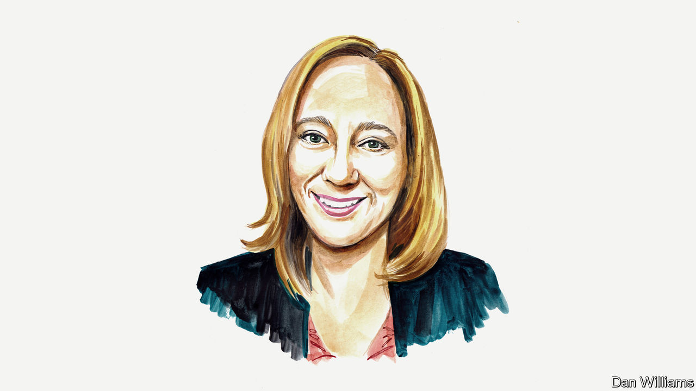

###### Finance and economics

# Claudia Sahm on what is driving inflation in America 

##### The former White House economist considers whether covid-19 rescue plans deserve any blame 

 

> May 17th 2022 

THE PAST few years have once again demonstrated that blunt tools—such as the government sending out cheques and pushing down interest rates—affect how much consumers and businesses spend. But it is difficult to fine-tune such policies without the benefit of hindsight. Even after the fact, it can be hard to analyse what should have been done. Inflation was not transitory, but neither was covid-19. And the stresses the pandemic put on the global economy were far-reaching. What does that mean for policy design in the future?

Economic support in response to the global economic crisis of 2007-09 was too little. This time, perhaps it was too much. But the debate among macroeconomists must recognise the need to improve how we combine our blunt tools with crisis-specific policies. Pushing up demand is more straightforward than fixing mortgage markets or containing a pandemic, but those crisis-specific measures are keys to an even and sustainable recovery. 

Joe Biden’s $1.9trn spring stimulus in America was a contentious fiscal program, even among left-of-centre macroeconomists. An important area of disagreement was the programme’s size. One metric was its dollar amount relative to estimates from the Congressional Budget Office of the “potential output” of the economy. Some opposed the programme because it was about twice as large as the shortfall in GDP at the time. Others, like myself, argued that those estimates of potential output were subject to substantial uncertainty and should not be a limiting factor in the policy. 

As it turned out, potential output was far too crude a metric. We only recently came within reach of closing the estimated gap, but inflation took off a year ago. It’s not that overall demand was wildly too high last year. After the rescue plan demand skewed further towards durable goods, such as cars, and thus collided with covid-related restrictions on their supply, pushing up prices. It reinforced a trend that began early in the pandemic, when we saw the rebound in goods far outpace the rebound in services, as a result of covid and social distancing. My research on the stimulus cheques during the crisis—including the $1,400 ones in Mr Biden’s rescue plan—shows a pronounced shift from spending on things like holidays to things like household goods, compared with the stimulus cheques of 2008. 

Even after that additional surge in demand for goods passed, it was not met with a greater supply. Lockdowns at production facilities in Asia and elsewhere, and the breakdown of global transport systems, continued even after effective vaccines started rolling out. The supply-side situation worsened as more covid waves arrived. The vital factor was the interaction between blunt fiscal policy and the pandemic. 

There are currently about twice as many job openings as unemployed people in the labour market. The rescue plan offered generous benefits to the unemployed, which probably delayed some from returning to work—not exactly a disaster amid a pandemic. But at least one study suggests that ending benefits in the summer of 2021 in certain states only modestly eased labour shortages. Meanwhile, contracting covid and caring for family members has kept workers from returning to the labour market. 

Demand for housing is outpacing supply even more than usual, and home prices and rents are rising sharply. Very low interest rates from the Federal Reserve may have combined with covid-related geographic mobility and a desire for more space at home. As with the shift towards goods purchases, this lasting shift in demand would have been hard to predict a year ago. The proportion of those working from home fell sharply during the first year of the recovery from its peak of 35% but has decreased to around 10%. 

But exactly how much of the higher inflation is due to the rescue plan? Even in these early stages of research, it is clear there are a wide range of answers to that question. As one example, two different teams of researchers at the Federal Reserve Bank of San Francisco come to markedly different conclusions.  that compares inflation in America and Europe, excluding food and energy, estimates that the rescue plan accounts for three percentage points of America’s inflation, which is basically all of the increase. The, that examines excess demand for workers, estimates a contribution from the rescue plan of only 0.3 percentage points. Of course, research is ongoing, and these two examples only serve to illustrate the uncertainty. But some link between the massive fiscal relief and higher-than-usual inflation (and rapid recovery in jobs and spending) must exist. 

So, what is the lesson for next time? A smaller fiscal response? Not necessarily. I have written extensively on the need for stronger automatic stabilisers—stimulus that is distributed when economic conditions deteriorate. For example, direct payments to households or extra jobless benefits could kick in when the unemployment rate rises. After the experience of the pandemic, I am even more convinced that this approach is critical. Congress passing these programmes ahead of time will commit them to building the delivery systems before the crisis; jobless benefits are in particular need of modernisation. 

Most importantly, now is the moment to take the politics out of the timing and design of these basic relief programmes. In our current situation, we are paying a heavy human and economic price because of our inability to get the pandemic under control. Perhaps the biggest lesson from the past two recessions is that Congress must commit to the basics in advance with the expectation that they will pass legislation during the crisis to deal with the specifics of any given recession and recovery. ■


