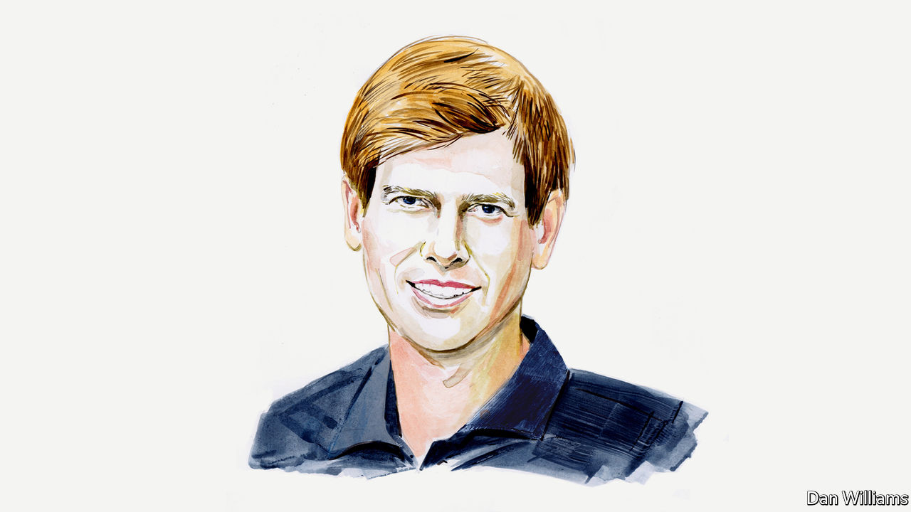

###### Finance and economics

# Jón Steinsson believes that a painless disinflation is no longer plausible 

##### The economics professor says that the Fed’s hard-won credibility is at stake 

 

> May 13th 2022 

AFTER RISING steadily for over a year, inflation in America is now higher than it has been for four decades. On May 4th the Federal Reserve raised the federal funds rate by 0.5 percentage points. Jerome Powell, its chair, also indicated that further 0.5-percentage-point increases are likely in June and July. Together, these actions will constitute the fastest tightening of policy since the 1980s. 

This “expeditious” tightening is a welcome shift from late last year. Back then the thinking of the Fed, of pundits and of market participants fell far behind the curve. The Fed was expected to raise rates by less than one percentage point over the course of 2022. Proposals (including one of my own) to raise rates by a total of two percentage points were considered radical. 

Even now some critics see the Fed‘s current stance as falling short. Markets currently expect it to raise rates to about 2.75% by the end of the year, and only by about 0.5 percentage points more next year. The Fed‘s own (rather optimistic) forecast from March had inflation at 4.3% at the end of this year and 2.7% at the end of 2023. This same forecast had unemployment remaining at record lows for the foreseeable future. This combination of forecasts has been dubbed the “immaculate disinflation” because inflation is seen as falling rapidly despite a very tight labour market and a policy rate that is for the most part negative in real terms (ie, adjusted for inflation). 

Is it plausible that inflation will come down with so little pain? This was certainly not the case last time inflation rose to its current heights in America. Back in the 1980s, the process of disinflation was extremely painful. Under the leadership of Paul Volcker, the Fed raised interest rates to 20% and engineered a huge recession. 

There are differences, however, between today’s situation and that of 40 years ago. Arguably, the most important is the credibility the Fed has built up since then thanks to its inflation-fighting. In the early 1980s, its credibility was in tatters after a decade of high and volatile inflation. But the Fed’s relentless focus on bringing about low and stable inflation meant that by 2000 its credibility was sky high. 

Credibility has the effect of anchoring longer-term expectations of inflation. Since the late 1990s, those expectations have been virtually constant. This makes controlling inflation much easier than it otherwise would be. For example, those setting wages and prices in the economy react less strongly to temporary disturbances, such as a disruption in the energy markets. 

The case for an “immaculate disinflation” today rests on longer-run expectations about inflation continuing to be solidly anchored at the Fed’s target of 2%. If this remains the case, it is entirely possible that inflation will simply return to target as the disturbances associated with covid-19 and the war in Ukraine dissipate. In this scenario, there is no need for particularly tight policy. After all, the unemployment rate is no lower today than it was at the start of 2020 when inflation was 2%. 

The risks to this benign scenario are twofold. First, it may be that some of the special disturbances associated with the pandemic and the war do not fade away quickly. A new wave of covid-19 may emerge. China’s adherence to its zero-covid policy seems likely to cause substantial disruptions for some time. And there is no end in sight to the war in Ukraine. 

The second, more serious, risk is that the Fed’s credibility starts eroding. The longer inflation stays high, the likelier this is. At a certain point the excuses for inflation’s persistence will wear thin—even if they are valid. The public will simply lose confidence in the Fed. I worried about this possibility late last year when the Fed’s delayed pivot towards tighter policy seemed woefully inadequate. Even now, I worry that the Fed is in a race against time to bring down inflation before its credibility is seriously damaged. For that reason, I think it needs to err on the side of tightening more than the most optimistic scenario would warrant, as insurance against the possibility that things might get worse.

These risks imply that disinflation will probably be painful. However, I remain optimistic that it is possible to disinflate at substantially lower cost than past experience suggests. The Fed has established the notion that it is ready to raise rates in 0.5-percentage-point increments as often as is needed. This amounts to as much as four percentage points of tightening per year, which should really be enough. More importantly, Fed officials are at last willing to state unequivocally that they will do whatever it takes to bring down inflation. It is only if the public remains fully confident that the Fed is willing to cause whatever pain is needed, that it stands any chance of engineering a disinflation without much suffering. 

_______________


