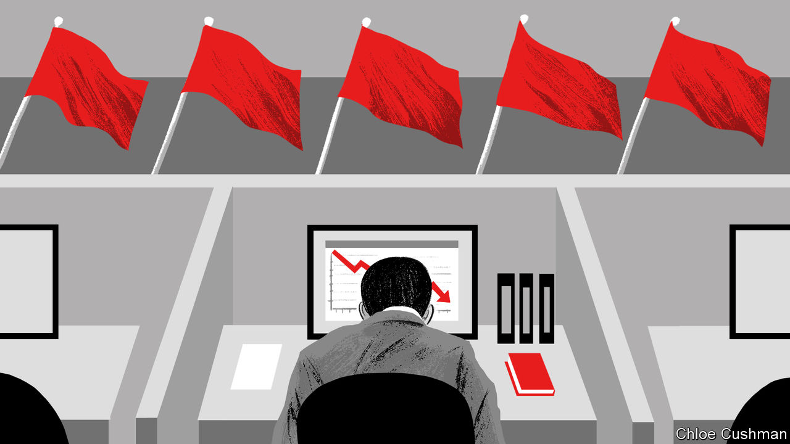

###### Chaguan

# Covid shows that in China, politics matters more than pragmatism 

##### Why officials are so strangely slow to vaccinate the elderly 

 

> May 19th 2022 

It is very possible that Wu Lien-teh, the father of China’s public health system, saved the world from a pandemic. Sent by the imperial government in 1910 to investigate a disease raging through China’s frozen north-east, Dr Wu identified it as the plague. After conducting China’s first autopsies, he overcame the disbelief of colleagues to insist that plague was spreading by droplets in human breath, as well as by fleas from marmots and other rodents hunted for fur. He ordered the wearing of face-masks, the isolation of the sick and a ban on outbound travel, enforced by troops. Patriots revere Dr Wu—born in Malaya to Chinese parents and educated at Cambridge University—for using Western learning to prove foreigners wrong. Scorning Dr Wu’s advice to wear a mask, Gérard Mesny, a French medic expecting to take control of the epidemic zone, caught the plague within days of arrival and died.

Adaptable, evidence-driven and willing to trample the odd freedom for the greater good, Dr Wu is a symbol of much that China’s boosters admire about the country’s system of government. For four decades the world has gasped at China’s economic rise. Technocrats get much of the credit. The praise began soon after Communist Party bosses began to rebuild state institutions after the death of Mao Zedong in 1976, drawing a line under years of violent purges and ideological campaigns. Senior officials were hailed for their professionalism and openness to foreign know-how. Political scientists wrote fat books about systems of performance review, discipline inspection and merit-based promotions that are supposed to make Chinese officials responsive and accountable, even in the absence of opposition parties or a free press. Recently Chinese leaders have seized on the election of bungling populists in the West as proof of the democratic world’s dysfunction. Notably, since the covid-19 pandemic began, they brag of shielding the vast majority of China’s people from catching the virus, unlike death-stalked America.

That record leaves outsiders baffled by China’s current approach to the pandemic, which is causing unsustainable damage to the economy while inflicting pain on tens of millions of locked-down citizens. For foreigners who thought they understood how the party derives legitimacy from competence and economic success, these are confusing times. Suddenly, officials do not look adaptable or open to foreign know-how. Instead they are sticking with brute-force strategies that worked to crush outbreaks when the pandemic began in 2020, but which are a dead-end when fighting the vastly more contagious Omicron variant. True, the ability of rich cities like Beijing to isolate single cases, track their contacts and isolate all these unfortunates in quarantine clinics is remarkable. But they are at root a high-tech perfecting of techniques that Dr Wu used in 1910. Since then, science has moved on.

China’s highest decision-making body, the Politburo’s standing committee, defensively declared on May 5th that relaxing controls would lead to “massive numbers of infections, critical cases and deaths”. This is correct, but ignores the extent to which it is the party’s fault. Abandoning pandemic controls risks disaster because China has a weak hospital system and old people with lots of chronic ailments. But above all, it is because China has not fully vaccinated 100m citizens over 60. This grave blunder blocks the easing of controls. In semi-autonomous Hong Kong, which follows some but not all of the mainland’s covid policies, an Omicron wave led to horribly high mortality rates. In all, 95% of the dead were people over 60 who had not been fully vaccinated.

Yet rather than set China’s propaganda juggernaut onto an all-out vaccination drive, leaders have wasted months. Resources have been poured into mass testing sites and what the head of the National Health Commission ominously calls “permanent” quarantine hospitals. China has not approved any mrna vaccines, the most effective kind, essentially because the only two versions available are Western-made. At first, this hesitancy reflected national pride and caution about a new technology’s possible side effects. But national security is now a concern, scientific sources report, with leaders anxious about dependency on a foreign drug.

Self-interest undermines China’s “political meritocracy”

As a rule, when outsiders see Chinese officials apparently bent on self-harm, a likely explanation is that they are responding to incentives and priorities that only insiders fully appreciate. That is true of city- or district-level bureaucrats extending lockdowns or imposing more onerous controls than national-level guidance would seem to demand, even as the economy stalls. Such officials are in fact juggling contradictory orders from on high. Professional survival involves weighing which can hurt them personally. If everywhere has low economic growth, officials need not fear bad gdp numbers. As for vaccinating reluctant old people, that may be good for the country overall. But if an official upsets local families by forcing a shot on grandparents (and worse, if the old then die of an unrelated illness) then career-harming protests may follow. The most menacing order of all is the one threatening to sack officials with an outbreak on their watch. So they build more fences.

The biggest cause of China’s stubbornness on covid is President Xi Jinping, who has made pandemic controls into a political campaign and loyalty test. A new essay on containing the pandemic in , a leading party journal, mentions Mr Xi 13 times, and the need to vaccinate old people once. At its meeting on May 5th the Politburo’s standing committee pledged to fight “any attempt to distort, question or dismiss China’s anti-covid policies”. Like Dr Wu, Mr Xi has proved sceptical foreigners wrong about pandemic controls. China’s lockdowns broke the country’s first wave of covid in 2020, despite Western doubts. Mr Xi’s wisdom certainly must not be questioned now, since later this year, he is expected to seek and secure a third term as party chief. China’s covid-policy paralysis is driven not by science, but by raw politics.■


